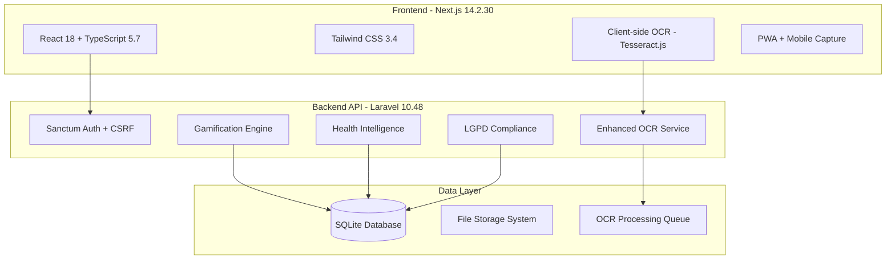

# AUSTA Onboarding Portal 🚀

[](https://laravel.com)
[](https://nextjs.org/)
[](https://www.php.net/)
[](https://www.typescriptlang.org/)
[](https://www.sqlite.org/)

> **Enterprise-grade healthcare onboarding platform** transforming bureaucratic enrollment processes into engaging, gamified digital experiences with advanced OCR, health intelligence, and comprehensive document management.

## 🏆 Platform Highlights

- **🎮 Gamification Engine**: Complete points, levels, badges, and achievement system
- **🔍 AI-Powered OCR**: Dual-provider document processing (AWS Textract + Tesseract fallback)
- **🏥 Intelligent Health Screening**: Adaptive questionnaires with clinical decision support
- **📱 Mobile-First PWA**: Optimized for mobile document capture and processing
- **🔐 LGPD Compliant**: Full Brazilian data privacy compliance with audit trails
- **🎯 Real-time Processing**: Client-side OCR with server-side validation and enhancement

## 🏗️ System Architecture



## ✨ Core Features

### 🎯 **Multi-Step Onboarding Flow**
1. **Health Questionnaire** - Intelligent screening with clinical pathways
2. **Document Upload** - Mobile-optimized capture with real-time OCR
3. **Interview Scheduling** - Integrated calendar management
4. **Completion Tracking** - Gamified progress with rewards system

### 🤖 **Advanced OCR Pipeline**
- **Dual-Provider Architecture**: AWS Textract (primary) + Tesseract (fallback)
- **Client-Side Processing**: Immediate feedback with Tesseract.js
- **Server-Side Enhancement**: AWS Textract for production-grade accuracy
- **Smart Quality Validation**: Automatic resolution and format checks
- **Mobile Optimization**: Camera capture with image enhancement

### 🏥 **Health Intelligence System**
- **Clinical Excellence Questionnaire**: Evidence-based health screening
- **Intelligent Pathway Router**: Adaptive question branching
- **Risk Assessment Engine**: ML-powered health risk scoring
- **Report Generation**: Comprehensive health profile reports

### 🎮 **Gamification Engine**
- **Point System**: Configurable rewards for actions (25-150 points per task)
- **Level Progression**: Experience-based advancement with unlocks
- **Badge System**: Achievement tracking with milestone rewards
- **Leaderboards**: Community engagement and friendly competition

### 🔐 **Security & Compliance**
- **LGPD Full Compliance**: Data export, deletion, consent management
- **Security Headers**: XSS, CSRF, clickjacking protection
- **Input Validation**: Server-side validation with Zod schemas
- **Audit Trails**: Complete activity logging and monitoring

## 🚀 Quick Start Guide

### Prerequisites

```bash
# Required versions (tested and verified)
PHP >= 8.3.23
Node.js >= 18.x
Composer >= 2.x
SQLite >= 3.46
```

### 📂 Project Structure

```
OnboardingPortal/
├── omni-portal/
│   ├── backend/              # Laravel 10.48 API
│   │   ├── app/
│   │   │   ├── Http/Controllers/Api/  # RESTful endpoints
│   │   │   ├── Models/               # Eloquent models
│   │   │   ├── Services/             # Business logic services
│   │   │   │   ├── GamificationService.php
│   │   │   │   ├── EnhancedOCRService.php
│   │   │   │   └── HealthDataCoordinator.php
│   │   │   └── Jobs/                 # Background processing
│   │   ├── config/                   # Configuration files
│   │   ├── database/migrations/      # Database schema
│   │   └── routes/api.php            # API routing
│   └── frontend/             # Next.js 14.2 App
│       ├── app/              # App Router structure
│       │   ├── (onboarding)/         # Onboarding flow pages
│       │   ├── (dashboard)/          # User dashboard
│       │   └── (auth)/               # Authentication pages
│       ├── components/               # React components
│       │   ├── health/               # Health questionnaire components
│       │   ├── upload/               # Document upload components
│       │   └── ui/                   # Reusable UI components
│       ├── lib/                      # Utilities and services
│       │   ├── api/                  # API client configuration
│       │   ├── ocr-service.ts        # OCR processing logic
│       │   └── gamification-calculator.ts
│       └── hooks/                    # Custom React hooks
└── Docs_For_development/     # Technical documentation
```

### 🛠️ Installation & Setup

#### Backend Setup (Laravel)

```bash
# Navigate to backend directory
cd omni-portal/backend

# Install PHP dependencies
composer install

# Environment configuration
cp .env.example .env
php artisan key:generate

# Database setup (SQLite - zero configuration)
php artisan migrate
php artisan db:seed

# Create storage link for file uploads
php artisan storage:link

# Optional: Create filesystems config if missing
php artisan vendor:publish --tag=laravel-filesystems
```

#### Frontend Setup (Next.js)

```bash
# Navigate to frontend directory
cd omni-portal/frontend

# Install Node dependencies
npm install

# Environment configuration
cp .env.example .env.local

# Configure API endpoint in .env.local
echo "NEXT_PUBLIC_API_URL=http://localhost:8000/api" >> .env.local

# Setup Tesseract.js for OCR (automated via postinstall)
npm run postinstall
```

### 🚦 Development Servers

```bash
# Terminal 1 - Backend API Server
cd omni-portal/backend
php artisan serve --host=127.0.0.1 --port=8000

# Terminal 2 - Frontend Development Server  
cd omni-portal/frontend
npm run dev
```

**🌐 Access Points:**
- Frontend: http://localhost:3000
- Backend API: http://localhost:8000/api
- Health Check: http://localhost:8000/api/health

## 🧪 Testing & Quality

### Backend Testing
```bash
cd omni-portal/backend
php artisan test              # Run PHPUnit test suite
php artisan test --coverage   # With coverage reports
```

### Frontend Testing
```bash
cd omni-portal/frontend
npm run test:ci               # Jest unit/integration tests
npm run test:e2e              # Playwright end-to-end tests
npm run test:a11y             # Accessibility compliance tests
npm run quality:check         # Full quality validation
```

### Code Quality
```bash
# Laravel - Code style and static analysis
cd omni-portal/backend
./vendor/bin/pint             # PHP CS Fixer
php artisan insights          # Static analysis

# Next.js - TypeScript and formatting
cd omni-portal/frontend
npm run typecheck             # TypeScript validation
npm run lint:strict           # ESLint with strict rules
npm run format:check          # Prettier formatting
```

## 🔧 Technology Stack

### Backend (Laravel 10.48.29)
- **Framework**: Laravel 10.48 with PHP 8.3.23
- **Authentication**: Laravel Sanctum with CSRF protection
- **Database**: SQLite (development) / MySQL (production ready)
- **OCR Services**: 
  - AWS Textract SDK (primary)
  - Tesseract OCR (fallback)
- **File Processing**: Intervention Image for optimization
- **Queue Management**: Database driver with Horizon ready
- **Permissions**: Spatie Laravel Permission for RBAC

### Frontend (Next.js 14.2.30)
- **Framework**: Next.js 14.2 with App Router
- **Runtime**: React 18.3 + TypeScript 5.7
- **Styling**: Tailwind CSS 3.4 + Headless UI components
- **Forms**: React Hook Form + Zod validation
- **State Management**: Zustand for global state
- **Data Fetching**: TanStack Query for server state
- **OCR Client**: Tesseract.js 5.1 for browser OCR
- **Mobile**: PWA-ready with mobile camera integration

### Key Libraries & Services
```json
{
  "backend_key_packages": {
    "laravel/sanctum": "^3.3 - API authentication",
    "aws/aws-sdk-php": "^3.351 - AWS Textract integration", 
    "thiagoalessio/tesseract_ocr": "^2.13 - OCR fallback",
    "intervention/image": "^2.7 - Image processing",
    "spatie/laravel-permission": "^6.0 - Role-based access"
  },
  "frontend_key_packages": {
    "tesseract.js": "^5.1.1 - Client-side OCR",
    "react-hook-form": "^7.60 - Form management",
    "zod": "^3.24 - Schema validation",
    "axios": "^1.7 - HTTP client with interceptors",
    "lucide-react": "^0.525 - Icon system"
  }
}
```

## 📊 API Documentation

### Core Endpoints

#### Authentication & User Management
```http
POST   /api/register              # Multi-step user registration
POST   /api/login                 # User authentication
POST   /api/logout                # Session termination
GET    /api/auth/user             # Current user profile
```

#### Health System
```http
POST   /api/health/questionnaire  # Submit health questionnaire
GET    /api/health/progress       # Get completion status
POST   /api/health/clinical-data  # Clinical data processing
```

#### Document Management
```http
POST   /api/v2/documents/upload   # Enhanced document upload with OCR
GET    /api/documents             # List user documents
GET    /api/documents/{id}        # Document details
DELETE /api/documents/{id}        # Document removal
```

#### Gamification System
```http
GET    /api/gamification/stats    # User points, level, progress
GET    /api/gamification/badges   # Achievement badges
GET    /api/gamification/leaderboard  # Community rankings
POST   /api/gamification/action   # Award points for actions
```

#### LGPD Compliance
```http
GET    /api/lgpd/privacy-settings # Privacy preferences
POST   /api/lgpd/export-data      # Data portability request
POST   /api/lgpd/delete-account   # Account deletion request
GET    /api/lgpd/consent-history  # Consent audit trail
```

## 🎮 Gamification Configuration

### Point System
```php
// Current point values (centralized in constants)
HEALTH_QUESTIONNAIRE_COMPLETE: 150 points
DOCUMENT_UPLOAD: 25 points per document
DOCUMENTS_ALL_COMPLETE: 100 bonus points
INTERVIEW_SCHEDULED: 75 points
PROFILE_COMPLETE: 50 points
CLINICAL_EXCELLENCE_BONUS: 25 points
```

### Achievement Milestones
- **Getting Started**: First document uploaded
- **Health Warrior**: Health questionnaire completed
- **Document Master**: All documents submitted
- **Interview Ready**: Interview scheduled
- **Onboarding Champion**: Full process completed

## 🔍 OCR Processing Pipeline

### Client-Side (Immediate Feedback)
1. **Image Capture**: Mobile camera or file selection
2. **Quality Validation**: Resolution and format checks
3. **Tesseract.js Processing**: Browser-based OCR with progress
4. **Real-time Results**: Instant text extraction and validation

### Server-Side (Enhanced Processing)
1. **AWS Textract Analysis**: High-accuracy OCR with form detection
2. **Fallback Processing**: Tesseract server-side if Textract fails
3. **Data Extraction**: Structured data parsing per document type
4. **Validation & Storage**: Business rule validation and secure storage

## 🚨 Troubleshooting Guide

### Common Issues & Solutions

#### 1. Frontend 404 Errors on Root Route
```bash
# Clear Next.js build cache
cd omni-portal/frontend
rm -rf .next
npm run dev
```

#### 2. OCR Processing Errors
```bash
# Check Tesseract installation (backend)
tesseract --version

# Reinstall Tesseract.js (frontend)
cd omni-portal/frontend
rm -rf node_modules/tesseract.js
npm install tesseract.js
npm run postinstall
```

#### 3. Document Upload Failures
```bash
# Ensure storage directory exists
cd omni-portal/backend
php artisan storage:link
mkdir -p storage/app/documents
chmod 755 storage/app/documents

# Check filesystems configuration
php artisan config:clear
```

#### 4. Database Connection Issues
```bash
# SQLite database creation
cd omni-portal/backend
touch database/database.sqlite
php artisan migrate:fresh --seed
```

#### 5. CSRF Token Mismatches
```bash
# Clear application cache
cd omni-portal/backend
php artisan config:clear
php artisan route:clear
php artisan view:clear

# Frontend - clear cookies
# Open browser dev tools > Application > Cookies > Clear All
```

## 🔐 Security Considerations

### Implemented Security Measures
- ✅ **Input Validation**: Zod schemas + Laravel validation rules  
- ✅ **CSRF Protection**: SameSite cookies + token validation
- ✅ **XSS Prevention**: Content Security Policy headers
- ✅ **File Upload Security**: MIME type validation + size limits
- ✅ **SQL Injection Protection**: Eloquent ORM with prepared statements
- ✅ **Rate Limiting**: API throttling on sensitive endpoints
- ✅ **Session Security**: HTTPOnly, Secure, SameSite cookie flags

### Security Headers Configured
```
X-Content-Type-Options: nosniff
X-Frame-Options: DENY  
X-XSS-Protection: 1; mode=block
Referrer-Policy: strict-origin-when-cross-origin
Content-Security-Policy: default-src 'self'
```

## 📈 Performance Optimization

### Implemented Optimizations
- **Frontend Bundle**: Code splitting + lazy loading (~2s initial load)
- **Image Processing**: Client-side compression before upload
- **Database**: Indexed queries + eager loading relationships  
- **Caching**: Query result caching + static asset optimization
- **Mobile Performance**: Progressive image enhancement + offline support

### Performance Metrics (Targets)
- API Response Time: < 200ms (average)
- Frontend FCP: < 2.0s 
- Frontend LCP: < 2.5s
- Mobile Performance Score: > 90

## 🌍 Environment Configuration

### Environment Variables

#### Backend (.env)
```env
APP_NAME="AUSTA Onboarding Portal"
APP_ENV=local
APP_DEBUG=true
APP_URL=http://localhost:8000

DB_CONNECTION=sqlite
DB_DATABASE=/absolute/path/to/database/database.sqlite

# OCR Configuration
AWS_ACCESS_KEY_ID=your_aws_key
AWS_SECRET_ACCESS_KEY=your_aws_secret
AWS_TEXTRACT_REGION=us-east-1

# Storage Configuration  
FILESYSTEM_DISK=local
```

#### Frontend (.env.local)
```env
NEXT_PUBLIC_API_URL=http://localhost:8000/api
NEXT_PUBLIC_APP_NAME="AUSTA Onboarding Portal"
NEXT_PUBLIC_ENABLE_ANALYTICS=false
NEXT_PUBLIC_OCR_PROVIDER=tesseract
```

## 🚀 Production Deployment

### Pre-deployment Checklist
- [ ] Run full test suite (`npm run quality:check`)
- [ ] Build optimization (`npm run build`)
- [ ] Security audit (`npm run security:audit`)
- [ ] Performance validation (`npm run test:performance`)
- [ ] Database migrations tested
- [ ] Environment variables configured
- [ ] SSL certificates installed
- [ ] CDN configured for assets

### Production Environment Considerations
- **Database**: Switch to MySQL/PostgreSQL for production
- **File Storage**: Configure S3 or equivalent cloud storage
- **OCR Services**: Enable AWS Textract with proper IAM roles
- **Monitoring**: Implement application monitoring (New Relic, DataDog)
- **Logging**: Configure structured logging with log aggregation
- **Backup**: Automated database and file backups

## 📝 Contributing Guidelines

### Development Workflow
1. **Feature Branch**: Create from `main` branch
2. **Code Standards**: Follow PSR-12 (PHP) + Prettier (TypeScript)
3. **Testing**: Maintain test coverage > 80%
4. **Security**: Run security audits before PR
5. **Documentation**: Update relevant docs with changes

### Code Review Requirements
- [ ] All tests passing
- [ ] Security scan clean
- [ ] Performance impact assessed
- [ ] LGPD compliance maintained
- [ ] Accessibility standards met

## 📞 Support & Maintenance

### Application Status
- **Backend**: ✅ Running (Laravel 10.48.29 on PHP 8.3.23)
- **Frontend**: ✅ Running (Next.js 14.2.30)
- **Database**: ✅ Connected (SQLite with migrations applied)
- **OCR Services**: ✅ Operational (Dual-provider setup)
- **Health System**: ✅ Active (Clinical questionnaire processing)

### Monitoring Endpoints
- **Health Check**: `GET /api/health` - System health status
- **Application Status**: Both services running on localhost
- **Database Status**: All migrations applied, seeded data available

## 📄 License & Compliance

This project is **proprietary software** developed for AUSTA healthcare services. All rights reserved.

**LGPD Compliance**: This application implements comprehensive Brazilian General Data Protection Law (LGPD) compliance including data portability, deletion rights, consent management, and audit trails.

---

<div align="center">

**🏥 AUSTA Onboarding Portal**  
*Transforming Healthcare Onboarding Through Technology*

Built with ❤️ by the Healthcare Digital Innovation Team

</div>