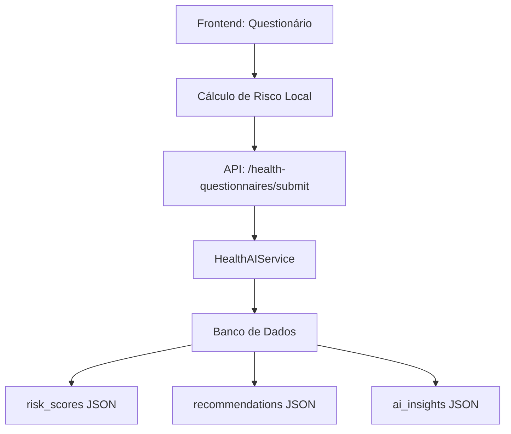

# Estratégia de Inteligência de Dados de Saúde - OmniPortal

## 📊 Análise Completa dos Cálculos de Risco

### 1. Sistema de Cálculo de Risco Atual

#### 1.1 Categorias de Risco Avaliadas

O sistema calcula scores de risco em 6 categorias principais:

```typescript
categories: {
  cardiovascular: number;      // Risco cardiovascular
  mental_health: number;       // Saúde mental (PHQ-9, GAD-7)
  substance_abuse: number;     // Uso de substâncias (AUDIT-C, NIDA)
  chronic_disease: number;     // Doenças crônicas
  allergy_risk: number;        // Risco de alergias graves
  safety_risk: number;         // Risco de segurança (suicídio, violência)
}
```

#### 1.2 Instrumentos Clínicos Validados

##### PHQ-9 (Patient Health Questionnaire-9)
- **Pontuação**: 0-27 pontos
- **Cutoffs**:
  - 0-4: Mínimo
  - 5-9: Leve (10 pontos de risco)
  - 10-14: Moderado (20 pontos de risco)
  - 15-19: Moderadamente severo (25 pontos de risco)
  - 20-27: Severo (30 pontos de risco)
- **Pergunta crítica**: PHQ-9 Q9 (ideação suicida) adiciona 50 pontos de risco de segurança

##### GAD-7 (Generalized Anxiety Disorder-7)
- **Pontuação**: 0-21 pontos
- **Cutoffs**:
  - 0-4: Mínimo
  - 5-9: Leve (10 pontos de risco)
  - 10-14: Moderado (20 pontos de risco)
  - 15-21: Severo (25 pontos de risco)

##### AUDIT-C (Alcohol Use Disorders Identification Test)
- **Pontuação**: 0-12 pontos
- **Cutoffs**:
  - 0-2: Baixo risco
  - 3-4: Risco leve (10 pontos de risco)
  - 5-7: Risco moderado (20 pontos de risco)
  - 8-12: Alto risco (30 pontos de risco)

##### NIDA (National Institute on Drug Abuse)
- Uso de substâncias: +25 pontos base
- Drogas ilegais: +15 pontos adicionais
- Drogas de alto risco (cocaína): +20 pontos adicionais

#### 1.3 Fatores de Risco Cardiovascular

Sistema multiplicador baseado em fatores presentes:
- Hipertensão
- Diabetes
- Doença cardíaca
- Tabagismo atual
- IMC > 30
- Exercício < 3x/semana
- História familiar
- Consumo alto de álcool
- Idade > 65 anos

**Cálculo**: Cada fator = 12 pontos

#### 1.4 Riscos de Segurança Críticos

##### Ideação Suicida
- Tentativa recente: 60 pontos
- Ideação ativa com plano: 50 pontos
- Ideação ativa sem plano: 35 pontos
- Ideação passiva: 20 pontos

##### Violência Doméstica
- Exposição atual: 30 pontos

##### Alergias Graves
- Risco de vida sem epinefrina: 60 pontos
- Risco de vida com epinefrina: 40 pontos
- Alergias severas: 25 pontos

### 2. Fluxo de Dados Atual



### 3. Lacunas Identificadas

1. **Sem Dashboard Administrativo**: Dados coletados não são visualizados
2. **Sem Sistema de Alertas**: Riscos críticos não geram notificações
3. **Sem Relatórios Automatizados**: Dados não são enviados ao plano de saúde
4. **Sem API de Integração**: Falta endpoint para sistemas externos
5. **Sem Análise Agregada**: Não há visão populacional dos riscos

## 🎯 Estratégia de Inteligência de Dados Proposta

### Fase 1: Dashboard Administrativo (Semana 1-2)

#### 1.1 Visão Individual
```typescript
interface PatientRiskProfile {
  patientId: string;
  lastAssessment: Date;
  overallRisk: 'low' | 'moderate' | 'high' | 'critical';
  riskScores: RiskScore;
  alerts: CriticalAlert[];
  trends: RiskTrend[];
  interventions: Intervention[];
}
```

#### 1.2 Visão Populacional
```typescript
interface PopulationHealthMetrics {
  totalPatients: number;
  riskDistribution: {
    low: number;
    moderate: number;
    high: number;
    critical: number;
  };
  topRisks: RiskCategory[];
  demographicAnalysis: DemographicRisk[];
  predictiveModels: PredictiveInsight[];
}
```

### Fase 2: Sistema de Alertas Inteligentes (Semana 3-4)

#### 2.1 Alertas Críticos Imediatos
- **Ideação suicida**: Notificação instantânea para equipe de saúde mental
- **Violência doméstica**: Protocolo de segurança ativado
- **Alergias graves sem epinefrina**: Alerta para prescrição urgente

#### 2.2 Alertas de Tendência
- Deterioração da saúde mental ao longo do tempo
- Aumento no uso de substâncias
- Progressão de fatores de risco cardiovascular

### Fase 3: API de Integração (Semana 5-6)

#### 3.1 Endpoints Seguros
```php
// Novo controller: HealthDataIntegrationController

// Obter dados agregados
GET /api/v1/health-intelligence/population-metrics
Authorization: Bearer {api_token}
X-Health-Plan-ID: {plan_id}

// Obter perfis de risco específicos
GET /api/v1/health-intelligence/risk-profiles
?risk_level=critical
&date_from=2025-01-01
&limit=100

// Webhook para alertas críticos
POST /api/v1/health-intelligence/critical-alerts/webhook
{
  "endpoint": "https://plano-saude.com/alerts",
  "events": ["suicide_risk", "violence_exposure", "critical_allergy"]
}
```

#### 3.2 Segurança e Compliance
- Autenticação OAuth2 para planos de saúde
- Criptografia end-to-end para dados sensíveis
- Logs de auditoria para todas as consultas
- Conformidade com LGPD/HIPAA

### Fase 4: Machine Learning e Predição (Semana 7-8)

#### 4.1 Modelos Preditivos
```typescript
interface PredictiveModel {
  // Predição de risco futuro baseado em padrões
  predictFutureRisk(patientHistory: HealthHistory[]): RiskPrediction;
  
  // Identificação de pacientes similares
  findSimilarPatients(profile: PatientProfile): SimilarPatient[];
  
  // Recomendações personalizadas
  generateInterventions(riskProfile: RiskProfile): Intervention[];
}
```

#### 4.2 Análise de Eficácia
- Tracking de intervenções aplicadas
- Medição de resultados
- Ajuste contínuo dos modelos

### Fase 5: Relatórios Automatizados (Semana 9-10)

#### 5.1 Relatórios Executivos Mensais
```typescript
interface ExecutiveHealthReport {
  period: DateRange;
  keyMetrics: {
    newAssessments: number;
    criticalRisksIdentified: number;
    interventionsApplied: number;
    outcomeImprovements: number;
  };
  costAnalysis: {
    potentialSavings: number;
    preventedHospitalizations: number;
    earlyInterventionROI: number;
  };
  recommendations: StrategicRecommendation[];
}
```

#### 5.2 Relatórios Clínicos Semanais
- Lista de pacientes de alto risco
- Intervenções recomendadas
- Follow-ups necessários
- Métricas de engajamento

## 🔐 Considerações de Privacidade e Ética

### 1. Consentimento Informado
- Explicação clara do uso dos dados
- Opt-in para compartilhamento com plano de saúde
- Direito de exclusão a qualquer momento

### 2. Anonimização
- Dados agregados sem identificação pessoal
- Pseudonimização para análises
- Segregação de dados sensíveis

### 3. Governança de Dados
- Comitê de ética para uso de dados
- Políticas claras de retenção
- Processos de auditoria regular

## 📈 Métricas de Sucesso

### KPIs Principais
1. **Redução de Internações**: Meta 20% em 12 meses
2. **Detecção Precoce**: 90% dos riscos críticos identificados
3. **Engajamento**: 70% dos usuários completam avaliações
4. **Satisfação**: NPS > 8 para usuários e administradores
5. **ROI**: 3:1 em economia de custos de saúde

### Métricas Secundárias
- Tempo médio para intervenção
- Taxa de falsos positivos
- Precisão das predições
- Adesão às recomendações

## 🚀 Roadmap de Implementação

### Mês 1
- [ ] Dashboard administrativo básico
- [ ] Sistema de alertas críticos
- [ ] Documentação de APIs

### Mês 2
- [ ] API de integração completa
- [ ] Relatórios automatizados
- [ ] Treinamento de equipes

### Mês 3
- [ ] Modelos preditivos v1
- [ ] Análise de eficácia
- [ ] Otimizações de performance

### Mês 4
- [ ] Machine Learning avançado
- [ ] Dashboard analytics completo
- [ ] Expansão para novos domínios

## 💡 Recomendações Imediatas

1. **Criar tabela de alertas no banco de dados**
```sql
CREATE TABLE health_alerts (
  id UUID PRIMARY KEY,
  beneficiary_id INT REFERENCES beneficiaries(id),
  alert_type VARCHAR(50),
  severity ENUM('low', 'medium', 'high', 'critical'),
  risk_category VARCHAR(50),
  risk_score INT,
  message TEXT,
  status ENUM('pending', 'acknowledged', 'resolved'),
  created_at TIMESTAMP,
  acknowledged_at TIMESTAMP,
  acknowledged_by INT REFERENCES users(id),
  resolved_at TIMESTAMP,
  resolved_by INT REFERENCES users(id),
  metadata JSONB
);
```

2. **Implementar job de processamento assíncrono**
```php
// ProcessHealthRisksJob.php
class ProcessHealthRisksJob implements ShouldQueue
{
    public function handle()
    {
        // Identificar riscos críticos
        $criticalRisks = HealthQuestionnaire::where('risk_scores->safety_risk', '>', 40)
            ->orWhere('risk_scores->overall', '>', 150)
            ->where('status', 'completed')
            ->whereNull('alert_sent_at')
            ->get();
            
        foreach ($criticalRisks as $risk) {
            // Criar alerta
            HealthAlert::create([...]);
            
            // Enviar notificação
            NotificationService::sendCriticalAlert($risk);
            
            // Marcar como processado
            $risk->update(['alert_sent_at' => now()]);
        }
    }
}
```

3. **Endpoint de status para administradores**
```php
// AdminHealthController.php
public function getCriticalPatients()
{
    $criticalPatients = DB::table('health_questionnaires')
        ->join('beneficiaries', 'beneficiaries.id', '=', 'health_questionnaires.beneficiary_id')
        ->where('risk_scores->overall', '>', 100)
        ->orWhereJsonContains('risk_scores->flags', 'suicide_risk')
        ->orWhereJsonContains('risk_scores->flags', 'current_violence_exposure')
        ->select([
            'beneficiaries.name',
            'beneficiaries.email',
            'health_questionnaires.risk_scores',
            'health_questionnaires.completed_at',
            'health_questionnaires.recommendations'
        ])
        ->orderByDesc('risk_scores->overall')
        ->limit(50)
        ->get();
        
    return response()->json([
        'success' => true,
        'data' => $criticalPatients,
        'metadata' => [
            'total_critical' => $criticalPatients->count(),
            'last_updated' => now()
        ]
    ]);
}
```

## 📞 Próximos Passos

1. Validar estratégia com stakeholders
2. Priorizar features por impacto/esforço
3. Definir SLAs para alertas críticos
4. Estabelecer parcerias com planos de saúde
5. Criar protótipos de dashboards
6. Definir protocolos de intervenção
7. Treinar equipes de saúde
8. Implementar monitoramento contínuo

---

**Nota**: Esta estratégia visa maximizar o valor dos dados coletados enquanto mantém a privacidade e segurança dos usuários como prioridade absoluta.