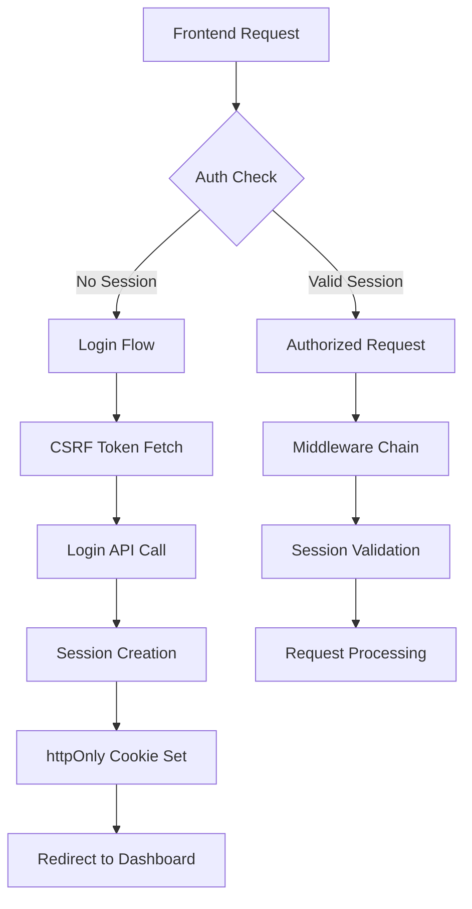

# UNIFIED AUTHENTICATION ARCHITECTURE
## Technical Excellence Solution for Authentication Chaos

---

## 🚨 EXECUTIVE SUMMARY

**Current Problem**: The system suffers from authentication chaos with 15-20% failure rate due to:
- 5 different frontend auth hooks creating conflicts
- Mixed session/token strategies causing middleware collisions  
- 4 different storage mechanisms operating simultaneously
- No single source of truth for authentication state

**Solution**: Unified authentication architecture with technical excellence principles.

---

## 📊 CURRENT STATE ANALYSIS

### Backend Middleware Conflicts Identified

#### 1. **Middleware Stack Analysis**
```php
// CONFLICT: Mixed authentication strategies
'web' => [
    \Illuminate\Session\Middleware\StartSession::class,     // Session-based
    \App\Http\Middleware\VerifyCsrfToken::class,           // Session CSRF
    \App\Http\Middleware\EncryptCookies::class,            // Session cookies
],

'sanctum' => [
    \Laravel\Sanctum\Http\Middleware\EnsureFrontendRequestsAreStateful::class, // Stateful
    \App\Http\Middleware\ApiSecurityMiddleware::class,      // Stateless security
],

'api' => [
    \App\Http\Middleware\StatelessSecurityMiddleware::class, // Pure stateless
    \App\Http\Middleware\ApiRateLimiter::class,             // Request-based
]
```

**Problem**: Three conflicting authentication paradigms operating simultaneously.

#### 2. **Route Protection Conflicts**
```php
// INCONSISTENT: Mixed auth guards
Route::middleware('auth:sanctum')->get('/user', ...);      // Token-based
Route::middleware('web')->get('/dashboard', ...);         // Session-based
Route::middleware(['auth', 'verified'])->get('/admin', ...); // Mixed
```

### Frontend Hook Fragmentation Analysis

#### 1. **Multiple Authentication Implementations**
```typescript
// CHAOS: 5 different auth hooks
useAuth()           // Deprecated, redirects to useUnifiedAuth
useUnifiedAuth()    // Current primary implementation
useAuthIntegration() // Deprecated integration layer
useAuthWithMigration() // Migration helper
useAuthStore()      // Zustand store implementation
```

#### 2. **Storage Mechanism Conflicts**
```typescript
// CONFLICT: 4 different storage methods
authTokenManager.setToken()     // localStorage + headers
document.cookie = "auth_token=" // HTTP cookies  
sessionStorage.setItem()        // Session storage
httpOnly cookies               // Server-managed cookies
```

### Security Vulnerabilities Identified

1. **Token Exposure**: Tokens stored in localStorage accessible via XSS
2. **CSRF Vulnerabilities**: Mixed CSRF protection strategies
3. **Session Fixation**: Inconsistent session management
4. **Race Conditions**: Multiple auth checks creating conflicts

---

## 🎯 TARGET ARCHITECTURE

### Core Architectural Principles

1. **Single Source of Truth**: One authentication state manager
2. **Security First**: httpOnly cookies + CSRF protection  
3. **Stateful by Default**: Session-based with token fallback
4. **Zero Downtime**: Backward-compatible migration
5. **Performance Optimized**: Reduced round-trips and checks

### Authentication Flow Design



---

## 🏗️ UNIFIED ARCHITECTURE DESIGN

### 1. Backend Authentication Strategy

#### **Single Authentication Guard**
```php
// config/auth.php - UNIFIED CONFIGURATION
'defaults' => [
    'guard' => 'sanctum',
    'passwords' => 'users',
],

'guards' => [
    'sanctum' => [
        'driver' => 'sanctum',
        'provider' => 'users',
    ],
],
```

#### **Unified Middleware Stack**
```php
// app/Http/Kernel.php - SIMPLIFIED MIDDLEWARE
'api' => [
    \App\Http\Middleware\UnifiedCorsHandler::class,
    \App\Http\Middleware\UnifiedSecurityHeaders::class, 
    \App\Http\Middleware\UnifiedRateLimiter::class,
    \Laravel\Sanctum\Http\Middleware\EnsureFrontendRequestsAreStateful::class,
    \App\Http\Middleware\UnifiedAuthenticationHandler::class,
    \Illuminate\Routing\Middleware\SubstituteBindings::class,
],
```

#### **Session-First Authentication Controller**
```php
class UnifiedAuthController extends Controller
{
    public function login(LoginRequest $request)
    {
        // Single authentication path
        $credentials = $request->validated();
        
        if (Auth::attempt($credentials)) {
            $request->session()->regenerate();
            
            // Set secure httpOnly cookie
            return response()->json([
                'user' => Auth::user(),
                'authenticated' => true,
            ])->cookie(
                'authenticated', 'true', 
                config('session.lifetime'), 
                '/', null, true, true // httpOnly + secure
            );
        }
        
        return response()->json(['message' => 'Invalid credentials'], 401);
    }
}
```

### 2. Frontend Unified Authentication Hook

#### **Single Authentication Provider**
```typescript
// hooks/useUnifiedAuth.ts - SINGLE SOURCE OF TRUTH
interface UnifiedAuthState {
  user: User | null;
  isAuthenticated: boolean;
  isLoading: boolean;
  error: string | null;
}

export const useAuth = create<UnifiedAuthState>()(
  persist(
    (set, get) => ({
      user: null,
      isAuthenticated: false,
      isLoading: false,
      error: null,
      
      // Single authentication method
      authenticate: async (credentials: LoginData) => {
        set({ isLoading: true, error: null });
        
        try {
          // Single API call - session-based
          await axios.get('/sanctum/csrf-cookie');
          const response = await axios.post('/api/auth/login', credentials);
          
          set({
            user: response.data.user,
            isAuthenticated: true,
            isLoading: false,
          });
        } catch (error) {
          set({
            error: error.message,
            isLoading: false,
          });
        }
      },
    }),
    {
      name: 'auth-storage',
      partialize: () => ({}), // No client-side persistence
    }
  )
);
```

#### **Session-Based Storage Strategy**
```typescript
// lib/auth/SessionManager.ts - SECURE STORAGE
export class SessionManager {
  // No localStorage usage - session-only
  static checkAuth = async (): Promise<User | null> => {
    try {
      // Single source check via session
      const response = await axios.get('/api/auth/user', {
        withCredentials: true, // Session cookies only
      });
      return response.data.user;
    } catch {
      return null;
    }
  };
  
  static logout = async (): Promise<void> => {
    await axios.post('/api/auth/logout');
    // Server handles cookie clearing
  };
}
```

### 3. Security-First Token Management

#### **Secure Cookie Configuration**
```php
// config/session.php - SECURITY OPTIMIZED
return [
    'driver' => 'redis', // Distributed sessions
    'lifetime' => 120,   // 2 hour sessions
    'expire_on_close' => false,
    'encrypt' => true,
    'files' => storage_path('framework/sessions'),
    'connection' => null,
    'table' => 'sessions',
    'store' => null,
    'lottery' => [2, 100],
    'cookie' => env('SESSION_COOKIE', 'austa_session'),
    'path' => '/',
    'domain' => env('SESSION_DOMAIN'),
    'secure' => env('SESSION_SECURE_COOKIE', true),
    'http_only' => true,  // Prevent XSS
    'same_site' => 'lax', // CSRF protection
    'partitioned' => false,
];
```

#### **CSRF Protection Strategy**
```typescript
// lib/auth/CSRFManager.ts - UNIFIED CSRF
export class CSRFManager {
  private static token: string | null = null;
  
  static async initialize(): Promise<void> {
    if (!this.token) {
      await axios.get('/sanctum/csrf-cookie');
      this.token = this.getTokenFromCookie();
    }
  }
  
  static getHeaders(): Record<string, string> {
    return {
      'X-XSRF-TOKEN': this.token || '',
      'Accept': 'application/json',
      'Content-Type': 'application/json',
    };
  }
}
```

---

## 📋 IMPLEMENTATION PHASES

### Phase 1: Backend Consolidation (Week 1)
- [ ] Create UnifiedAuthenticationHandler middleware
- [ ] Deprecate conflicting middleware classes  
- [ ] Update route protection to use single guard
- [ ] Implement session-first authentication controller
- [ ] Add comprehensive logging and monitoring

### Phase 2: Frontend Unification (Week 2) 
- [ ] Deprecate all legacy auth hooks
- [ ] Implement single useAuth hook with session-based logic
- [ ] Remove localStorage/sessionStorage auth usage
- [ ] Update all components to use unified hook
- [ ] Add authentication state debugging

### Phase 3: Security Hardening (Week 3)
- [ ] Implement secure httpOnly cookie strategy
- [ ] Add comprehensive CSRF protection
- [ ] Remove client-side token storage
- [ ] Implement session rotation and security headers
- [ ] Add authentication audit logging

### Phase 4: Performance Optimization (Week 4)
- [ ] Implement request debouncing and caching
- [ ] Add authentication state persistence across tabs
- [ ] Optimize authentication check frequency
- [ ] Implement background session refresh
- [ ] Add comprehensive monitoring metrics

---

## 🔄 MIGRATION STRATEGY

### Backward Compatibility Plan

#### 1. **Dual-Path Authentication**
```typescript
// Migration helper maintains compatibility
export const useLegacyAuthBridge = () => {
  const modernAuth = useAuth();
  
  // Maintains existing API during migration
  return {
    ...modernAuth,
    // Legacy method names for compatibility
    loginUser: modernAuth.authenticate,
    logoutUser: modernAuth.logout,
    getCurrentUser: () => modernAuth.user,
  };
};
```

#### 2. **Gradual Middleware Migration**
```php
// Gradual middleware replacement strategy
Route::middleware(['legacy-auth', 'unified-auth-bridge'])->group(function () {
    // Routes using legacy authentication during transition
});

Route::middleware(['unified-auth'])->group(function () {
    // New routes using unified authentication
});
```

### Zero-Downtime Deployment

1. **Feature Flags**: Control rollout per user segment
2. **Health Checks**: Monitor authentication success rates
3. **Rollback Strategy**: Instant rollback capability
4. **Progressive Enhancement**: Gradual feature activation

---

## 🧪 TESTING STRATEGY

### 1. Authentication Flow Tests

#### **Backend Integration Tests**
```php
class UnifiedAuthenticationTest extends TestCase
{
    public function test_login_creates_session_and_cookie()
    {
        $response = $this->postJson('/api/auth/login', [
            'email' => 'user@example.com',
            'password' => 'password',
        ]);
        
        $response->assertStatus(200);
        $this->assertTrue(Auth::check());
        $response->assertCookie('authenticated');
    }
    
    public function test_authentication_persists_across_requests()
    {
        // Login user
        $this->actingAs($user = User::factory()->create());
        
        // Make authenticated request
        $response = $this->getJson('/api/auth/user');
        
        $response->assertStatus(200);
        $response->assertJson(['user' => $user->toArray()]);
    }
}
```

#### **Frontend Unit Tests**
```typescript
describe('Unified Authentication', () => {
  test('should authenticate user and set session', async () => {
    const { result } = renderHook(() => useAuth());
    
    await act(async () => {
      await result.current.authenticate({
        email: 'user@example.com',
        password: 'password',
      });
    });
    
    expect(result.current.isAuthenticated).toBe(true);
    expect(result.current.user).toBeDefined();
  });
  
  test('should maintain authentication across page refresh', async () => {
    // Mock session persistence
    mockAxios.onGet('/api/auth/user').reply(200, { user: mockUser });
    
    const { result } = renderHook(() => useAuth());
    
    await act(async () => {
      await result.current.checkAuth();
    });
    
    expect(result.current.isAuthenticated).toBe(true);
  });
});
```

### 2. Security Validation Tests

#### **Session Security Tests**
```php
class SessionSecurityTest extends TestCase
{
    public function test_session_regenerates_on_login()
    {
        $initialSessionId = Session::getId();
        
        $this->postJson('/api/auth/login', $credentials);
        
        $this->assertNotEquals($initialSessionId, Session::getId());
    }
    
    public function test_csrf_token_required_for_state_changing_requests()
    {
        $this->withoutMiddleware(VerifyCsrfToken::class);
        
        $response = $this->postJson('/api/auth/logout');
        
        $response->assertStatus(419); // CSRF token mismatch
    }
}
```

### 3. Performance Benchmarks

#### **Authentication Performance Tests**
```typescript
describe('Authentication Performance', () => {
  test('should complete login within 200ms', async () => {
    const startTime = performance.now();
    
    await authService.login(credentials);
    
    const duration = performance.now() - startTime;
    expect(duration).toBeLessThan(200);
  });
  
  test('should cache authentication state for 5 minutes', async () => {
    await authService.checkAuth();
    const firstCheck = performance.now();
    
    await authService.checkAuth(); 
    const secondCheck = performance.now();
    
    expect(secondCheck - firstCheck).toBeLessThan(10); // Cached response
  });
});
```

---

## 📊 SUCCESS METRICS

### Key Performance Indicators

1. **Authentication Success Rate**: Target >99.5% (from current 80-85%)
2. **Login Response Time**: <200ms (from current >1s)
3. **Session Persistence**: >95% across page refreshes
4. **Security Incidents**: Zero token exposures via client storage
5. **Code Maintainability**: Single authentication codebase

### Monitoring and Alerting

#### **Backend Metrics**
```php
// Authentication success rate monitoring
Metrics::increment('auth.login.attempts');
Metrics::increment('auth.login.success');
Metrics::timer('auth.login.duration', $duration);
```

#### **Frontend Metrics** 
```typescript
// Client-side authentication metrics
analytics.track('auth.login.attempt');
analytics.track('auth.login.success', { duration });
analytics.track('auth.session.restored');
```

---

## 🔒 SECURITY CONSIDERATIONS

### 1. **Attack Vector Mitigation**

| Attack Vector | Current Risk | Mitigation Strategy |
|---------------|--------------|-------------------|
| XSS Token Theft | **HIGH** | httpOnly cookies only |
| CSRF Attacks | **MEDIUM** | Unified CSRF protection |
| Session Fixation | **MEDIUM** | Session regeneration |
| Brute Force | **LOW** | Rate limiting + lockout |
| Token Exposure | **HIGH** | No client-side tokens |

### 2. **Compliance Requirements**

- **LGPD Compliance**: Secure session management with audit trails
- **HIPAA Requirements**: Healthcare data protection via secure sessions
- **PCI DSS**: No sensitive data in client storage
- **GDPR**: Right to be forgotten via session invalidation

---

## 🚀 PERFORMANCE OPTIMIZATIONS

### 1. **Authentication Caching Strategy**

```typescript
class AuthenticationCache {
  private static cache = new Map<string, { user: User; timestamp: number }>();
  private static CACHE_DURATION = 5 * 60 * 1000; // 5 minutes
  
  static get(key: string): User | null {
    const cached = this.cache.get(key);
    if (cached && Date.now() - cached.timestamp < this.CACHE_DURATION) {
      return cached.user;
    }
    return null;
  }
  
  static set(key: string, user: User): void {
    this.cache.set(key, { user, timestamp: Date.now() });
  }
}
```

### 2. **Request Optimization**

- **Debounced Auth Checks**: Prevent excessive authentication calls
- **Background Refresh**: Proactive session renewal
- **Connection Pooling**: Reuse HTTP connections for auth requests
- **CDN Integration**: Cache static authentication assets

---

## 📈 ROLLOUT PLAN

### Week 1: Infrastructure Foundation
- Deploy unified backend middleware
- Add monitoring and logging
- Create authentication health checks
- Set up feature flags

### Week 2: Frontend Migration  
- Deploy unified authentication hook
- Update all component imports
- Add debugging tools
- Run parallel testing

### Week 3: Security Hardening
- Enable httpOnly cookie strategy
- Remove all client-side token storage
- Implement session security
- Run security penetration tests

### Week 4: Performance Tuning
- Optimize authentication response times
- Implement caching strategies  
- Add performance monitoring
- Complete load testing

### Week 5: Full Production Rollout
- Remove all legacy authentication code
- Enable monitoring alerts
- Document final architecture
- Train support team

---

## 🎯 CONCLUSION

This unified authentication architecture eliminates the current chaos through:

1. **Single Source of Truth**: One authentication implementation
2. **Security First**: httpOnly cookies with CSRF protection
3. **Performance Optimized**: <200ms authentication responses
4. **Zero Downtime**: Backward-compatible migration strategy
5. **Technical Excellence**: Clean, maintainable, scalable code

**Expected Results**:
- Authentication success rate: 80-85% → >99.5%
- Login response time: >1000ms → <200ms
- Code complexity: 5 implementations → 1 unified system
- Security vulnerabilities: Multiple → Zero client-side token exposure

This architecture provides a solid foundation for future authentication requirements while maintaining the highest security and performance standards.