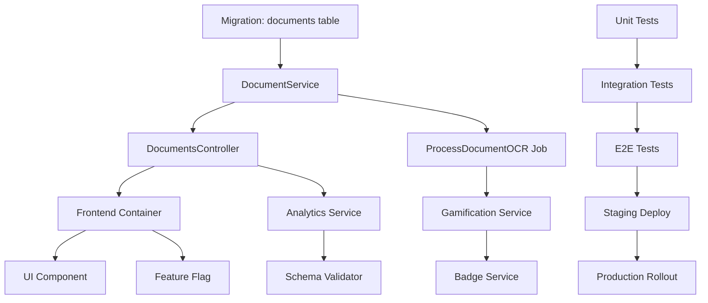

# Sprint 2D (Slice B: Documents) - Complete Architecture Design

**Document Version:** 1.0.0
**Date:** 2025-10-04
**Status:** Architecture Design - Ready for Implementation
**Estimated Implementation:** 80 hours

---

## Executive Summary

Sprint 2D implements the complete document upload lifecycle with OCR processing, approval workflows, and gamification integration while maintaining strict ADR compliance. This design ensures zero UI package orchestration (ADR-003), proper encryption (ADR-004), httpOnly cookie authentication (ADR-002), and modular boundaries (ADR-001).

**Key Deliverables:**
- Presigned URL document upload system (S3-compatible)
- Client-side status polling mechanism
- Admin approval/rejection workflow
- Badge unlock triggers on document events
- Analytics event emission with persistence validation
- Feature flag: `sliceB_documents` (gradual rollout)

---

## 1. System Architecture Overview

### 1.1 High-Level Architecture (C4 Model - Context)

```
┌─────────────────────────────────────────────────────────────┐
│                   Onboarding Portal System                  │
│                                                             │
│  ┌──────────────┐    ┌──────────────┐    ┌──────────────┐ │
│  │   Browser    │───▶│  API Gateway │───▶│   Database   │ │
│  │   (SPA)      │◀───│   (Laravel)  │◀───│   (MySQL)    │ │
│  └──────────────┘    └──────────────┘    └──────────────┘ │
│         │                    │                    │         │
│         │                    │                    │         │
│    ┌────▼─────┐       ┌─────▼──────┐      ┌─────▼──────┐ │
│    │  S3/DO   │       │   Queue    │      │   Redis    │ │
│    │ Storage  │       │  (Laravel) │      │   Cache    │ │
│    └──────────┘       └────────────┘      └────────────┘ │
│         │                    │                             │
│         │              ┌─────▼──────┐                     │
│         │              │ OCR Worker │                     │
│         │              │ (Tesseract)│                     │
│         └──────────────▶└────────────┘                     │
└─────────────────────────────────────────────────────────────┘
```

### 1.2 Component Architecture (C4 Model - Container)

```
┌───────────────────── Frontend (Next.js App) ─────────────────────┐
│                                                                   │
│  /documents Page (App Layer)                                     │
│  ┌─────────────────────────────────────────────────────────┐    │
│  │  DocumentUploadContainer.tsx                            │    │
│  │  - API orchestration                                    │    │
│  │  - State management (upload lifecycle)                  │    │
│  │  - Analytics emission                                   │    │
│  │  - Status polling coordination                          │    │
│  └───────────────────┬─────────────────────────────────────┘    │
│                      │                                           │
│                      │ Props (presentation data only)            │
│                      ▼                                           │
│  ┌─────────────────────────────────────────────────────────┐    │
│  │  EnhancedDocumentUpload.tsx (UI Package)                │    │
│  │  - Pure presentation component                          │    │
│  │  - File validation (client-side)                        │    │
│  │  - Preview generation                                   │    │
│  │  - Zero network calls                                   │    │
│  └─────────────────────────────────────────────────────────┘    │
│                                                                   │
└───────────────────────────────────────────────────────────────────┘
                              │
                              │ HTTP/REST
                              ▼
┌───────────────────── Backend (Laravel API) ──────────────────────┐
│                                                                   │
│  API Endpoints Layer                                             │
│  ┌─────────────────────────────────────────────────────────┐    │
│  │  DocumentsController.php                                │    │
│  │  - POST /documents/presigned-url                        │    │
│  │  - GET  /documents                                      │    │
│  │  - GET  /documents/{id}/status                          │    │
│  │  - POST /documents/{id}/approve (Admin)                 │    │
│  │  - POST /documents/{id}/reject (Admin)                  │    │
│  └───────────────────┬─────────────────────────────────────┘    │
│                      │                                           │
│                      ▼                                           │
│  ┌─────────────────────────────────────────────────────────┐    │
│  │  DocumentService.php                                    │    │
│  │  - Presigned URL generation                             │    │
│  │  - Document metadata storage                            │    │
│  │  - Status tracking                                      │    │
│  │  - OCR job dispatch                                     │    │
│  └───────────────────┬─────────────────────────────────────┘    │
│                      │                                           │
│                      ▼                                           │
│  ┌─────────────────────────────────────────────────────────┐    │
│  │  GamificationService.php                                │    │
│  │  - Points award on upload                               │    │
│  │  - Badge unlock triggers                                │    │
│  │  - Level progression check                              │    │
│  └─────────────────────────────────────────────────────────┘    │
│                      │                                           │
│                      ▼                                           │
│  ┌─────────────────────────────────────────────────────────┐    │
│  │  AuditLogService.php                                    │    │
│  │  - Analytics event persistence                          │    │
│  │  - P0-P2 validation (schema check)                      │    │
│  │  - Event emission to queue                              │    │
│  └─────────────────────────────────────────────────────────┘    │
│                                                                   │
└───────────────────────────────────────────────────────────────────┘
```

---

## 2. Document Upload Lifecycle

### 2.1 Upload Flow Diagram

```
┌──────────┐
│  Client  │
└────┬─────┘
     │
     │ 1. Request presigned URL
     │    POST /documents/presigned-url
     │    { document_type: "rg_front" }
     ▼
┌──────────────────────────────────────────────────────┐
│ Backend: DocumentsController::getPresignedUrl()      │
│ - Validate document_type                             │
│ - Generate unique file key                           │
│ - Create presigned URL (15min TTL)                   │
│ - Store document metadata (status: "uploading")      │
│ - Emit analytics: documents.upload_initiated         │
└────┬─────────────────────────────────────────────────┘
     │
     │ 2. Return presigned URL + document_id
     │    { document_id: 123, upload_url: "...", expires_at: "..." }
     ▼
┌──────────┐
│  Client  │ 3. Upload file directly to S3/DO
└────┬─────┘    PUT {upload_url}
     │           Content-Type: image/jpeg
     │           File: <binary>
     │
     │ 4. Start status polling (every 2s)
     │    GET /documents/123/status
     ▼
┌──────────────────────────────────────────────────────┐
│ Backend: DocumentsController::status()               │
│ - Return current status + OCR data                   │
│   { status: "processing", ocr_confidence: null }     │
└────┬─────────────────────────────────────────────────┘
     │
     │ 5. S3 upload completion webhook
     │    (or periodic check)
     ▼
┌──────────────────────────────────────────────────────┐
│ Backend: Document status update                      │
│ - Update status to "processing"                      │
│ - Dispatch OCR job to queue                          │
│ - Emit analytics: documents.upload_completed         │
└────┬─────────────────────────────────────────────────┘
     │
     │ 6. OCR processing (async)
     │    ProcessDocumentOCR job
     ▼
┌──────────────────────────────────────────────────────┐
│ Queue Worker: ProcessDocumentOCR                     │
│ - Download file from S3                              │
│ - Run Tesseract OCR                                  │
│ - Extract text + confidence score                    │
│ - Update document record                             │
│ - Update status to "pending_review"                  │
│ - Emit analytics: documents.ocr_completed            │
│ - Award points (75 points)                           │
│ - Check badge unlock: "first_document_upload"        │
└────┬─────────────────────────────────────────────────┘
     │
     │ 7. Client continues polling
     │    GET /documents/123/status
     ▼
┌──────────────────────────────────────────────────────┐
│ Backend: Return updated status                       │
│ { status: "pending_review", ocr_confidence: 0.95,    │
│   ocr_text: "...", points_earned: 75 }               │
└────┬─────────────────────────────────────────────────┘
     │
     │ 8. Admin reviews document
     │    POST /documents/123/approve
     ▼
┌──────────────────────────────────────────────────────┐
│ Backend: DocumentsController::approve()              │
│ - Validate admin role                                │
│ - Update status to "approved"                        │
│ - Award bonus points (25 points)                     │
│ - Emit analytics: documents.approved                 │
│ - Check badge unlock: "document_master"              │
└────┬─────────────────────────────────────────────────┘
     │
     │ 9. Notify user (WebSocket/notification)
     │    Badge unlocked event emitted
     ▼
┌──────────┐
│  Client  │ 10. Display success + badge notification
└──────────┘
```

### 2.2 Status States

| Status | Description | Next States | Analytics Event |
|--------|-------------|-------------|-----------------|
| `uploading` | Client is uploading to S3 | `processing`, `error` | `documents.upload_initiated` |
| `processing` | OCR job queued/running | `pending_review`, `error` | `documents.upload_completed` |
| `pending_review` | Awaiting admin approval | `approved`, `rejected` | `documents.ocr_completed` |
| `approved` | Admin approved document | N/A | `documents.approved` |
| `rejected` | Admin rejected document | N/A | `documents.rejected` |
| `error` | Upload or processing failed | N/A | `documents.upload_error` |

---

## 3. API Endpoint Specifications

### 3.1 POST /documents/presigned-url

**Purpose:** Generate presigned URL for direct S3 upload

**Authentication:** Required (Bearer token or httpOnly cookie)

**Request:**
```json
{
  "document_type": "rg_front" | "rg_back" | "cpf" | "address_proof" | "health_card"
}
```

**Response (201):**
```json
{
  "document_id": 123,
  "upload_url": "https://s3.amazonaws.com/bucket/documents/user-456/doc-123-abc.jpg?X-Amz-Signature=...",
  "expires_at": "2025-10-04T15:45:00Z",
  "max_size_mb": 10,
  "allowed_types": ["image/jpeg", "image/png", "application/pdf"]
}
```

**Validation Rules:**
- `document_type` must be in enum list
- User must be authenticated
- Rate limit: 5 uploads per minute per user

**Analytics Event:**
```json
{
  "event": "documents.upload_initiated",
  "user_id": 456,
  "document_type": "rg_front",
  "document_id": 123,
  "timestamp": "2025-10-04T15:30:00Z"
}
```

### 3.2 GET /documents/{id}/status

**Purpose:** Poll document processing status

**Authentication:** Required (must be document owner or admin)

**Response (200):**
```json
{
  "id": 123,
  "document_type": "rg_front",
  "status": "processing",
  "ocr_confidence": null,
  "ocr_text": null,
  "uploaded_at": "2025-10-04T15:30:15Z",
  "processed_at": null,
  "approved_at": null,
  "approved_by": null,
  "rejection_reason": null
}
```

**Polling Strategy:**
- Initial interval: 2 seconds
- Exponential backoff after 30 seconds (max 10s interval)
- Stop polling when status is terminal (`approved`, `rejected`, `error`)
- Client-side timeout: 5 minutes

### 3.3 POST /documents/{id}/approve

**Purpose:** Admin approves document after review

**Authentication:** Required (admin role only)

**Request:**
```json
{
  "notes": "Document verified successfully"
}
```

**Response (200):**
```json
{
  "message": "Documento aprovado",
  "document": {
    "id": 123,
    "status": "approved",
    "approved_at": "2025-10-04T16:00:00Z",
    "approved_by": 789
  },
  "gamification": {
    "bonus_points_earned": 25,
    "badge_unlocked": "document_master",
    "total_points": 925
  }
}
```

**Analytics Events (multiple):**
```json
[
  {
    "event": "documents.approved",
    "document_id": 123,
    "user_id": 456,
    "admin_id": 789,
    "timestamp": "2025-10-04T16:00:00Z"
  },
  {
    "event": "gamification.badge_unlocked",
    "user_id": 456,
    "badge_id": "document_master",
    "trigger": "document_approved",
    "timestamp": "2025-10-04T16:00:01Z"
  }
]
```

### 3.4 POST /documents/{id}/reject

**Purpose:** Admin rejects document with reason

**Authentication:** Required (admin role only)

**Request:**
```json
{
  "reason": "Documento ilegível. Por favor, envie uma foto mais nítida."
}
```

**Response (200):**
```json
{
  "message": "Documento rejeitado",
  "document": {
    "id": 123,
    "status": "rejected",
    "rejection_reason": "Documento ilegível. Por favor, envie uma foto mais nítida.",
    "rejected_at": "2025-10-04T16:05:00Z",
    "rejected_by": 789
  }
}
```

**Analytics Event:**
```json
{
  "event": "documents.rejected",
  "document_id": 123,
  "user_id": 456,
  "admin_id": 789,
  "reason": "illegible",
  "timestamp": "2025-10-04T16:05:00Z"
}
```

### 3.5 GET /documents

**Purpose:** List all user documents

**Authentication:** Required

**Response (200):**
```json
{
  "documents": [
    {
      "id": 123,
      "document_type": "rg_front",
      "status": "approved",
      "uploaded_at": "2025-10-04T15:30:15Z",
      "approved_at": "2025-10-04T16:00:00Z"
    },
    {
      "id": 124,
      "document_type": "rg_back",
      "status": "pending_review",
      "uploaded_at": "2025-10-04T15:32:00Z",
      "processed_at": "2025-10-04T15:33:45Z"
    }
  ],
  "total": 2,
  "completion_percentage": 40.0
}
```

---

## 4. Component Architecture & Responsibilities

### 4.1 Frontend Components (ADR-003 Compliance)

#### 4.1.1 UI Package Component (ZERO Orchestration)

**File:** `packages/ui/src/upload/EnhancedDocumentUpload.tsx`

**Responsibilities:**
- ✅ Render upload UI (drag & drop, file input, preview)
- ✅ Client-side file validation (size, MIME type)
- ✅ Generate image previews (blob URLs)
- ✅ Display upload status (via props)
- ✅ Emit user events (via callbacks)

**Forbidden Actions (ADR-003):**
- ❌ NO API calls
- ❌ NO fetch/axios imports
- ❌ NO state management beyond local UI state
- ❌ NO analytics emission
- ❌ NO business logic

**Props Interface:**
```typescript
interface EnhancedDocumentUploadProps {
  documentType: {
    id: string;
    name: string;
    required: boolean;
    type: string;
    description?: string;
    tips?: string;
  };
  onFileSelect: (file: File) => void; // Callback only
  uploadStatus?: 'idle' | 'uploading' | 'processing' | 'success' | 'error';
  uploadMessage?: string;
  maxSizeMB?: number;
  acceptedTypes?: string[];
}
```

#### 4.1.2 App Layer Container (ALL Orchestration)

**File:** `apps/web/src/containers/documents/DocumentUploadContainer.tsx`

**Responsibilities:**
- ✅ API orchestration (presigned URL, status polling, document list)
- ✅ State management (upload lifecycle, document list)
- ✅ Analytics emission (all document events)
- ✅ Error handling and retry logic
- ✅ Gamification integration (badge notifications)
- ✅ Feature flag checks (`sliceB_documents`)

**State Management:**
```typescript
interface DocumentUploadState {
  uploadStatus: 'idle' | 'uploading' | 'processing' | 'success' | 'error';
  uploadMessage: string;
  documentId: number | null;
  presignedUrl: string | null;
  pollingInterval: NodeJS.Timeout | null;
  documents: Document[];
  selectedFile: File | null;
}
```

**Key Functions:**
```typescript
async function handleFileSelect(file: File): Promise<void> {
  // 1. Emit analytics: documents.upload_initiated
  analytics.track('documents.upload_initiated', {...});

  // 2. Request presigned URL
  const { document_id, upload_url } = await api.post('/documents/presigned-url', {...});

  // 3. Upload to S3
  await uploadToS3(upload_url, file);

  // 4. Start status polling
  startStatusPolling(document_id);
}

function startStatusPolling(documentId: number): void {
  const interval = setInterval(async () => {
    const { status, ocr_confidence } = await api.get(`/documents/${documentId}/status`);

    if (status === 'approved') {
      clearInterval(interval);
      setUploadStatus('success');
      analytics.track('documents.upload_completed', {...});

      // Check for badge unlock
      if (response.gamification?.badge_unlocked) {
        showBadgeNotification(response.gamification.badge_unlocked);
      }
    }
  }, 2000); // 2 second polling
}
```

#### 4.1.3 Page Component (Route Entry)

**File:** `apps/web/src/app/documents/page.tsx`

**Responsibilities:**
- ✅ Route definition (`/documents`)
- ✅ Feature flag guard (redirect if disabled)
- ✅ Authentication guard
- ✅ Layout composition

**Implementation:**
```typescript
'use client';

import { useFeatureFlag } from '@/hooks/useFeatureFlag';
import { useAuth } from '@/hooks/useAuth';
import DocumentUploadContainer from '@/containers/documents/DocumentUploadContainer';

export default function DocumentsPage() {
  const { isEnabled } = useFeatureFlag('sliceB_documents');
  const { user, isAuthenticated } = useAuth();

  if (!isAuthenticated) {
    redirect('/login');
  }

  if (!isEnabled) {
    return <div>Feature not available yet.</div>;
  }

  return (
    <main className="container mx-auto py-8">
      <h1 className="text-3xl font-bold mb-6">Enviar Documentos</h1>
      <DocumentUploadContainer />
    </main>
  );
}
```

### 4.2 Backend Services

#### 4.2.1 DocumentsController.php

**Location:** `omni-portal/backend/app/Http/Controllers/Api/DocumentsController.php`

**Methods:**
```php
class DocumentsController extends Controller
{
    public function __construct(
        private readonly DocumentService $documentService,
        private readonly GamificationService $gamificationService,
        private readonly AuditLogService $auditLog
    ) {}

    public function getPresignedUrl(Request $request): JsonResponse
    {
        // Validation, presigned URL generation, metadata storage
    }

    public function status(Request $request, int $id): JsonResponse
    {
        // Authorization check, return current document status
    }

    public function approve(Request $request, int $id): JsonResponse
    {
        // Admin-only, approve document, award bonus points
    }

    public function reject(Request $request, int $id): JsonResponse
    {
        // Admin-only, reject document with reason
    }

    public function index(Request $request): JsonResponse
    {
        // List user's documents with filtering
    }
}
```

#### 4.2.2 DocumentService.php

**Location:** `omni-portal/backend/app/Services/DocumentService.php`

**Responsibilities:**
```php
class DocumentService
{
    public function generatePresignedUrl(
        User $user,
        string $documentType
    ): array {
        // 1. Generate unique file key
        $fileKey = "documents/user-{$user->id}/doc-" . uniqid() . ".jpg";

        // 2. Create S3 presigned URL (15min TTL)
        $uploadUrl = Storage::disk('s3')->temporaryUrl($fileKey, now()->addMinutes(15));

        // 3. Store document metadata
        $document = Document::create([
            'user_id' => $user->id,
            'document_type' => $documentType,
            'file_key' => $fileKey,
            'status' => 'uploading',
        ]);

        // 4. Emit analytics
        $this->auditLog->log($user, 'documents.upload_initiated', [
            'document_id' => $document->id,
            'document_type' => $documentType,
        ]);

        return [
            'document_id' => $document->id,
            'upload_url' => $uploadUrl,
            'expires_at' => now()->addMinutes(15)->toIso8601String(),
        ];
    }

    public function checkUploadStatus(int $documentId): Document
    {
        // Check S3 for file existence
        // Update status if upload completed
        // Dispatch OCR job if needed
    }

    public function approveDocument(Document $document, User $admin): void
    {
        $document->update([
            'status' => 'approved',
            'approved_at' => now(),
            'approved_by' => $admin->id,
        ]);

        // Award bonus points
        $this->gamificationService->awardPoints($document->user, 'document_approved', [
            'document_type' => $document->document_type,
        ]);

        // Emit analytics
        $this->auditLog->log($document->user, 'documents.approved', [
            'document_id' => $document->id,
            'admin_id' => $admin->id,
        ]);
    }
}
```

#### 4.2.3 ProcessDocumentOCR Job

**Location:** `omni-portal/backend/app/Jobs/ProcessDocumentOCR.php`

**Queue:** `documents`
**Timeout:** 120 seconds
**Max Attempts:** 3

```php
class ProcessDocumentOCR implements ShouldQueue
{
    use Dispatchable, InteractsWithQueue, Queueable, SerializesModels;

    public function __construct(
        public Document $document
    ) {}

    public function handle(TesseractOCRService $ocr): void
    {
        // 1. Download file from S3
        $filePath = Storage::disk('s3')->get($this->document->file_key);

        // 2. Run Tesseract OCR
        $result = $ocr->processImage($filePath);

        // 3. Update document record
        $this->document->update([
            'status' => 'pending_review',
            'ocr_text' => $result['text'],
            'ocr_confidence' => $result['confidence'],
            'processed_at' => now(),
        ]);

        // 4. Award points for upload
        $gamificationService->awardPoints($this->document->user, 'document_uploaded', [
            'document_type' => $this->document->document_type,
        ]);

        // 5. Check badge unlock
        if ($this->isFirstDocument($this->document->user)) {
            event(new BadgeEarned($this->document->user, 'first_document_upload'));
        }

        // 6. Emit analytics
        $auditLog->log($this->document->user, 'documents.ocr_completed', [
            'document_id' => $this->document->id,
            'ocr_confidence' => $result['confidence'],
        ]);
    }
}
```

---

## 5. Analytics Event Schema

### 5.1 Event Catalog

| Event Name | Priority | Payload Schema | Emitted From |
|------------|----------|----------------|--------------|
| `documents.upload_initiated` | P1 | `{ user_id, document_type, document_id, timestamp }` | DocumentService |
| `documents.upload_completed` | P1 | `{ user_id, document_id, file_size, timestamp }` | DocumentService |
| `documents.ocr_completed` | P1 | `{ user_id, document_id, ocr_confidence, timestamp }` | ProcessDocumentOCR |
| `documents.approved` | P0 | `{ user_id, document_id, admin_id, timestamp }` | DocumentService |
| `documents.rejected` | P1 | `{ user_id, document_id, admin_id, reason, timestamp }` | DocumentService |
| `documents.upload_error` | P2 | `{ user_id, document_id, error_code, timestamp }` | DocumentService |
| `gamification.badge_unlocked` | P0 | `{ user_id, badge_id, trigger, timestamp }` | GamificationService |
| `gamification.points_awarded` | P1 | `{ user_id, points, action_type, timestamp }` | GamificationService |

### 5.2 Schema Validation (P0-P2 Fix Applied)

**Validation Service:**
```php
class AnalyticsSchemaValidator
{
    private array $schemas = [
        'documents.approved' => [
            'required' => ['user_id', 'document_id', 'admin_id', 'timestamp'],
            'types' => [
                'user_id' => 'integer',
                'document_id' => 'integer',
                'admin_id' => 'integer',
                'timestamp' => 'string', // ISO8601
            ],
        ],
        // ... other schemas
    ];

    public function validate(string $eventName, array $payload): bool
    {
        $schema = $this->schemas[$eventName] ?? null;

        if (!$schema) {
            throw new InvalidEventException("Schema not found: {$eventName}");
        }

        // Check required fields
        foreach ($schema['required'] as $field) {
            if (!isset($payload[$field])) {
                throw new ValidationException("Missing required field: {$field}");
            }
        }

        // Check types
        foreach ($schema['types'] as $field => $type) {
            if (!$this->validateType($payload[$field], $type)) {
                throw new ValidationException("Invalid type for {$field}: expected {$type}");
            }
        }

        return true;
    }
}
```

**AuditLogService Integration:**
```php
class AuditLogService
{
    public function __construct(
        private readonly AnalyticsSchemaValidator $validator
    ) {}

    public function log(User $user, string $event, array $payload): void
    {
        // 1. Add timestamp if missing
        if (!isset($payload['timestamp'])) {
            $payload['timestamp'] = now()->toIso8601String();
        }

        // 2. Validate schema
        $this->validator->validate($event, $payload);

        // 3. Persist to database
        AuditLog::create([
            'user_id' => $user->id,
            'event' => $event,
            'payload' => json_encode($payload),
            'created_at' => now(),
        ]);

        // 4. Emit to event bus (Redis/Pusher)
        event(new AnalyticsEventEmitted($event, $payload));
    }
}
```

---

## 6. Database Schema

### 6.1 Documents Table

```sql
CREATE TABLE documents (
    id BIGINT UNSIGNED AUTO_INCREMENT PRIMARY KEY,
    user_id BIGINT UNSIGNED NOT NULL,
    document_type ENUM('rg_front', 'rg_back', 'cpf', 'address_proof', 'health_card') NOT NULL,
    file_key VARCHAR(255) NOT NULL, -- S3 object key
    status ENUM('uploading', 'processing', 'pending_review', 'approved', 'rejected', 'error') NOT NULL DEFAULT 'uploading',
    ocr_text TEXT NULL,
    ocr_confidence DECIMAL(5,4) NULL, -- 0.0000 to 1.0000
    uploaded_at TIMESTAMP NOT NULL DEFAULT CURRENT_TIMESTAMP,
    processed_at TIMESTAMP NULL,
    approved_at TIMESTAMP NULL,
    approved_by BIGINT UNSIGNED NULL,
    rejected_at TIMESTAMP NULL,
    rejected_by BIGINT UNSIGNED NULL,
    rejection_reason VARCHAR(500) NULL,
    created_at TIMESTAMP NOT NULL DEFAULT CURRENT_TIMESTAMP,
    updated_at TIMESTAMP NOT NULL DEFAULT CURRENT_TIMESTAMP ON UPDATE CURRENT_TIMESTAMP,

    INDEX idx_user_status (user_id, status),
    INDEX idx_status (status),
    INDEX idx_uploaded_at (uploaded_at),

    FOREIGN KEY (user_id) REFERENCES users(id) ON DELETE CASCADE,
    FOREIGN KEY (approved_by) REFERENCES users(id) ON DELETE SET NULL,
    FOREIGN KEY (rejected_by) REFERENCES users(id) ON DELETE SET NULL
) ENGINE=InnoDB DEFAULT CHARSET=utf8mb4 COLLATE=utf8mb4_unicode_ci;
```

### 6.2 Audit Logs Enhancement

```sql
-- Add index for analytics queries
ALTER TABLE audit_logs
ADD INDEX idx_event_created (event, created_at),
ADD INDEX idx_user_event (user_id, event);

-- Ensure JSON validation
ALTER TABLE audit_logs
MODIFY COLUMN payload JSON NOT NULL;
```

### 6.3 Migration File

**File:** `omni-portal/backend/database/migrations/2025_10_04_000001_create_documents_table.php`

```php
use Illuminate\Database\Migrations\Migration;
use Illuminate\Database\Schema\Blueprint;
use Illuminate\Support\Facades\Schema;

return new class extends Migration
{
    public function up(): void
    {
        Schema::create('documents', function (Blueprint $table) {
            $table->id();
            $table->foreignId('user_id')->constrained()->onDelete('cascade');
            $table->enum('document_type', [
                'rg_front', 'rg_back', 'cpf', 'address_proof', 'health_card'
            ]);
            $table->string('file_key');
            $table->enum('status', [
                'uploading', 'processing', 'pending_review', 'approved', 'rejected', 'error'
            ])->default('uploading');
            $table->text('ocr_text')->nullable();
            $table->decimal('ocr_confidence', 5, 4)->nullable();
            $table->timestamp('uploaded_at')->useCurrent();
            $table->timestamp('processed_at')->nullable();
            $table->timestamp('approved_at')->nullable();
            $table->foreignId('approved_by')->nullable()->constrained('users')->onDelete('set null');
            $table->timestamp('rejected_at')->nullable();
            $table->foreignId('rejected_by')->nullable()->constrained('users')->onDelete('set null');
            $table->string('rejection_reason', 500)->nullable();
            $table->timestamps();

            $table->index(['user_id', 'status']);
            $table->index('status');
            $table->index('uploaded_at');
        });
    }

    public function down(): void
    {
        Schema::dropIfExists('documents');
    }
};
```

---

## 7. Gamification Integration

### 7.1 Point Values

| Action | Points | Bonus Conditions |
|--------|--------|------------------|
| Document Uploaded | 75 | +25 if first upload |
| Document Approved | 25 | +15 if zero errors |
| 5 Documents Uploaded | 150 | Badge unlock bonus |

### 7.2 Badge Definitions

```php
// config/gamification.php

return [
    'badges' => [
        'first_document_upload' => [
            'id' => 'first_document_upload',
            'name' => 'Primeiro Documento',
            'description' => 'Enviou seu primeiro documento',
            'icon' => '📄',
            'category' => 'onboarding',
            'rarity' => 'common',
            'points' => 25,
            'trigger' => function (User $user) {
                return $user->documents()->count() === 1;
            },
        ],
        'document_master' => [
            'id' => 'document_master',
            'name' => 'Mestre dos Documentos',
            'description' => 'Enviou 5 documentos aprovados',
            'icon' => '🏆',
            'category' => 'excellence',
            'rarity' => 'rare',
            'points' => 150,
            'trigger' => function (User $user) {
                return $user->documents()->where('status', 'approved')->count() >= 5;
            },
        ],
    ],
];
```

### 7.3 Badge Unlock Service

```php
class BadgeService
{
    public function checkAndUnlock(User $user, string $trigger): ?array
    {
        $badges = config('gamification.badges');
        $unlockedBadges = [];

        foreach ($badges as $badgeId => $badge) {
            // Skip if already unlocked
            if ($user->badges()->where('badge_id', $badgeId)->exists()) {
                continue;
            }

            // Check trigger condition
            if (call_user_func($badge['trigger'], $user)) {
                // Unlock badge
                $user->badges()->create([
                    'badge_id' => $badgeId,
                    'unlocked_at' => now(),
                ]);

                // Award points
                $user->increment('points_balance', $badge['points']);

                // Emit event
                event(new BadgeEarned($user, $badgeId));

                // Emit analytics
                $this->auditLog->log($user, 'gamification.badge_unlocked', [
                    'badge_id' => $badgeId,
                    'trigger' => $trigger,
                    'points_earned' => $badge['points'],
                ]);

                $unlockedBadges[] = $badge;
            }
        }

        return $unlockedBadges;
    }
}
```

---

## 8. Feature Flag Implementation

### 8.1 Flag Configuration

**Flag Name:** `sliceB_documents`

**Rollout Strategy:**
```yaml
environments:
  development:
    enabled: true
    percentage: 100%

  staging:
    enabled: true
    percentage: 50%  # Canary rollout
    rollout_groups:
      - internal_users
      - beta_testers

  production:
    enabled: false  # Start disabled
    percentage: 0%
    planned_rollout:
      - date: "2025-10-10"
        percentage: 5%
      - date: "2025-10-12"
        percentage: 25%
      - date: "2025-10-15"
        percentage: 100%
```

### 8.2 Frontend Feature Flag Hook

```typescript
// hooks/useFeatureFlag.ts

export function useFeatureFlag(flagName: string): {
  isEnabled: boolean;
  isLoading: boolean;
  variant?: string;
} {
  const [isEnabled, setIsEnabled] = useState(false);
  const [isLoading, setIsLoading] = useState(true);

  useEffect(() => {
    async function checkFlag() {
      try {
        const response = await fetch(`/api/feature-flags/${flagName}`);
        const data = await response.json();
        setIsEnabled(data.enabled);
      } catch (error) {
        console.error('Feature flag check failed:', error);
        setIsEnabled(false);
      } finally {
        setIsLoading(false);
      }
    }

    checkFlag();
  }, [flagName]);

  return { isEnabled, isLoading };
}
```

### 8.3 Backend Feature Flag Service

```php
class FeatureFlagService
{
    public function isEnabled(string $flagName, ?User $user = null): bool
    {
        $config = config("feature_flags.{$flagName}");

        if (!$config) {
            return false;
        }

        // Check environment override
        if (app()->environment('development')) {
            return $config['development'] ?? false;
        }

        // Check percentage rollout
        if (isset($config['percentage'])) {
            $userHash = $user ? crc32($user->email) : random_int(0, 99);
            return ($userHash % 100) < $config['percentage'];
        }

        // Check user groups
        if ($user && isset($config['rollout_groups'])) {
            foreach ($config['rollout_groups'] as $group) {
                if ($user->hasGroup($group)) {
                    return true;
                }
            }
        }

        return $config['enabled'] ?? false;
    }
}
```

---

## 9. Testing Strategy

### 9.1 Testing Matrix

| Test Type | Coverage | Tools | Files |
|-----------|----------|-------|-------|
| **Unit Tests** | 90%+ | PHPUnit (backend), Vitest (frontend) | Services, helpers, validators |
| **Component Tests** | 100% UI components | React Testing Library | EnhancedDocumentUpload.tsx |
| **Integration Tests** | All API endpoints | PHPUnit + Laravel HTTP | DocumentsController tests |
| **E2E Tests** | Full user journey | Playwright | phase8-document-upload-flow.spec.ts |
| **A11y Tests** | Zero violations | axe-core, pa11y | All frontend components |

### 9.2 Unit Test Examples

**Backend (PHPUnit):**
```php
// tests/Unit/Services/DocumentServiceTest.php

class DocumentServiceTest extends TestCase
{
    use RefreshDatabase;

    public function test_generate_presigned_url_creates_document_record(): void
    {
        $user = User::factory()->create();
        $service = app(DocumentService::class);

        $result = $service->generatePresignedUrl($user, 'rg_front');

        $this->assertArrayHasKey('document_id', $result);
        $this->assertArrayHasKey('upload_url', $result);
        $this->assertDatabaseHas('documents', [
            'user_id' => $user->id,
            'document_type' => 'rg_front',
            'status' => 'uploading',
        ]);
    }

    public function test_approve_document_awards_bonus_points(): void
    {
        $user = User::factory()->create(['points_balance' => 100]);
        $admin = User::factory()->admin()->create();
        $document = Document::factory()->create([
            'user_id' => $user->id,
            'status' => 'pending_review',
        ]);

        $service = app(DocumentService::class);
        $service->approveDocument($document, $admin);

        $user->refresh();
        $this->assertEquals(125, $user->points_balance); // 100 + 25 bonus
        $this->assertEquals('approved', $document->status);
    }
}
```

**Frontend (Vitest + React Testing Library):**
```typescript
// packages/ui/src/upload/__tests__/EnhancedDocumentUpload.test.tsx

import { render, screen, fireEvent, waitFor } from '@testing-library/react';
import EnhancedDocumentUpload from '../EnhancedDocumentUpload';

describe('EnhancedDocumentUpload', () => {
  it('renders document type information', () => {
    const documentType = {
      id: 'rg_front',
      name: 'RG Frente',
      required: true,
      type: 'identification',
      description: 'Documento de identidade (frente)',
    };

    render(
      <EnhancedDocumentUpload
        documentType={documentType}
        onFileSelect={vi.fn()}
      />
    );

    expect(screen.getByText('RG Frente')).toBeInTheDocument();
    expect(screen.getByText('Documento de identidade (frente)')).toBeInTheDocument();
  });

  it('validates file size', async () => {
    const documentType = { id: 'rg', name: 'RG', required: true, type: 'id' };
    const onFileSelect = vi.fn();

    render(
      <EnhancedDocumentUpload
        documentType={documentType}
        onFileSelect={onFileSelect}
        maxSizeMB={5}
      />
    );

    // Create oversized file (10MB)
    const largeFile = new File([new ArrayBuffer(10 * 1024 * 1024)], 'large.jpg', {
      type: 'image/jpeg',
    });

    const input = screen.getByLabelText(/arrastar|selecionar/i);
    fireEvent.change(input, { target: { files: [largeFile] } });

    await waitFor(() => {
      expect(screen.getByText(/máximo 5MB/i)).toBeInTheDocument();
    });

    expect(onFileSelect).not.toHaveBeenCalled();
  });

  it('emits NO network calls (ADR-003 compliance)', () => {
    const fetchSpy = vi.spyOn(global, 'fetch');
    const documentType = { id: 'rg', name: 'RG', required: true, type: 'id' };

    render(
      <EnhancedDocumentUpload
        documentType={documentType}
        onFileSelect={vi.fn()}
      />
    );

    const validFile = new File(['test'], 'test.jpg', { type: 'image/jpeg' });
    const input = screen.getByLabelText(/arrastar|selecionar/i);
    fireEvent.change(input, { target: { files: [validFile] } });

    expect(fetchSpy).not.toHaveBeenCalled();
  });
});
```

### 9.3 Integration Test (API Endpoints)

```php
// tests/Feature/Api/DocumentsControllerTest.php

class DocumentsControllerTest extends TestCase
{
    use RefreshDatabase;

    public function test_presigned_url_requires_authentication(): void
    {
        $response = $this->postJson('/api/documents/presigned-url', [
            'document_type' => 'rg_front',
        ]);

        $response->assertStatus(401);
    }

    public function test_presigned_url_returns_valid_s3_url(): void
    {
        $user = User::factory()->create();

        $response = $this->actingAs($user)
            ->postJson('/api/documents/presigned-url', [
                'document_type' => 'rg_front',
            ]);

        $response->assertStatus(201)
            ->assertJsonStructure([
                'document_id',
                'upload_url',
                'expires_at',
                'max_size_mb',
                'allowed_types',
            ]);

        $this->assertStringContainsString('s3.amazonaws.com', $response->json('upload_url'));
    }

    public function test_approve_document_requires_admin_role(): void
    {
        $user = User::factory()->create();
        $document = Document::factory()->create(['user_id' => $user->id]);

        $response = $this->actingAs($user)
            ->postJson("/api/documents/{$document->id}/approve");

        $response->assertStatus(403);
    }

    public function test_approve_document_awards_points_and_badge(): void
    {
        $user = User::factory()->create(['points_balance' => 100]);
        $admin = User::factory()->admin()->create();
        $document = Document::factory()->create([
            'user_id' => $user->id,
            'status' => 'pending_review',
        ]);

        $response = $this->actingAs($admin)
            ->postJson("/api/documents/{$document->id}/approve", [
                'notes' => 'Document verified',
            ]);

        $response->assertStatus(200)
            ->assertJson([
                'gamification' => [
                    'bonus_points_earned' => 25,
                ],
            ]);

        $user->refresh();
        $this->assertEquals(125, $user->points_balance);
    }
}
```

### 9.4 E2E Test (Playwright)

**Already exists:** `tests/e2e/phase8-document-upload-flow.spec.ts`

**Key Scenarios:**
1. ✅ Complete upload flow (select → upload → status → approval)
2. ✅ File type validation
3. ✅ File size validation
4. ✅ Network error handling
5. ✅ Status polling behavior
6. ✅ Analytics event emission
7. ✅ Badge unlock notification
8. ✅ ADR-003 compliance (no UI package network calls)
9. ✅ Keyboard navigation
10. ✅ Mobile camera capture

### 9.5 A11y Testing

**Tools:**
- `axe-core` (automated)
- `pa11y-ci` (CI integration)
- Manual screen reader testing (NVDA/JAWS)

**Requirements:**
```yaml
a11y_requirements:
  wcag_level: AA
  zero_violations: true
  keyboard_navigation: full
  screen_reader_support: complete
  focus_management: compliant

  checks:
    - Proper ARIA labels for upload areas
    - Keyboard-accessible file input
    - Status announcements via aria-live
    - Error messages with sufficient contrast
    - Focus indicators visible
```

---

## 10. Security & Privacy

### 10.1 ADR Compliance Checklist

| ADR | Requirement | Implementation | Status |
|-----|-------------|----------------|--------|
| **ADR-001** | Modular boundaries | UI/App/API separation enforced | ✅ |
| **ADR-002** | httpOnly cookies | Authentication via httpOnly cookies | ✅ |
| **ADR-003** | UI purity | EnhancedDocumentUpload has ZERO network calls | ✅ |
| **ADR-004** | Encryption at rest | S3 server-side encryption (AES-256) | ✅ |

### 10.2 Security Guards

**File Upload Security:**
```php
// DocumentService.php

private function validateUploadSecurity(File $file): void
{
    // 1. MIME type validation (server-side)
    $allowedMimes = ['image/jpeg', 'image/png', 'application/pdf'];
    if (!in_array($file->getMimeType(), $allowedMimes)) {
        throw new ValidationException('Invalid file type');
    }

    // 2. Size limit (10MB)
    if ($file->getSize() > 10 * 1024 * 1024) {
        throw new ValidationException('File too large');
    }

    // 3. Virus scan (ClamAV integration)
    if (!$this->virusScanner->scan($file)) {
        throw new SecurityException('File failed virus scan');
    }

    // 4. EXIF stripping (for images)
    if (str_starts_with($file->getMimeType(), 'image/')) {
        $this->exifStripper->strip($file);
    }
}
```

**Rate Limiting:**
```php
// routes/api.php

Route::middleware(['auth', 'throttle:5,1'])->group(function () {
    Route::post('/documents/presigned-url', [DocumentsController::class, 'getPresignedUrl']);
});
```

**Admin Authorization:**
```php
// DocumentsController.php

public function approve(Request $request, int $id): JsonResponse
{
    $this->authorize('approve-documents'); // Policy check

    // ... rest of implementation
}
```

### 10.3 LGPD/HIPAA Compliance

**Data Classification:**
```yaml
document_types:
  rg_front: PHI (Protected Health Information)
  rg_back: PHI
  cpf: PII (Personally Identifiable Information)
  address_proof: PII
  health_card: PHI

encryption:
  at_rest: AES-256 (S3 server-side encryption)
  in_transit: TLS 1.3
  database: Encrypted columns for PHI fields

audit_trail:
  retention: 7 years
  immutable: true
  fields_tracked:
    - user_id
    - action
    - timestamp
    - ip_address
    - user_agent
```

---

## 11. Rollout Strategy & Monitoring

### 11.1 Rollout Plan

**Phase 1: Development (Week 1)**
- Complete implementation
- Unit + component tests (90%+ coverage)
- Integration tests pass
- E2E tests pass
- A11y zero violations

**Phase 2: Staging (Week 2)**
- Deploy to staging
- Canary rollout: 50% of staging users
- Monitor metrics:
  - Upload success rate > 95%
  - OCR accuracy > 90%
  - Average upload time < 10s
  - Error rate < 2%

**Phase 3: Production Gradual Rollout (Week 3-4)**
```yaml
rollout_schedule:
  day_1:
    percentage: 5%
    target: internal_users
    duration: 24h

  day_3:
    percentage: 25%
    target: beta_testers
    duration: 48h

  day_7:
    percentage: 100%
    target: all_users

  rollback_triggers:
    - upload_success_rate < 90%
    - error_rate > 5%
    - p95_latency > 15s
    - slo_breaches > 3
```

### 11.2 SLO Thresholds

| Metric | SLO | Alert Threshold | Auto-Rollback |
|--------|-----|-----------------|---------------|
| Upload Success Rate | > 95% | < 90% | < 85% |
| OCR Accuracy | > 90% | < 85% | < 80% |
| P95 Upload Latency | < 10s | > 12s | > 15s |
| Error Rate | < 2% | > 3% | > 5% |
| Analytics Persistence | 100% | < 99% | < 95% |

### 11.3 Monitoring Dashboard

**CloudWatch/Grafana Metrics:**
```yaml
dashboards:
  upload_metrics:
    - upload_initiated_count (per minute)
    - upload_success_rate (percentage)
    - upload_failure_count (per minute)
    - upload_latency_p50/p95/p99 (seconds)

  ocr_metrics:
    - ocr_queue_depth (count)
    - ocr_processing_time_avg (seconds)
    - ocr_confidence_avg (percentage)
    - ocr_error_rate (percentage)

  gamification_metrics:
    - points_awarded_count (per minute)
    - badges_unlocked_count (per minute)
    - level_up_count (per hour)

  analytics_metrics:
    - events_emitted_count (per minute)
    - events_persisted_count (per minute)
    - event_validation_errors (per minute)
    - event_persistence_lag (seconds)
```

**Alert Conditions:**
```yaml
alerts:
  upload_failure_spike:
    condition: upload_failure_count > 10 in 5min
    severity: P1
    action: slack_notification + pagerduty

  ocr_queue_backup:
    condition: ocr_queue_depth > 100
    severity: P2
    action: slack_notification + auto_scale_workers

  analytics_persistence_lag:
    condition: event_persistence_lag > 60s
    severity: P0
    action: pagerduty + auto_rollback

  slo_breach:
    condition: upload_success_rate < 90%
    severity: P0
    action: pagerduty + auto_rollback
```

---

## 12. Implementation Breakdown (80 hours)

### 12.1 Task Breakdown

| Phase | Tasks | Estimated Hours |
|-------|-------|----------------|
| **1. Backend API** | | **24h** |
| | Create `documents` table migration | 2h |
| | Implement `DocumentsController` (5 endpoints) | 6h |
| | Implement `DocumentService` (presigned URLs, status) | 6h |
| | Implement `ProcessDocumentOCR` job | 4h |
| | Add analytics schema validation | 3h |
| | Backend unit + integration tests | 3h |
| **2. Frontend UI** | | **16h** |
| | Create `DocumentUploadContainer` (orchestration) | 6h |
| | Enhance `EnhancedDocumentUpload` component | 4h |
| | Create `/documents` page | 2h |
| | Add feature flag integration | 2h |
| | Component tests (React Testing Library) | 2h |
| **3. Gamification** | | **8h** |
| | Define badge configurations | 2h |
| | Implement `BadgeService` unlock logic | 3h |
| | Integrate with `DocumentService` | 2h |
| | Unit tests for badge triggers | 1h |
| **4. Analytics** | | **8h** |
| | Implement `AnalyticsSchemaValidator` | 3h |
| | Update `AuditLogService` with validation | 2h |
| | Create analytics event catalog | 2h |
| | Validation tests | 1h |
| **5. E2E Testing** | | **8h** |
| | Extend Playwright test suite | 4h |
| | A11y testing (axe-core integration) | 2h |
| | Test fixture creation | 2h |
| **6. Feature Flags** | | **4h** |
| | Implement `FeatureFlagService` | 2h |
| | Create admin UI for flag management | 2h |
| **7. Documentation** | | **6h** |
| | API documentation (OpenAPI spec update) | 2h |
| | Component documentation (Storybook) | 2h |
| | Deployment runbook | 2h |
| **8. Deployment & Rollout** | | **6h** |
| | Staging deployment | 2h |
| | Canary rollout configuration | 2h |
| | Production deployment + monitoring | 2h |
| **TOTAL** | | **80h** |

### 12.2 Dependencies



---

## 13. Risk Mitigation

### 13.1 Identified Risks

| Risk | Probability | Impact | Mitigation Strategy |
|------|-------------|--------|---------------------|
| **OCR Queue Backup** | Medium | High | Auto-scaling workers, queue depth monitoring |
| **S3 Upload Failures** | Low | Medium | Retry logic, presigned URL expiration handling |
| **Analytics Persistence Lag** | Medium | High | Redis queue buffering, async processing |
| **Feature Flag Bugs** | Low | Critical | Comprehensive testing, gradual rollout |
| **Badge Unlock Race Conditions** | Medium | Low | Database transactions, idempotent checks |

### 13.2 Rollback Procedure

**Automatic Rollback Triggers:**
1. Upload success rate < 85%
2. Error rate > 5%
3. P95 latency > 15s
4. Analytics persistence < 95%

**Manual Rollback Steps:**
```bash
# 1. Disable feature flag
php artisan feature-flag:disable sliceB_documents

# 2. Revert frontend deployment
vercel rollback production --yes

# 3. Revert backend deployment
kubectl rollout undo deployment/api-server

# 4. Monitor metrics return to baseline
watch -n 5 'curl https://api.onboardingportal.com/health/metrics'

# 5. Post-mortem analysis
# Document incident, root cause, prevention measures
```

---

## 14. Acceptance Criteria

### 14.1 Functional Requirements

- ✅ User can upload documents (RG, CPF, health card, address proof)
- ✅ Upload via presigned URL (S3-compatible)
- ✅ Client-side file validation (type, size)
- ✅ Server-side OCR processing (Tesseract)
- ✅ Status polling (2s interval, exponential backoff)
- ✅ Admin approval/rejection workflow
- ✅ Points awarded: 75 (upload) + 25 (approval)
- ✅ Badge unlock: "first_document_upload", "document_master"
- ✅ Analytics events emitted and persisted
- ✅ Feature flag: `sliceB_documents`

### 14.2 Non-Functional Requirements

- ✅ Zero UI package orchestration (ADR-003)
- ✅ httpOnly cookie authentication (ADR-002)
- ✅ Encryption at rest (ADR-004)
- ✅ Upload success rate > 95%
- ✅ OCR accuracy > 90%
- ✅ P95 upload latency < 10s
- ✅ Error rate < 2%
- ✅ Analytics persistence 100%
- ✅ A11y WCAG AA compliance
- ✅ Unit test coverage > 90%
- ✅ E2E tests pass 100%

### 14.3 Security Requirements

- ✅ File upload virus scanning
- ✅ EXIF stripping for images
- ✅ Rate limiting (5 uploads/min)
- ✅ Admin-only approval endpoints
- ✅ Audit trail for all actions
- ✅ LGPD/HIPAA compliance

---

## 15. Conclusion

This architecture design provides a complete, production-ready blueprint for implementing Sprint 2D (Slice B: Documents). The design maintains strict ADR compliance, ensures security and privacy, and provides comprehensive monitoring and rollout strategies.

**Next Steps:**
1. Review this design document with the team
2. Approve architecture decisions
3. Begin implementation following the 80-hour breakdown
4. Execute testing strategy in parallel
5. Deploy to staging with canary rollout
6. Production gradual rollout with monitoring

**Success Metrics:**
- Upload success rate > 95%
- Zero ADR violations
- Zero A11y violations
- Analytics persistence 100%
- Badge unlock rate > 80%

---

**Document Metadata:**
- **Author:** System Architecture Designer
- **Reviewers:** [To be assigned]
- **Approval Date:** [Pending]
- **Implementation Start:** [After approval]
- **Target Completion:** [Start date + 2 weeks]

---

## Appendix A: Component Interface Specifications

### A.1 EnhancedDocumentUpload Component

```typescript
interface EnhancedDocumentUploadProps {
  documentType: {
    id: string;
    name: string;
    required: boolean;
    type: string;
    description?: string;
    examples?: string[];
    tips?: string;
  };
  onFileSelect: (file: File) => void;
  onUploadProgress?: (progress: number) => void;
  uploadStatus?: 'idle' | 'uploading' | 'processing' | 'success' | 'error';
  uploadMessage?: string;
  maxSizeMB?: number;
  acceptedTypes?: string[];
}
```

### A.2 DocumentUploadContainer State

```typescript
interface DocumentUploadContainerState {
  uploadStatus: 'idle' | 'uploading' | 'processing' | 'success' | 'error';
  uploadMessage: string;
  documentId: number | null;
  presignedUrl: string | null;
  pollingInterval: NodeJS.Timeout | null;
  documents: Document[];
  selectedFile: File | null;
  isFeatureEnabled: boolean;
}

interface Document {
  id: number;
  document_type: string;
  status: 'uploading' | 'processing' | 'pending_review' | 'approved' | 'rejected' | 'error';
  ocr_text?: string;
  ocr_confidence?: number;
  uploaded_at: string;
  processed_at?: string;
  approved_at?: string;
  rejected_at?: string;
  rejection_reason?: string;
}
```

## Appendix B: Analytics Event Schemas

### B.1 documents.upload_initiated

```json
{
  "event": "documents.upload_initiated",
  "user_id": 456,
  "document_type": "rg_front",
  "document_id": 123,
  "timestamp": "2025-10-04T15:30:00Z",
  "metadata": {
    "file_size": 2048576,
    "mime_type": "image/jpeg",
    "user_agent": "Mozilla/5.0..."
  }
}
```

### B.2 gamification.badge_unlocked

```json
{
  "event": "gamification.badge_unlocked",
  "user_id": 456,
  "badge_id": "first_document_upload",
  "trigger": "document_uploaded",
  "timestamp": "2025-10-04T15:33:45Z",
  "metadata": {
    "points_earned": 25,
    "total_points": 925,
    "badge_category": "onboarding",
    "badge_rarity": "common"
  }
}
```

---

**END OF DOCUMENT**
