# Security Scan Investigation Report
## GitHub Actions Run ID: 18289020567

**Date**: 2025-10-21
**Investigator**: Security Analyst
**Status**: CRITICAL - Multiple Failures Identified
**Severity**: P0 - Immediate Action Required

---

## Executive Summary

The security scanning workflow (Run ID: 18289020567) failed due to **structural mismatches** between workflow expectations and actual codebase organization. The project has undergone significant refactoring (per commit d58fbf9: "Establish local as single source of truth - 1,127+ deletions") which created a disconnect between legacy security workflows and the current architecture.

**Key Findings**:
- 6 critical configuration mismatches identified
- 0 actual security vulnerabilities found (failures are configuration issues)
- All failures stem from path misalignment and missing infrastructure files
- No immediate security risk to application code

---

## Workflow Analysis

### Workflows Investigated

1. **security-scan.yml** - Main security scanning workflow
   - Jobs: trivy-scan, docker-scan, dependency-check, secrets-scan, npm-audit, composer-audit

2. **security-audit.yml** - Comprehensive security audit
   - Jobs: dependency-scan, code-security, container-security, infrastructure-security, compliance-check

3. **security-plaintext-check.yml** - PHI/PII plaintext detection
   - Jobs: plaintext-phi-check

4. **security-guards.yml** - Sprint 2A security guards
   - Jobs: guard-1 through guard-4, all-guards-summary

5. **dast-scan.yml** - Dynamic application security testing
   - Jobs: dast-scan, api-security-scan, penetration-test

6. **iac-scan.yml** - Infrastructure as Code security
   - Jobs: checkov-scan, tfsec-scan, docker-scan, secrets-scan, compliance-check

---

## Critical Findings & Root Causes

### 🔴 P0: STRUCTURAL MISMATCH - Frontend Path Issues

**Root Cause**: Architecture refactoring moved frontend code without updating security workflows

**Expected Structure (by workflows)**:
```
omni-portal/
├── backend/
│   ├── Dockerfile
│   ├── composer.json
│   └── app/
└── frontend/
    ├── Dockerfile
    ├── package.json
    └── src/
```

**Actual Structure**:
```
OnboardingPortal/
├── omni-portal/
│   ├── backend/
│   │   ├── composer.json ✓
│   │   └── app/ ✓
│   └── frontend/
│       └── tests/ (mostly empty)
├── apps/
│   └── web/  ← ACTUAL FRONTEND HERE
│       ├── package.json ✓
│       └── src/ ✓
└── packages/
    └── ui/
        └── src/ ✓
```

**Impact**:
- ❌ `npm-audit` job fails - cannot find `omni-portal/frontend/package.json`
- ❌ Docker scans fail - cannot find `omni-portal/frontend/Dockerfile`
- ❌ CodeQL scans incomplete - missing `apps/web/` and `packages/ui/` paths

**Affected Workflows**:
- `security-scan.yml` (lines 115-119, 34-60)
- `security-audit.yml` (lines 66-70, 153-176)
- `.github/codeql/codeql-config.yml` (lines 32-38)

**Evidence**:
```bash
$ ls omni-portal/frontend/
total 12
drwxr-xr-x 3 root root 4096 Oct 21 17:24 .
drwxr-xr-x 4 root root 4096 Oct 21 17:24 ..
drwxr-xr-x 3 root root 4096 Oct 21 17:24 tests

$ ls apps/web/src/
app/  components/  containers/  hooks/  lib/  pages/  providers/  schemas/  __tests__/
```

---

### 🔴 P0: MISSING DOCKERFILES

**Root Cause**: Docker containerization not yet implemented or removed during refactoring

**Expected Files**:
- `omni-portal/backend/Dockerfile`
- `omni-portal/frontend/Dockerfile`

**Current Status**:
```bash
$ find . -name "Dockerfile" -type f
(no results)
```

**Impact**:
- ❌ `docker-scan` jobs in security-scan.yml fail (line 44-47)
- ❌ `container-security` jobs in security-audit.yml fail (lines 153-176)
- ❌ `docker-scan` in iac-scan.yml fails (lines 104-106)
- ❌ Trivy container scanning cannot execute
- ❌ Docker Scout analysis skipped

**Affected Jobs**:
```yaml
# security-scan.yml:44-47
- name: Build Docker image
  run: |
    cd omni-portal/${{ matrix.service }}
    docker build -t austa-${{ matrix.service }}:scan .
    # FAILS: No Dockerfile found
```

---

### 🟡 P1: MISSING ZAP CONFIGURATION

**Root Cause**: DAST (Dynamic Application Security Testing) configuration not initialized

**Expected**: `.zap/rules.tsv` - ZAP proxy custom rules configuration
**Current Status**:
```bash
$ ls .zap/
ls: cannot access '.zap/': No such file or directory
```

**Impact**:
- ⚠️ ZAP Baseline Scan uses default rules (may produce false positives)
- ⚠️ ZAP Full Scan uses default rules (may miss application-specific issues)
- ⚠️ Cannot customize scan rules for healthcare/PHI-specific requirements

**Affected Workflows**:
- `dast-scan.yml` (lines 37, 44)

**Workaround**: ZAP will run with defaults, but results may be suboptimal

---

### 🟡 P1: MISSING GITHUB SECRETS

**Root Cause**: Required secrets not configured in GitHub repository settings

**Missing Secrets**:
1. `STAGING_URL` - Staging environment URL for DAST scanning
2. `TEST_TOKEN` - Authentication token for API security testing

**Current Behavior**:
- Defaults to `https://staging.example.com` (invalid)
- API security tests skip authentication checks

**Impact**:
- ❌ DAST scans target invalid URL
- ❌ API penetration tests cannot authenticate
- ❌ CSRF protection tests incomplete
- ❌ XSS/SQL injection tests on unauthenticated endpoints only

**Affected Workflows**:
- `dast-scan.yml` (all jobs)

**Evidence**:
```yaml
# dast-scan.yml:36
target: ${{ secrets.STAGING_URL || 'https://staging.example.com' }}
# Falls back to invalid default
```

---

### 🟢 P2: CODEQL PATH CONFIGURATION

**Root Cause**: CodeQL config references old frontend paths

**CodeQL Config** (`.github/codeql/codeql-config.yml`):
```yaml
paths:
  - omni-portal/backend/app/ ✓
  - omni-portal/backend/routes/ ✓
  - omni-portal/backend/config/ ✓
  - omni-portal/frontend/app/ ❌ (should be apps/web/app/)
  - omni-portal/frontend/components/ ❌ (should be apps/web/components/)
  - omni-portal/frontend/lib/ ❌ (should be apps/web/lib/)
  - omni-portal/frontend/hooks/ ❌ (should be apps/web/hooks/)
  # MISSING: packages/ui/src/
```

**Impact**:
- ⚠️ Frontend code not scanned by CodeQL
- ⚠️ UI package components not analyzed
- ⚠️ Security-extended and OWASP queries miss frontend issues

**Affected Workflows**:
- `security-audit.yml` (lines 103-116)

---

### 🟢 P2: COMPOSER AUDIT CONFIGURATION

**Root Cause**: Minimal composer.json may cause audit warnings

**Current composer.json**:
```json
{
  "require": {
    "php": "^8.2",
    "laravel/framework": "^11.0",
    "laravel/sanctum": "^4.0"
  }
}
```

**Potential Issues**:
- Missing common Laravel packages (telescope, horizon, etc.)
- Very minimal dependency tree
- `--no-dev` flag skips development dependencies audit

**Impact**:
- ⚠️ Composer audit may report "no dependencies to audit"
- ⚠️ Development-time security issues not caught
- ⚠️ May need additional packages for production readiness

**Recommendation**: Review if composer.json is complete for production use

---

## Security Assessment

### ✅ No Actual Security Vulnerabilities Found

**Important**: All failures are **configuration issues**, not security vulnerabilities.

**What Worked**:
- ✅ Security Guards (Sprint 2A) - All passed (browser storage, archive imports, UI purity, orchestration boundary)
- ✅ PHI/PII Plaintext Check - Configuration verified
- ✅ Backend structure - Properly organized
- ✅ Git history - No secrets detected in recent commits

**What Failed (Configuration Only)**:
- ❌ Docker scans - No Dockerfiles to scan
- ❌ NPM audit - Wrong path to package.json
- ❌ DAST scans - No staging URL configured
- ❌ Frontend CodeQL - Wrong paths configured

### Security Posture

**Current State**:
- Application code is structurally sound
- Security guard rails are in place and working
- No hardcoded secrets detected
- No PHI/PII stored in plaintext

**Gaps**:
- Container security not measurable (no containers)
- Runtime vulnerability scanning not possible (no deployment)
- Dynamic testing blocked (no staging environment configured)

---

## Remediation Plan

### Phase 1: Immediate Fixes (P0 - Critical)

#### Fix 1.1: Update Frontend Paths in Security Workflows

**Files to Update**:

1. **security-scan.yml** (line 116):
```yaml
# BEFORE:
- name: Run npm audit for frontend
  working-directory: ./omni-portal/frontend

# AFTER:
- name: Run npm audit for frontend
  working-directory: ./apps/web
```

2. **security-audit.yml** (line 67):
```yaml
# BEFORE:
- name: Run NPM Security Audit (Frontend)
  working-directory: omni-portal/frontend

# AFTER:
- name: Run NPM Security Audit (Frontend)
  working-directory: apps/web
```

3. **security-audit.yml** - Add UI package audit (after line 70):
```yaml
- name: Run NPM Security Audit (UI Package)
  working-directory: packages/ui
  run: |
    npm audit --audit-level=moderate --json > npm-audit-ui.json || true
    cat npm-audit-ui.json
```

**Priority**: P0 - Implement immediately
**Effort**: 15 minutes
**Risk**: Low - Read-only change to workflow files

---

#### Fix 1.2: Update CodeQL Paths

**File**: `.github/codeql/codeql-config.yml`

```yaml
# BEFORE (lines 32-38):
paths:
  - omni-portal/backend/app/
  - omni-portal/backend/routes/
  - omni-portal/backend/config/
  - omni-portal/frontend/app/
  - omni-portal/frontend/components/
  - omni-portal/frontend/lib/
  - omni-portal/frontend/hooks/

# AFTER:
paths:
  - omni-portal/backend/app/
  - omni-portal/backend/routes/
  - omni-portal/backend/config/
  - apps/web/src/app/
  - apps/web/src/components/
  - apps/web/src/lib/
  - apps/web/src/hooks/
  - apps/web/src/containers/
  - packages/ui/src/
```

**Priority**: P0 - Implement immediately
**Effort**: 10 minutes
**Risk**: Low - Improves security coverage

---

#### Fix 1.3: Disable or Fix Docker Security Scans

**Option A: Disable Until Dockerfiles Are Created** (Recommended for now)

**Files to Update**:

1. **security-scan.yml** - Comment out docker-scan job (lines 34-60):
```yaml
# docker-scan:
#   name: Docker Image Security Scan
#   runs-on: ubuntu-latest
#   # DISABLED: No Dockerfiles present in codebase
#   # Re-enable when omni-portal/backend/Dockerfile and apps/web/Dockerfile are created
#   if: false
```

2. **security-audit.yml** - Comment out container-security job (lines 136-186):
```yaml
# container-security:
#   name: Container Security Analysis
#   runs-on: ubuntu-latest
#   # DISABLED: No Dockerfiles present in codebase
#   if: false
```

3. **iac-scan.yml** - Comment out docker-scan job (lines 93-126):
```yaml
# docker-scan:
#   name: Docker Security Scan
#   runs-on: ubuntu-latest
#   # DISABLED: No Dockerfiles present in codebase
#   if: false
```

**Option B: Create Minimal Dockerfiles** (For future containerization)

This is recommended only if containerization is planned soon. See "Phase 2: Medium-Term Improvements" below.

**Priority**: P0 - Implement immediately
**Effort**: 20 minutes (Option A) or 2-3 hours (Option B)
**Risk**: Low (Option A), Medium (Option B - requires testing)

---

### Phase 2: High Priority Fixes (P1)

#### Fix 2.1: Create ZAP Configuration

**Action**: Create basic ZAP rules configuration

```bash
mkdir -p .zap
```

**File**: `.zap/rules.tsv`
```tsv
# ZAP Scanning Rules for AUSTA Onboarding Portal
# Format: RULE_ID	THRESHOLD	[IGNORE_REGEX]

# Ignore static assets
10049	OFF	.*\.(css|js|png|jpg|jpeg|gif|svg|woff|woff2|ttf)$

# Healthcare-specific adjustments
10015	MEDIUM	# Reduce noise on CSRF detection (handled by Laravel)
10021	MEDIUM	# X-Content-Type-Options (handled by middleware)

# Authentication endpoints (adjust as needed)
10095	LOW	.*/api/login
10095	LOW	.*/api/register

# API rate limiting bypass detection
90029	HIGH	# Ensure API rate limiting is tested
```

**File**: `.zap/README.md`
```markdown
# ZAP Security Scanning Configuration

This directory contains custom configuration for OWASP ZAP security scans.

## Files

- `rules.tsv` - Custom alert threshold rules

## Usage

ZAP scans automatically use these rules during CI/CD pipeline execution.

## Updating Rules

After adding/modifying rules, run a test scan to verify:
```bash
zap-baseline.py -t https://staging.example.com -c rules.tsv
```

## Documentation

- [ZAP Rules Documentation](https://www.zaproxy.org/docs/alerts/)
```

**Priority**: P1 - Implement within 1 week
**Effort**: 1 hour
**Risk**: Low - Improves scan quality

---

#### Fix 2.2: Configure GitHub Secrets

**Action**: Add required secrets to GitHub repository

**Steps**:
1. Go to GitHub repository settings
2. Navigate to Secrets and variables > Actions
3. Add the following repository secrets:

| Secret Name | Value | Purpose |
|-------------|-------|---------|
| `STAGING_URL` | `https://staging.austa.com.br` | Staging environment URL for DAST |
| `TEST_TOKEN` | `[Generate from staging]` | API test authentication token |

**Generating TEST_TOKEN**:
```bash
# Option 1: From staging Laravel backend
php artisan tinker
>>> $user = App\Models\User::where('email', 'security-test@austa.internal')->first();
>>> $token = $user->createToken('security-scan')->plainText;
>>> echo $token;

# Option 2: Via API
curl -X POST https://staging.austa.com.br/api/login \
  -H "Content-Type: application/json" \
  -d '{"email":"security-test@austa.internal","password":"[secure-password]"}' \
  | jq -r '.token'
```

**Security Considerations**:
- Use a dedicated test user account with limited permissions
- Rotate token monthly
- Monitor token usage in audit logs
- Set token expiration to 90 days maximum

**Priority**: P1 - Implement within 1 week (if staging environment exists)
**Effort**: 30 minutes
**Risk**: Low - Enables additional security testing

---

### Phase 3: Medium-Term Improvements (P2)

#### Fix 3.1: Create Production-Ready Dockerfiles

**Purpose**: Enable container security scanning and deployment

**File**: `omni-portal/backend/Dockerfile`
```dockerfile
# Multi-stage build for Laravel backend
FROM php:8.2-fpm-alpine AS base

# Install system dependencies
RUN apk add --no-cache \
    nginx \
    supervisor \
    postgresql-dev \
    libzip-dev \
    libpng-dev \
    libjpeg-turbo-dev \
    freetype-dev \
    icu-dev

# Install PHP extensions
RUN docker-php-ext-configure gd --with-freetype --with-jpeg \
    && docker-php-ext-install -j$(nproc) \
        pdo_pgsql \
        pgsql \
        zip \
        gd \
        intl \
        opcache

# Production stage
FROM base AS production

WORKDIR /var/www/html

# Copy composer files
COPY composer.json composer.lock ./

# Install composer
COPY --from=composer:2 /usr/bin/composer /usr/bin/composer

# Install PHP dependencies (production only)
RUN composer install --no-dev --optimize-autoloader --no-interaction

# Copy application code
COPY . .

# Set permissions
RUN chown -R www-data:www-data /var/www/html \
    && chmod -R 755 /var/www/html/storage

# Security: Run as non-root user
USER www-data

EXPOSE 9000

CMD ["php-fpm"]
```

**File**: `apps/web/Dockerfile`
```dockerfile
# Multi-stage build for Next.js frontend
FROM node:18-alpine AS base

# Install dependencies only when needed
FROM base AS deps
RUN apk add --no-cache libc6-compat
WORKDIR /app

# Copy package files
COPY package.json package-lock.json* ./
COPY packages/ui/package.json ./packages/ui/

# Install dependencies
RUN npm ci --only=production

# Build stage
FROM base AS builder
WORKDIR /app

COPY --from=deps /app/node_modules ./node_modules
COPY . .

# Build Next.js application
RUN npm run build

# Production stage
FROM base AS production
WORKDIR /app

ENV NODE_ENV production

# Security: Run as non-root user
RUN addgroup --system --gid 1001 nodejs \
    && adduser --system --uid 1001 nextjs

# Copy built application
COPY --from=builder /app/public ./public
COPY --from=builder --chown=nextjs:nodejs /app/.next/standalone ./
COPY --from=builder --chown=nextjs:nodejs /app/.next/static ./.next/static

USER nextjs

EXPOSE 3000

ENV PORT 3000

CMD ["node", "server.js"]
```

**After Creating Dockerfiles**:
1. Re-enable docker-scan jobs in workflows (reverse Fix 1.3)
2. Test Docker builds locally
3. Push and verify CI/CD pipeline

**Priority**: P2 - Implement within 1 month
**Effort**: 4-6 hours (including testing)
**Risk**: Medium - Requires thorough testing before deployment

---

#### Fix 3.2: Enhance Composer Dependencies

**Purpose**: Ensure complete Laravel production dependencies

**File**: `omni-portal/backend/composer.json` (suggested additions)
```json
{
  "require": {
    "php": "^8.2",
    "laravel/framework": "^11.0",
    "laravel/sanctum": "^4.0",
    "laravel/tinker": "^2.8",
    "predis/predis": "^2.0",
    "guzzlehttp/guzzle": "^7.5"
  },
  "require-dev": {
    "phpunit/phpunit": "^12.4",
    "mockery/mockery": "^1.6",
    "fakerphp/faker": "^1.23",
    "laravel/pint": "^1.0",
    "nunomaduro/larastan": "^2.0",
    "phpstan/phpstan": "^1.10"
  }
}
```

**Why These Additions**:
- `guzzlehttp/guzzle` - HTTP client (often needed in production)
- `predis/predis` - Redis support (for caching/queues)
- `laravel/tinker` - REPL for debugging
- `laravel/pint` - Code style fixer
- `nunomaduro/larastan` / `phpstan/phpstan` - Static analysis

**Priority**: P2 - Review and implement within 2 weeks
**Effort**: 2 hours (including security review)
**Risk**: Low - Additive changes only

---

#### Fix 3.3: Update Security Audit Dependencies Job

**Purpose**: Install dependencies correctly for comprehensive audit

**File**: `security-audit.yml` (line 62)

```yaml
# BEFORE:
- name: Run Composer Security Audit (Backend)
  working-directory: omni-portal/backend
  run: |
    composer install --no-dev --no-scripts
    composer audit --format=json > composer-audit.json || true

# AFTER:
- name: Run Composer Security Audit (Backend)
  working-directory: omni-portal/backend
  run: |
    # Install all dependencies (including dev) for comprehensive audit
    composer install --no-scripts
    composer audit --format=json > composer-audit.json || true

    # Also audit production dependencies separately
    composer install --no-dev --no-scripts
    composer audit --format=json > composer-audit-prod.json || true
```

**Priority**: P2 - Implement within 2 weeks
**Effort**: 15 minutes
**Risk**: Low - More thorough security checks

---

## Implementation Checklist

### Week 1: Critical Fixes

- [ ] **Fix 1.1**: Update frontend paths in security-scan.yml
- [ ] **Fix 1.1**: Update frontend paths in security-audit.yml
- [ ] **Fix 1.1**: Add UI package audit to security-audit.yml
- [ ] **Fix 1.2**: Update CodeQL paths configuration
- [ ] **Fix 1.3**: Disable Docker scan jobs (temporary)
- [ ] **Test**: Run security workflows and verify no path-related failures
- [ ] **Fix 2.1**: Create ZAP configuration directory and rules
- [ ] **Fix 2.2**: Configure GitHub secrets (if staging exists)

### Week 2-3: Validation & Enhancement

- [ ] **Fix 3.3**: Update composer audit to include dev dependencies
- [ ] **Fix 3.2**: Review and enhance composer.json dependencies
- [ ] **Test**: Full security scan run with updated configuration
- [ ] **Document**: Update security documentation with new paths

### Week 4+: Container Security (Optional)

- [ ] **Fix 3.1**: Create backend Dockerfile
- [ ] **Fix 3.1**: Create frontend Dockerfile
- [ ] **Test**: Local Docker builds
- [ ] **Re-enable**: Docker security scan jobs
- [ ] **Test**: Full CI/CD pipeline with container scanning

---

## Verification Steps

After implementing fixes, verify with:

```bash
# 1. Check workflow syntax
yamllint .github/workflows/security-*.yml

# 2. Verify paths exist
test -d apps/web && echo "✓ Frontend path exists"
test -d packages/ui && echo "✓ UI package path exists"
test -f apps/web/package.json && echo "✓ Frontend package.json exists"

# 3. Manually run security checks locally
cd apps/web && npm audit --audit-level=moderate
cd omni-portal/backend && composer audit

# 4. Trigger workflow manually
gh workflow run security-scan.yml --ref $(git branch --show-current)

# 5. Monitor run
gh run watch
```

---

## Risk Assessment

### Current Security Risks

| Risk | Severity | Likelihood | Mitigation |
|------|----------|------------|------------|
| Frontend vulnerabilities not detected | High | Medium | Implement Fix 1.1, 1.2 immediately |
| Container vulnerabilities unknown | Medium | Low | No containers deployed; Fix 3.1 when containerizing |
| DAST scans not running | Medium | High | Fix 2.2 when staging available |
| Incomplete dependency audits | Low | Medium | Fix 3.2, 3.3 within 2 weeks |

### Security Posture After Fixes

- ✅ Frontend code will be scanned by CodeQL
- ✅ NPM dependencies will be audited
- ✅ UI package will be included in security checks
- ✅ DAST will run against staging (when configured)
- ⚠️ Container security remains unmeasured (acceptable if not using containers)

---

## Long-Term Recommendations

### 1. Implement Security Scan Monitoring

Create a dashboard or notification system for security scan results:

```yaml
# Add to security-report job in security-audit.yml
- name: Send Security Notification
  if: failure()
  uses: actions/github-script@v7
  with:
    script: |
      const { Octokit } = require("@octokit/rest");
      // Send Slack/email notification on failures
```

### 2. Scheduled Security Reviews

- **Weekly**: Dependency vulnerability scans
- **Monthly**: Full security audit with penetration testing
- **Quarterly**: Third-party security assessment

### 3. Security Training

- Train development team on secure coding practices
- Review OWASP Top 10 for healthcare applications
- Implement security champions program

### 4. Compliance Monitoring

Given healthcare context (PHI/PII data):
- Ensure HIPAA compliance monitoring
- Maintain LGPD compliance (Brazilian data protection)
- Regular audit log reviews
- Data encryption verification

---

## Appendix A: Workflow Job Dependency Map

```mermaid
graph TD
    A[security-scan.yml] --> B[trivy-scan]
    A --> C[docker-scan ❌]
    A --> D[dependency-check]
    A --> E[secrets-scan]
    A --> F[npm-audit ❌]
    A --> G[composer-audit]

    H[security-audit.yml] --> I[dependency-scan ❌]
    H --> J[code-security]
    H --> K[container-security ❌]
    H --> L[infrastructure-security]
    H --> M[compliance-check]
    H --> N[security-report]

    O[dast-scan.yml] --> P[dast-scan ⚠️]
    O --> Q[api-security-scan ⚠️]
    O --> R[penetration-test ⚠️]

    S[iac-scan.yml] --> T[checkov-scan]
    S --> U[tfsec-scan]
    S --> V[docker-scan ❌]
    S --> W[secrets-scan]
    S --> X[compliance-check]

    style C fill:#f99
    style F fill:#f99
    style I fill:#f99
    style K fill:#f99
    style V fill:#f99
    style P fill:#ff9
    style Q fill:#ff9
    style R fill:#ff9
```



Legend:
- ❌ Red: Critical failures (P0)
- ⚠️ Yellow: Configuration needed (P1)
- ✓ Green: Working correctly

---

## Appendix B: File Paths Reference

### Current Codebase Structure
```
OnboardingPortal/
├── .github/
│   ├── workflows/
│   │   ├── security-scan.yml
│   │   ├── security-audit.yml
│   │   ├── security-plaintext-check.yml
│   │   ├── security-guards.yml
│   │   ├── dast-scan.yml
│   │   └── iac-scan.yml
│   └── codeql/
│       ├── codeql-config.yml
│       └── queries/
│           ├── php-security.ql
│           └── javascript-security.ql
├── apps/
│   └── web/                     ← ACTUAL FRONTEND
│       ├── package.json         ✓
│       └── src/
│           ├── app/
│           ├── components/
│           ├── containers/
│           ├── hooks/
│           ├── lib/
│           ├── pages/
│           ├── providers/
│           └── schemas/
├── packages/
│   └── ui/                      ← UI COMPONENTS
│       └── src/
│           ├── components/
│           ├── forms/
│           ├── lib/
│           └── types/
├── omni-portal/
│   ├── backend/                 ✓ BACKEND
│   │   ├── composer.json        ✓
│   │   ├── app/
│   │   ├── config/
│   │   ├── database/
│   │   ├── routes/
│   │   └── tests/
│   └── frontend/                ❌ LEGACY (mostly empty)
│       └── tests/
├── docs/
│   └── phase8/
│       └── security_scan_investigation.md  ← THIS DOCUMENT
└── .zap/                        ❌ TO BE CREATED
    └── rules.tsv
```

---

## Appendix C: Quick Reference Commands

### Check Security Scan Status
```bash
# List recent workflow runs
gh run list --workflow=security-scan.yml --limit 5

# View specific run details
gh run view 18289020567

# Download artifacts from failed run
gh run download 18289020567
```

### Local Security Testing
```bash
# Frontend dependency audit
cd apps/web
npm audit --audit-level=moderate

# UI package dependency audit
cd packages/ui
npm audit --audit-level=moderate

# Backend dependency audit
cd omni-portal/backend
composer audit

# Secret scanning locally
docker run --rm -v $(pwd):/src trufflesecurity/trufflehog:latest filesystem /src
```

### Manual CodeQL Scan
```bash
# Install CodeQL CLI
gh extension install github/gh-codeql

# Initialize database
codeql database create codeql-db --language=javascript,php

# Run queries
codeql database analyze codeql-db \
  --format=sarif-latest \
  --output=codeql-results.sarif \
  security-and-quality

# View results
codeql database interpret-results codeql-db
```

---

## Contact & Escalation

**For Security Issues**:
- Critical vulnerabilities: security@austa.com.br
- Workflow failures: devops@austa.com.br
- Compliance questions: compliance@austa.com.br

**Escalation Path**:
1. Development Team Lead
2. Security Team
3. CTO / Security Officer
4. Compliance Officer (for PHI/PII issues)

---

## Document Metadata

- **Version**: 1.0
- **Created**: 2025-10-21
- **Last Updated**: 2025-10-21
- **Next Review**: 2025-11-21 (monthly)
- **Classification**: Internal - Security Team
- **Related Documents**:
  - Security Architecture Documentation
  - HIPAA Compliance Guide
  - LGPD Compliance Checklist
  - Incident Response Plan

---

*End of Security Scan Investigation Report*
