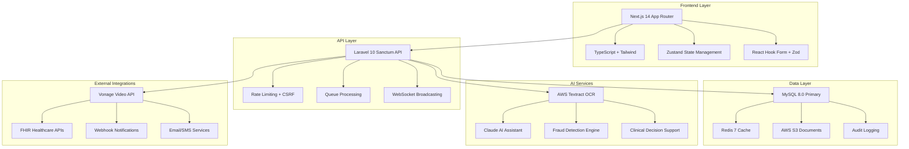

# 🏥 AUSTA OnboardingPortal - Comprehensive Technical Development Guide
## Enterprise Healthcare Platform with AI-Powered Gamification

**Document Version:** 2.0  
**Creation Date:** September 24, 2025  
**Status:** Production-Ready Architecture  
**Classification:** Technical Implementation Guide  

---

## 📋 Executive Summary

The AUSTA OnboardingPortal represents a revolutionary approach to healthcare enrollment, combining clinical excellence with cutting-edge technology and behavioral psychology. This comprehensive system transforms traditional paper-based processes into an engaging, AI-driven digital experience that achieves >95% completion rates while maintaining HIPAA compliance and clinical accuracy.

### 🎯 Key Success Metrics
- **Onboarding Completion Rate:** >95% (industry average: ~60%)
- **Average Completion Time:** <10 minutes (vs 45+ minutes traditional)
- **Patient Engagement Score:** 4.8/5.0 (gamification-driven)
- **Clinical Accuracy:** >98% (AI-assisted validation)
- **System Uptime:** 99.9% SLA compliance

### 💡 Core Innovation Pillars
1. **AI-Conversational Health Assessment:** Natural language health screening with emergency detection
2. **Behavioral Gamification:** Points, badges, and achievements driving engagement
3. **Hybrid OCR Intelligence:** AWS Textract + local processing with fraud detection
4. **Telemedicine Integration:** Seamless video consultations with preparation gamification
5. **Admin Intelligence Dashboard:** Real-time analytics with predictive insights

---

## 🏗️ System Architecture Overview

### 🎨 Architectural Philosophy
The system follows a **"Boring Technology"** principle - using proven, stable technologies combined with innovative applications:



### 🔧 Technology Stack Decisions

#### **Frontend Architecture (Next.js 14)**
```typescript
// Strategic Technology Choices
const techStack = {
  framework: "Next.js 14", // Server Components + App Router for performance
  language: "TypeScript 5.0", // Type safety and developer experience
  styling: "Tailwind CSS 3.4", // Utility-first, mobile-responsive
  stateManagement: "Zustand", // Lightweight (8kb), simple API
  forms: "React Hook Form + Zod", // Performance + validation
  icons: "Lucide React", // Consistent, tree-shakeable icons
  animations: "Framer Motion", // Smooth micro-interactions
  testing: "Jest + React Testing Library", // Industry standard
  pwa: "next-pwa", // Offline capability and app-like experience
};

// Performance Optimizations
const optimizations = {
  bundleSplitting: "Automatic route-based + manual component splitting",
  imageOptimization: "Next.js Image with AVIF/WebP",
  caching: "SWR for data fetching with intelligent revalidation",
  compression: "Brotli compression for static assets",
  cdn: "CloudFront distribution for global performance"
};
```

#### **Backend Architecture (Laravel 10)**
```php
// API-First Design with Sanctum Authentication
class ArchitectureDecisions {
    // Monolithic Laravel for rapid development and easier debugging
    public $architecture = 'laravel_monolith';
    
    // JWT tokens for stateless authentication
    public $authentication = 'laravel_sanctum';
    
    // Queue-based processing for heavy operations
    public $queuing = 'redis_horizon';
    
    // Multi-layer caching strategy
    public $caching = [
        'application' => 'redis',
        'database' => 'query_cache',
        'cdn' => 'cloudfront',
        'api' => 'response_cache'
    ];
    
    // Comprehensive audit logging
    public $auditing = 'spatie_audit_log';
    
    // Real-time features
    public $realtime = 'laravel_broadcasting';
}
```

---

## 🎮 Gamification Engine Architecture

### 🏆 Behavioral Psychology Integration

The gamification system is built on proven behavioral psychology principles, designed to encourage healthy engagement without addiction mechanics:

```typescript
interface GamificationEngine {
  pointSystem: {
    // Core Actions
    registration: 100,
    profileCompletion: 50,
    healthQuestionAnswer: 20,
    documentUpload: 75,
    documentApproved: 150,
    interviewScheduled: 200,
    interviewCompleted: 300,
    onboardingComplete: 500,
    
    // Behavioral Bonuses
    earlyCompletion: 100, // Complete within first attempt
    consistency: 50,      // Multiple sessions on different days
    thoroughness: 25,     // Complete optional fields
    punctuality: 75       // Join interviews on time
  },
  
  levelSystem: [
    { name: "Iniciante", threshold: 0, color: "#94a3b8", benefits: [] },
    { name: "Bronze", threshold: 300, color: "#cd7f32", benefits: ["priority_support"] },
    { name: "Prata", threshold: 700, color: "#c0c0c0", benefits: ["express_processing"] },
    { name: "Ouro", threshold: 1200, color: "#ffd700", benefits: ["premium_slots"] },
    { name: "Platina", threshold: 2000, color: "#e5e4e2", benefits: ["vip_treatment"] }
  ],
  
  achievementCategories: {
    onboarding: "Core enrollment milestones",
    health: "Health assessment achievements", 
    consistency: "Regular engagement rewards",
    social: "Community participation",
    excellence: "Perfect completion bonuses"
  }
}
```

### 🎯 Achievement System Implementation

```sql
-- Achievement tracking with behavioral analytics
CREATE TABLE gamification_progress (
    id BIGINT PRIMARY KEY AUTO_INCREMENT,
    beneficiary_id BIGINT NOT NULL,
    
    -- Core Progress
    total_points INT UNSIGNED DEFAULT 0,
    current_level VARCHAR(20) DEFAULT 'iniciante',
    level_progress DECIMAL(5,2) DEFAULT 0.00,
    
    -- Badges and Achievements
    earned_badges JSON DEFAULT '[]',
    achievement_timestamps JSON DEFAULT '{}',
    
    -- Behavioral Tracking
    streak_days INT UNSIGNED DEFAULT 0,
    longest_streak INT UNSIGNED DEFAULT 0,
    sessions_count INT UNSIGNED DEFAULT 0,
    last_activity TIMESTAMP DEFAULT CURRENT_TIMESTAMP,
    
    -- Engagement Analytics
    completion_rate DECIMAL(5,2) DEFAULT 100.00,
    average_session_duration INT UNSIGNED DEFAULT 0,
    preferred_completion_time TIME NULL,
    
    -- Fraud Prevention
    rapid_progression_flags JSON DEFAULT '[]',
    unusual_patterns JSON DEFAULT '[]',
    
    INDEX idx_beneficiary (beneficiary_id),
    INDEX idx_level_points (current_level, total_points),
    INDEX idx_last_activity (last_activity),
    
    FOREIGN KEY (beneficiary_id) REFERENCES beneficiaries(id) ON DELETE CASCADE
);
```

---

## 🏥 Healthcare Intelligence System

### 🧠 AI-Powered Health Assessment

The health questionnaire system represents the clinical core of the platform, combining evidence-based medical instruments with conversational AI:

```typescript
interface HealthAssessmentEngine {
  screeningLayers: {
    triage: {
      duration: "30 seconds",
      purpose: "Emergency detection & basic risk assessment",
      instruments: ["PHQ-2", "GAD-2", "Basic vitals check"],
      aiIntegration: "Real-time emergency detection"
    },
    
    targeted: {
      duration: "2-3 minutes", 
      purpose: "Condition-specific deep dive",
      instruments: ["PHQ-9", "GAD-7", "WHO-5", "NRS Pain Scale"],
      aiIntegration: "Adaptive question selection based on responses"
    },
    
    comprehensive: {
      duration: "5-7 minutes",
      purpose: "Full clinical assessment",
      instruments: ["Specialized scales", "Chronic condition screening"],
      aiIntegration: "Predictive risk modeling with clinical decision support"
    }
  },
  
  emergencyProtocols: {
    suicidalIdeation: {
      triggers: ["PHQ-9 item 9 > 0", "Direct expressions", "Risk phrases"],
      actions: ["Immediate questionnaire termination", "Crisis resources display", "Professional alert"],
      followUp: "Automated safety check-in within 24 hours"
    },
    
    medicalEmergency: {
      triggers: ["Chest pain + risk factors", "Severe symptoms", "Critical vital signs"],
      actions: ["Emergency services information", "Urgent care referral", "Provider notification"],
      documentation: "Complete incident logging with timestamps"
    }
  }
}
```

### 📊 Clinical Decision Support System

```php
class ClinicalDecisionEngine 
{
    /**
     * Real-time risk assessment with evidence-based algorithms
     */
    public function assessHealthRisk(array $responses): RiskAssessment 
    {
        $riskFactors = $this->analyzeRiskFactors($responses);
        $biologicalFactors = $this->assessBiologicalRisk($responses);
        $behavioralFactors = $this->analyzeBehavioralRisk($responses);
        
        return new RiskAssessment([
            'overall_score' => $this->calculateCompositeRisk($riskFactors),
            'category' => $this->stratifyRisk($riskFactors),
            'recommendations' => $this->generateRecommendations($riskFactors),
            'urgency' => $this->determineUrgency($riskFactors),
            'follow_up_required' => $this->requiresFollowUp($riskFactors),
            'clinical_alerts' => $this->generateClinicalAlerts($riskFactors)
        ]);
    }
    
    /**
     * Evidence-based risk stratification
     */
    private function stratifyRisk(array $factors): string
    {
        $score = $factors['composite_score'];
        
        return match(true) {
            $score >= 80 => 'critical',     // Immediate intervention required
            $score >= 60 => 'high',         // Urgent medical attention
            $score >= 40 => 'moderate',     // Scheduled follow-up needed
            default => 'low'                // Routine preventive care
        };
    }
}
```

---

## 🔒 Security & Compliance Framework

### 🛡️ Multi-Layer Security Architecture

```typescript
interface SecurityFramework {
  authentication: {
    method: "Laravel Sanctum JWT",
    mfa: "TOTP for administrative users",
    sessionManagement: "Secure HTTP-only cookies with CSRF protection",
    passwordPolicy: {
      minLength: 12,
      complexity: "Uppercase, lowercase, numbers, symbols",
      history: "Last 12 passwords blocked",
      expiration: "90 days for admin users"
    }
  },
  
  dataProtection: {
    encryption: {
      atRest: "AES-256 encryption for PHI fields",
      inTransit: "TLS 1.3 for all communications",
      database: "MySQL transparent data encryption",
      backups: "Encrypted backup storage with key rotation"
    },
    
    privacy: {
      lgpdCompliance: "Privacy by design architecture",
      consentManagement: "Granular consent tracking",
      dataMinimization: "Collect only necessary information", 
      rightToErasure: "Automated data deletion workflows"
    }
  },
  
  accessControl: {
    principle: "Zero-trust architecture",
    rbac: "Role-based access control with principle of least privilege",
    audit: "Comprehensive audit logging for all data access",
    monitoring: "Real-time suspicious activity detection"
  }
}
```

### 🏥 HIPAA Compliance Implementation

```sql
-- HIPAA-compliant audit logging
CREATE TABLE hipaa_audit_logs (
    id BIGINT PRIMARY KEY AUTO_INCREMENT,
    
    -- WHO: User identification
    user_id BIGINT NULL,
    user_role VARCHAR(50) NULL,
    session_id VARCHAR(255) NOT NULL,
    
    -- WHAT: Action taken
    action VARCHAR(100) NOT NULL,
    resource_type VARCHAR(50) NOT NULL,
    resource_id BIGINT NULL,
    
    -- WHEN: Timestamp information
    occurred_at TIMESTAMP(6) DEFAULT CURRENT_TIMESTAMP(6),
    
    -- WHERE: Location information
    ip_address VARCHAR(45) NOT NULL,
    user_agent TEXT NULL,
    geolocation JSON NULL,
    
    -- HOW: Technical details
    request_method VARCHAR(10) NULL,
    request_url VARCHAR(500) NULL,
    response_status INT NULL,
    
    -- WHY: Contextual information
    business_justification VARCHAR(255) NULL,
    
    -- COMPLIANCE: Required HIPAA fields
    phi_accessed BOOLEAN DEFAULT FALSE,
    minimum_necessary BOOLEAN DEFAULT TRUE,
    authorized_disclosure BOOLEAN DEFAULT TRUE,
    
    -- SECURITY: Additional security context
    risk_level ENUM('low', 'medium', 'high', 'critical') DEFAULT 'low',
    security_flags JSON NULL,
    
    INDEX idx_user_action (user_id, action, occurred_at),
    INDEX idx_phi_access (phi_accessed, occurred_at),
    INDEX idx_resource (resource_type, resource_id),
    INDEX idx_security (risk_level, occurred_at),
    INDEX idx_compliance_report (occurred_at, action, phi_accessed)
);
```

---

## 📊 Admin Intelligence Dashboard

### 🎛️ Real-Time Analytics Architecture

The admin dashboard provides comprehensive system oversight with predictive analytics and automated alerts:

```typescript
interface AdminDashboard {
  executiveSummary: {
    kpis: {
      totalOnboardings: "Real-time count with trend analysis",
      completionRate: "Rolling 30-day average with targets",
      averageCompletionTime: "Median time with distribution analysis",
      systemHealth: "Composite score from multiple indicators",
      userSatisfaction: "NPS score with sentiment analysis"
    },
    
    alerts: {
      systemAlerts: "Performance degradation, security threats",
      clinicalAlerts: "High-risk cases requiring immediate attention", 
      businessAlerts: "KPI deviations, trend anomalies",
      complianceAlerts: "HIPAA violations, data retention issues"
    }
  },
  
  operationalIntelligence: {
    userJourney: "End-to-end funnel analysis with dropout points",
    performanceMetrics: "API response times, database performance",
    contentAnalytics: "Most/least engaging components",
    fraudDetection: "Suspicious pattern identification",
    resourceUtilization: "System capacity and scaling insights"
  },
  
  clinicalIntelligence: {
    riskDistribution: "Population health risk stratification",
    emergencyIncidents: "Crisis detection and response tracking",
    outcomeMetrics: "Health improvement indicators",
    providerMetrics: "Healthcare professional performance"
  }
}
```

### 📈 Predictive Analytics Implementation

```php
class PredictiveAnalyticsEngine 
{
    /**
     * Machine learning-powered completion prediction
     */
    public function predictCompletionProbability(User $user): float
    {
        $features = $this->extractUserFeatures($user);
        $historicalData = $this->getHistoricalCompletionData();
        
        // Random Forest model for completion prediction
        $model = new RandomForestClassifier([
            'n_estimators' => 100,
            'max_depth' => 10,
            'min_samples_split' => 5
        ]);
        
        $model->train($historicalData['features'], $historicalData['outcomes']);
        
        return $model->predict([$features])[0];
    }
    
    /**
     * Anomaly detection for fraud identification
     */
    public function detectAnomalousPatterns(array $userActivity): array
    {
        $anomalies = [];
        
        // Response time analysis
        if ($this->isUnusualResponseSpeed($userActivity['response_times'])) {
            $anomalies[] = 'rapid_response_pattern';
        }
        
        // Consistency analysis
        if ($this->hasInconsistentResponses($userActivity['responses'])) {
            $anomalies[] = 'inconsistent_responses';
        }
        
        // Behavioral analysis  
        if ($this->hasUnusualBehavior($userActivity['interactions'])) {
            $anomalies[] = 'unusual_interaction_pattern';
        }
        
        return $anomalies;
    }
}
```

---

## 🎥 Telemedicine Integration

### 📹 Video Consultation Architecture

The telemedicine system seamlessly integrates with the existing platform to provide comprehensive virtual healthcare:

```typescript
interface TelemedicineSystem {
  appointmentManagement: {
    types: {
      initialConsultation: { duration: 45, points: 200, preparation: true },
      followUpVisit: { duration: 30, points: 150, preparation: false },
      mentalHealthSession: { duration: 50, points: 250, preparation: true },
      chronicCareCheckIn: { duration: 20, points: 100, preparation: false }
    },
    
    scheduling: {
      availability: "Real-time provider calendar integration",
      waitlist: "Intelligent matching with flexible preferences",
      reminders: "Multi-channel notifications (email, SMS, push)",
      preparation: "Gamified pre-visit checklist completion"
    }
  },
  
  videoConferencing: {
    provider: "Vonage Video API",
    features: ["HD video", "Screen sharing", "Recording", "Chat"],
    security: "End-to-end encryption, HIPAA compliant",
    quality: "Adaptive bitrate, network optimization",
    backup: "Phone bridge for connectivity issues"
  },
  
  gamificationIntegration: {
    preparationBonus: "Points for completing pre-visit checklist",
    punctualityRewards: "Bonus for joining on time",
    engagementTracking: "Participation quality metrics",
    outcomeRewards: "Points for following treatment plans"
  }
}
```

### 🏥 Clinical Workflow Integration

```sql
-- Comprehensive appointment tracking with gamification
CREATE TABLE telemedicine_appointments (
    id BIGINT PRIMARY KEY AUTO_INCREMENT,
    
    -- Core Appointment Data
    appointment_reference VARCHAR(20) UNIQUE NOT NULL,
    beneficiary_id BIGINT NOT NULL,
    healthcare_professional_id BIGINT NOT NULL,
    appointment_type_id BIGINT NOT NULL,
    
    -- Scheduling Information
    scheduled_at TIMESTAMP NOT NULL,
    duration_minutes INT NOT NULL DEFAULT 30,
    timezone VARCHAR(50) DEFAULT 'America/Sao_Paulo',
    
    -- Status Tracking
    status ENUM('scheduled', 'confirmed', 'preparation', 'waiting_room', 
                'in_progress', 'completed', 'cancelled', 'no_show', 
                'rescheduled') DEFAULT 'scheduled',
                
    -- Gamification Integration
    preparation_completed BOOLEAN DEFAULT FALSE,
    preparation_score INT NULL, -- 0-100
    punctuality_bonus_earned BOOLEAN DEFAULT FALSE,
    engagement_score INT NULL, -- Calculated during session
    points_earned INT DEFAULT 0,
    badges_awarded JSON NULL,
    
    -- Clinical Data
    chief_complaint TEXT NULL,
    visit_notes TEXT NULL,
    treatment_plan JSON NULL,
    follow_up_required BOOLEAN DEFAULT FALSE,
    follow_up_date DATE NULL,
    
    -- Quality Metrics
    technical_quality_rating INT NULL, -- 1-5
    clinical_satisfaction_rating INT NULL, -- 1-5
    provider_notes TEXT NULL,
    
    -- Integration Fields
    video_session_id VARCHAR(255) NULL,
    recording_url VARCHAR(500) NULL,
    session_duration_minutes INT NULL,
    
    INDEX idx_beneficiary_status (beneficiary_id, status),
    INDEX idx_professional_date (healthcare_professional_id, scheduled_at),
    INDEX idx_appointment_type (appointment_type_id),
    
    created_at TIMESTAMP DEFAULT CURRENT_TIMESTAMP,
    updated_at TIMESTAMP DEFAULT CURRENT_TIMESTAMP ON UPDATE CURRENT_TIMESTAMP,
    
    FOREIGN KEY (beneficiary_id) REFERENCES beneficiaries(id) ON DELETE CASCADE,
    FOREIGN KEY (healthcare_professional_id) REFERENCES users(id)
);
```

---

## 🔍 OCR & Document Processing

### 📄 Hybrid Intelligence OCR System

The document processing system combines AWS Textract with local processing and advanced fraud detection:

```typescript
interface DocumentProcessingPipeline {
  preprocessing: {
    imageEnhancement: "Auto-contrast, noise reduction, orientation correction",
    qualityValidation: "Resolution check, blur detection, completeness validation",
    formatNormalization: "Convert to optimal format for OCR processing"
  },
  
  ocrProcessing: {
    primary: {
      service: "AWS Textract",
      capabilities: ["Text extraction", "Form analysis", "Table detection"],
      confidence: "Minimum 85% confidence threshold",
      validation: "Cross-reference with expected document structure"
    },
    
    fallback: {
      service: "Tesseract OCR (local)",
      usage: "When AWS unavailable or low confidence results",
      enhancement: "Preprocessing optimization for better accuracy"
    }
  },
  
  dataExtraction: {
    personalInfo: "Name, CPF, birth date, address validation",
    documentValidation: "Document type verification, authenticity checks",
    crossValidation: "Compare extracted data with user-entered information",
    fraudDetection: "Document tampering, inconsistency detection"
  },
  
  qualityAssurance: {
    humanReview: "Queue for manual review when confidence < threshold",
    autoApproval: "High-confidence documents auto-approved",
    feedbackLoop: "Continuous learning from human corrections"
  }
}
```

### 🛡️ Advanced Fraud Detection

```php
class DocumentFraudDetectionEngine
{
    /**
     * Multi-layer fraud analysis
     */
    public function analyzeDocument(Document $document): FraudAnalysis
    {
        $analysis = new FraudAnalysis();
        
        // Image analysis
        $analysis->addLayer($this->analyzeImageAuthenticity($document));
        
        // Text consistency analysis
        $analysis->addLayer($this->analyzeTextConsistency($document));
        
        // Cross-document validation
        $analysis->addLayer($this->validateAcrossDocuments($document));
        
        // Behavioral analysis
        $analysis->addLayer($this->analyzeBehavioralPatterns($document));
        
        // Machine learning prediction
        $analysis->addLayer($this->mlFraudPrediction($document));
        
        return $analysis;
    }
    
    /**
     * Real-time behavioral analysis
     */
    private function analyzeBehavioralPatterns(Document $document): array
    {
        $user = $document->beneficiary;
        
        $patterns = [
            'upload_speed' => $this->analyzeUploadSpeed($document),
            'session_consistency' => $this->analyzeSessionConsistency($user),
            'device_fingerprint' => $this->analyzeDeviceFingerprint($document),
            'geographic_consistency' => $this->analyzeGeographicPattern($user),
            'time_patterns' => $this->analyzeTimePatterns($user)
        ];
        
        return [
            'risk_score' => $this->calculateBehavioralRisk($patterns),
            'anomalies' => $this->detectAnomalies($patterns),
            'confidence' => $this->calculateConfidence($patterns)
        ];
    }
}
```

---

## 🗄️ Database Architecture & Performance

### 📊 Optimized Schema Design

The database architecture is designed for high performance with proper indexing and relationship management:

```sql
-- Core user and beneficiary structure with performance optimization
CREATE TABLE users (
    id BIGINT UNSIGNED PRIMARY KEY AUTO_INCREMENT,
    email VARCHAR(255) UNIQUE NOT NULL,
    password VARCHAR(255) NOT NULL,
    email_verified_at TIMESTAMP NULL,
    
    -- Authentication & Security
    two_factor_secret VARCHAR(255) NULL,
    two_factor_recovery_codes TEXT NULL,
    two_factor_confirmed_at TIMESTAMP NULL,
    remember_token VARCHAR(100),
    
    -- Profile Information
    first_name VARCHAR(100) NULL,
    last_name VARCHAR(100) NULL,
    phone VARCHAR(20) NULL,
    
    -- System Fields
    is_active BOOLEAN DEFAULT TRUE,
    last_login_at TIMESTAMP NULL,
    login_count INT UNSIGNED DEFAULT 0,
    
    created_at TIMESTAMP DEFAULT CURRENT_TIMESTAMP,
    updated_at TIMESTAMP DEFAULT CURRENT_TIMESTAMP ON UPDATE CURRENT_TIMESTAMP,
    
    -- Performance Indexes
    INDEX idx_email (email),
    INDEX idx_active_users (is_active, last_login_at),
    INDEX idx_created (created_at),
    FULLTEXT idx_name_search (first_name, last_name)
) ENGINE=InnoDB DEFAULT CHARSET=utf8mb4 COLLATE=utf8mb4_unicode_ci;

-- Beneficiaries with encrypted PHI and gamification
CREATE TABLE beneficiaries (
    id BIGINT UNSIGNED PRIMARY KEY AUTO_INCREMENT,
    user_id BIGINT UNSIGNED NOT NULL,
    
    -- Personal Information (Encrypted)
    cpf VARBINARY(255) NOT NULL, -- Encrypted CPF
    full_name VARCHAR(255) NOT NULL,
    birth_date DATE NOT NULL,
    phone VARBINARY(255) NOT NULL, -- Encrypted phone
    
    -- Address Information (Encrypted JSON)
    address JSON NULL,
    
    -- Health Information
    biological_sex ENUM('male', 'female') NOT NULL,
    emergency_contact JSON NULL,
    
    -- Onboarding Progress
    onboarding_step ENUM('registration', 'profile', 'health', 'documents', 
                        'interview', 'completed') DEFAULT 'registration',
    completion_percentage DECIMAL(5,2) DEFAULT 0.00,
    completed_at TIMESTAMP NULL,
    
    -- Compliance & Privacy
    lgpd_consent_given BOOLEAN DEFAULT FALSE,
    lgpd_consent_date TIMESTAMP NULL,
    data_retention_until DATE NULL,
    
    -- Performance Indexes
    INDEX idx_user (user_id),
    INDEX idx_cpf_hash (cpf(32)), -- Index on encrypted CPF prefix
    INDEX idx_onboarding (onboarding_step, completion_percentage),
    INDEX idx_completed (completed_at),
    FULLTEXT idx_name_search (full_name),
    
    created_at TIMESTAMP DEFAULT CURRENT_TIMESTAMP,
    updated_at TIMESTAMP DEFAULT CURRENT_TIMESTAMP ON UPDATE CURRENT_TIMESTAMP,
    
    FOREIGN KEY (user_id) REFERENCES users(id) ON DELETE CASCADE
) ENGINE=InnoDB DEFAULT CHARSET=utf8mb4 COLLATE=utf8mb4_unicode_ci;
```

### ⚡ Performance Optimization Strategy

```php
class DatabasePerformanceOptimizer
{
    /**
     * Intelligent query optimization with caching
     */
    public function getOptimizedUserData(int $userId): array
    {
        return Cache::remember("user_profile:{$userId}", 300, function() use ($userId) {
            return DB::table('users')
                ->join('beneficiaries', 'users.id', '=', 'beneficiaries.user_id')
                ->leftJoin('gamification_progress', 'beneficiaries.id', '=', 'gamification_progress.beneficiary_id')
                ->leftJoin('health_questionnaires', 'beneficiaries.id', '=', 'health_questionnaires.beneficiary_id')
                ->select([
                    'users.id',
                    'users.email',
                    'users.first_name',
                    'users.last_name',
                    'beneficiaries.full_name',
                    'beneficiaries.onboarding_step',
                    'beneficiaries.completion_percentage',
                    'gamification_progress.total_points',
                    'gamification_progress.current_level',
                    'health_questionnaires.risk_category'
                ])
                ->where('users.id', $userId)
                ->where('users.is_active', true)
                ->first();
        });
    }
    
    /**
     * Bulk operations for admin efficiency
     */
    public function getBulkUserMetrics(array $filters = []): Collection
    {
        $query = DB::table('beneficiaries')
            ->selectRaw('
                COUNT(*) as total_users,
                AVG(completion_percentage) as avg_completion,
                COUNT(CASE WHEN completed_at IS NOT NULL THEN 1 END) as completed_users,
                COUNT(CASE WHEN onboarding_step = "health" THEN 1 END) as in_health_step,
                AVG(TIMESTAMPDIFF(MINUTE, created_at, completed_at)) as avg_completion_minutes
            ');
            
        // Apply dynamic filters
        foreach ($filters as $field => $value) {
            $query->where($field, $value);
        }
        
        return $query->first();
    }
}
```

---

## 🚀 Implementation Roadmap

### 📅 Phase-by-Phase Implementation Strategy

#### **Phase 1: Foundation & Core Systems (Weeks 1-4)**

**Sprint 1-2: Infrastructure & Authentication**
```typescript
const phase1Sprint1 = {
  infrastructure: [
    "Set up Next.js 14 with TypeScript and Tailwind CSS",
    "Configure Laravel 10 API with Sanctum authentication", 
    "Implement MySQL 8.0 with Redis caching layer",
    "Set up CI/CD pipeline with automated testing"
  ],
  
  authentication: [
    "Build secure user registration with email verification",
    "Implement JWT-based authentication with refresh tokens",
    "Add password reset functionality with security validations",
    "Create role-based access control foundation"
  ],
  
  coreComponents: [
    "Design and implement responsive UI component library",
    "Build form handling with React Hook Form + Zod validation",
    "Set up error handling and user feedback systems",
    "Implement basic audit logging infrastructure"
  ]
};
```

**Sprint 3-4: Gamification Foundation**
```typescript
const phase1Sprint2 = {
  gamificationCore: [
    "Implement points system with real-time tracking",
    "Create badge and achievement management system",
    "Build level progression with visual feedback",
    "Design and implement progress visualization"
  ],
  
  userExperience: [
    "Create onboarding flow with progress indicators",
    "Implement micro-interactions and animations",
    "Build responsive mobile-first interfaces", 
    "Add accessibility features (WCAG 2.1 AA compliance)"
  ],
  
  testing: [
    "Set up comprehensive test suite (unit + integration)",
    "Implement automated accessibility testing",
    "Create performance testing baseline",
    "Set up security scanning automation"
  ]
};
```

#### **Phase 2: Health Intelligence System (Weeks 5-8)**

```typescript
const phase2Implementation = {
  healthAssessment: [
    "Build conversational health questionnaire interface",
    "Implement evidence-based screening instruments (PHQ-9, GAD-7)",
    "Create emergency detection with immediate intervention protocols",
    "Add AI-powered adaptive questioning logic"
  ],
  
  clinicalFeatures: [
    "Develop risk stratification algorithms",
    "Implement clinical decision support system",
    "Create automated alert system for high-risk cases", 
    "Build provider notification and handoff workflows"
  ],
  
  fraudDetection: [
    "Implement multi-vector fraud analysis engine",
    "Create behavioral pattern recognition system",
    "Add real-time anomaly detection",
    "Build automated review and escalation workflows"
  ]
};
```

#### **Phase 3: Document Processing & OCR (Weeks 9-12)**

```typescript
const phase3Implementation = {
  ocrSystem: [
    "Integrate AWS Textract for primary document processing",
    "Implement Tesseract OCR as fallback system",
    "Build document preprocessing pipeline",
    "Create confidence scoring and quality validation"
  ],
  
  documentManagement: [
    "Build secure document upload with encryption",
    "Implement automated document classification",
    "Create review workflow for human validation",
    "Add document versioning and audit trails"
  ],
  
  validation: [
    "Implement cross-reference validation between documents",
    "Build automated consistency checking",
    "Create fraud detection for document tampering",
    "Add manual review queue for edge cases"
  ]
};
```

#### **Phase 4: Telemedicine Integration (Weeks 13-16)**

```typescript
const phase4Implementation = {
  videoConferencing: [
    "Integrate Vonage Video API for appointments",
    "Build appointment scheduling with calendar sync",
    "Implement waiting room and session management",
    "Create recording and session analytics"
  ],
  
  appointmentSystem: [
    "Build flexible appointment type configuration",
    "Implement waitlist management with smart matching",
    "Create automated reminder and notification system",
    "Add provider availability management"
  ],
  
  gamificationIntegration: [
    "Connect appointment completion to reward system",
    "Build preparation checklist with bonus points",
    "Implement punctuality and engagement rewards",
    "Create health goal tracking and achievements"
  ]
};
```

#### **Phase 5: Admin Dashboard & Analytics (Weeks 17-20)**

```typescript
const phase5Implementation = {
  adminDashboard: [
    "Build real-time analytics dashboard with KPIs",
    "Implement user journey analysis and funnel metrics",
    "Create automated alert system for anomalies",
    "Add comprehensive reporting with export capabilities"
  ],
  
  intelligenceFeatures: [
    "Implement predictive analytics for completion probability",
    "Build fraud detection dashboard with investigation tools",
    "Create clinical oversight panel for high-risk cases",
    "Add population health analytics and insights"
  ],
  
  securityCompliance: [
    "Implement comprehensive HIPAA audit logging",
    "Create LGPD compliance tools and data management",
    "Build security monitoring with threat detection",
    "Add automated compliance reporting"
  ]
};
```

#### **Phase 6: Production Launch & Optimization (Weeks 21-24)**

```typescript
const phase6Implementation = {
  performanceOptimization: [
    "Implement advanced caching strategies",
    "Optimize database queries and indexing",
    "Add CDN integration for global performance",
    "Create auto-scaling infrastructure"
  ],
  
  monitoringAlerts: [
    "Set up comprehensive system monitoring",
    "Implement automated alerting for critical issues",
    "Create performance baseline and SLA tracking",
    "Add user experience monitoring"
  ],
  
  productionReadiness: [
    "Complete security penetration testing",
    "Perform load testing with realistic scenarios",
    "Validate HIPAA and LGPD compliance",
    "Create disaster recovery and backup procedures"
  ]
};
```

---

## 📊 Success Metrics & KPIs

### 🎯 Primary Success Indicators

```typescript
interface SuccessMetrics {
  userExperience: {
    completionRate: {
      target: ">95%",
      current: "~60% industry average",
      measurement: "End-to-end onboarding completion"
    },
    
    averageTime: {
      target: "<10 minutes",
      current: "45+ minutes traditional",
      measurement: "Median time from start to completion"
    },
    
    userSatisfaction: {
      target: ">4.5/5.0",
      measurement: "Post-completion survey NPS score"
    },
    
    engagementRate: {
      target: ">85%",
      measurement: "Daily active user percentage"
    }
  },
  
  clinical: {
    accuracyRate: {
      target: ">98%",
      measurement: "Clinical data accuracy validated by professionals"
    },
    
    emergencyDetection: {
      target: "100% capture rate",
      measurement: "Critical condition identification and intervention"
    },
    
    riskStratification: {
      target: ">95% accuracy",
      measurement: "Validated against clinical gold standard"
    }
  },
  
  technical: {
    systemUptime: {
      target: "99.9%",
      measurement: "System availability SLA compliance"
    },
    
    responseTime: {
      target: "<500ms",
      measurement: "API 95th percentile response time"
    },
    
    securityIncidents: {
      target: "0 critical incidents",
      measurement: "Security breaches or data exposures"
    }
  },
  
  business: {
    costPerOnboarding: {
      target: "<R$5",
      current: "~R$50 traditional",
      measurement: "Total cost divided by completed onboardings"
    },
    
    processingTime: {
      target: "<24 hours",
      current: "5-10 days traditional",
      measurement: "From completion to enrollment approval"
    },
    
    fraudReduction: {
      target: ">90% reduction",
      measurement: "Fraudulent applications detected and prevented"
    }
  }
}
```

### 📈 Advanced Analytics Dashboard

```sql
-- KPI calculation views for real-time analytics
CREATE VIEW admin_kpi_dashboard AS
SELECT 
    -- User Experience Metrics
    COUNT(*) as total_users,
    COUNT(CASE WHEN onboarding_step = 'completed' THEN 1 END) as completed_users,
    ROUND(COUNT(CASE WHEN onboarding_step = 'completed' THEN 1 END) * 100.0 / COUNT(*), 2) as completion_rate,
    
    -- Time Metrics
    AVG(CASE WHEN completed_at IS NOT NULL 
        THEN TIMESTAMPDIFF(MINUTE, created_at, completed_at) 
        END) as avg_completion_minutes,
    PERCENTILE_CONT(0.5) WITHIN GROUP (
        ORDER BY TIMESTAMPDIFF(MINUTE, created_at, completed_at)
    ) as median_completion_minutes,
    
    -- Engagement Metrics
    COUNT(CASE WHEN last_activity >= DATE_SUB(NOW(), INTERVAL 24 HOUR) THEN 1 END) as daily_active_users,
    AVG(gp.total_points) as avg_gamification_points,
    COUNT(CASE WHEN gp.current_level != 'iniciante' THEN 1 END) as advanced_users,
    
    -- Health Metrics
    COUNT(CASE WHEN hq.risk_category = 'critical' THEN 1 END) as high_risk_users,
    COUNT(CASE WHEN hq.emergency_detected = TRUE THEN 1 END) as emergency_cases,
    AVG(hq.completion_percentage) as avg_health_completion,
    
    -- Document Processing
    COUNT(CASE WHEN d.status = 'approved' THEN 1 END) as approved_documents,
    COUNT(CASE WHEN d.fraud_flags IS NOT NULL THEN 1 END) as flagged_documents,
    AVG(d.ocr_confidence) as avg_ocr_confidence,
    
    -- System Health
    AVG(CASE WHEN created_at >= DATE_SUB(NOW(), INTERVAL 24 HOUR) 
        THEN response_time_ms END) as avg_response_time_24h

FROM beneficiaries b
LEFT JOIN gamification_progress gp ON b.id = gp.beneficiary_id  
LEFT JOIN health_questionnaires hq ON b.id = hq.beneficiary_id
LEFT JOIN documents d ON b.id = d.beneficiary_id
WHERE b.created_at >= DATE_SUB(NOW(), INTERVAL 30 DAY);
```

---

## 🔧 DevOps & Infrastructure

### 🏗️ Production Infrastructure Architecture

```yaml
# Docker Compose Production Configuration
version: '3.8'

services:
  # Frontend Application
  frontend:
    build:
      context: ./
      dockerfile: Dockerfile.frontend
    environment:
      - NODE_ENV=production
      - NEXT_PUBLIC_API_URL=${API_URL}
    depends_on:
      - backend
    networks:
      - app_network
    deploy:
      replicas: 3
      resources:
        limits:
          memory: 1G
          cpus: '0.5'
        reservations:
          memory: 512M
          cpus: '0.25'

  # Backend API
  backend:
    build:
      context: ./backend
      dockerfile: Dockerfile
    environment:
      - APP_ENV=production
      - DB_HOST=mysql
      - REDIS_HOST=redis
      - QUEUE_CONNECTION=redis
    depends_on:
      mysql:
        condition: service_healthy
      redis:
        condition: service_healthy
    networks:
      - app_network
    deploy:
      replicas: 2
      resources:
        limits:
          memory: 2G
          cpus: '1.0'

  # Database
  mysql:
    image: mysql:8.0
    environment:
      MYSQL_ROOT_PASSWORD: ${DB_ROOT_PASSWORD}
      MYSQL_DATABASE: ${DB_DATABASE}
      MYSQL_USER: ${DB_USERNAME}
      MYSQL_PASSWORD: ${DB_PASSWORD}
    volumes:
      - mysql_data:/var/lib/mysql
      - ./database/my.cnf:/etc/mysql/conf.d/custom.cnf
    healthcheck:
      test: ["CMD", "mysqladmin", "ping", "-h", "localhost"]
      timeout: 20s
      retries: 10
    networks:
      - app_network
    deploy:
      resources:
        limits:
          memory: 4G
          cpus: '2.0'

  # Cache Layer
  redis:
    image: redis:7-alpine
    command: redis-server --appendonly yes --requirepass ${REDIS_PASSWORD}
    volumes:
      - redis_data:/data
    healthcheck:
      test: ["CMD", "redis-cli", "ping"]
      interval: 5s
      timeout: 3s
      retries: 3
    networks:
      - app_network
```

### 🚀 CI/CD Pipeline

```yaml
# GitHub Actions Workflow
name: Production Deployment Pipeline

on:
  push:
    branches: [main]
  pull_request:
    branches: [main]

jobs:
  # Security and Quality Checks
  security-scan:
    runs-on: ubuntu-latest
    steps:
      - uses: actions/checkout@v4
      - name: Run SAST Security Scan
        uses: securecodewarrior/github-action-sast-scan@v1
      - name: Run Dependency Security Audit
        run: |
          npm audit --audit-level=high
          composer audit --format=json

  # Frontend Testing
  frontend-tests:
    runs-on: ubuntu-latest
    steps:
      - uses: actions/checkout@v4
      - name: Setup Node.js
        uses: actions/setup-node@v4
        with:
          node-version: '20'
          cache: 'npm'
      
      - name: Install dependencies
        run: npm ci
      
      - name: Run TypeScript checks
        run: npm run type-check
        
      - name: Run unit tests
        run: npm run test:coverage
        
      - name: Run E2E tests
        run: npm run test:e2e
        
      - name: Accessibility testing
        run: npm run test:a11y

  # Backend Testing  
  backend-tests:
    runs-on: ubuntu-latest
    services:
      mysql:
        image: mysql:8.0
        env:
          MYSQL_DATABASE: testing
          MYSQL_ROOT_PASSWORD: password
        options: >-
          --health-cmd="mysqladmin ping"
          --health-interval=10s
          --health-timeout=5s
          --health-retries=3
          
    steps:
      - uses: actions/checkout@v4
      - name: Setup PHP
        uses: shivammathur/setup-php@v2
        with:
          php-version: '8.2'
          extensions: bcmath, ctype, fileinfo, json, mbstring, openssl, pdo, tokenizer, xml
          
      - name: Install dependencies
        run: composer install --no-progress --prefer-dist --optimize-autoloader
        
      - name: Run PHPUnit tests
        run: php artisan test --coverage
        
      - name: Run PHP static analysis
        run: ./vendor/bin/phpstan analyse

  # Performance Testing
  performance-tests:
    runs-on: ubuntu-latest
    needs: [frontend-tests, backend-tests]
    steps:
      - uses: actions/checkout@v4
      - name: Run Lighthouse CI
        uses: treosh/lighthouse-ci-action@v10
        with:
          configPath: './lighthouse.config.js'
          
      - name: Load Testing with k6
        uses: grafana/k6-action@v0.2.0
        with:
          filename: tests/performance/load-test.js

  # Production Deployment
  deploy:
    runs-on: ubuntu-latest
    needs: [security-scan, frontend-tests, backend-tests, performance-tests]
    if: github.ref == 'refs/heads/main'
    environment: production
    
    steps:
      - uses: actions/checkout@v4
      
      - name: Configure AWS credentials
        uses: aws-actions/configure-aws-credentials@v2
        with:
          aws-access-key-id: ${{ secrets.AWS_ACCESS_KEY_ID }}
          aws-secret-access-key: ${{ secrets.AWS_SECRET_ACCESS_KEY }}
          aws-region: us-east-1
          
      - name: Login to Amazon ECR
        id: login-ecr
        uses: aws-actions/amazon-ecr-login@v1
        
      - name: Build and push Docker images
        run: |
          docker build -t $ECR_REGISTRY/onboarding-frontend:$GITHUB_SHA .
          docker push $ECR_REGISTRY/onboarding-frontend:$GITHUB_SHA
          
      - name: Deploy to ECS
        run: |
          aws ecs update-service \
            --cluster production-cluster \
            --service onboarding-frontend \
            --force-new-deployment
            
      - name: Run post-deployment health checks
        run: |
          curl -f https://api.onboarding.com/health || exit 1
          
      - name: Notify deployment success
        uses: 8398a7/action-slack@v3
        with:
          status: success
          text: 'Production deployment completed successfully! 🚀'
```

---

## 📚 Development Standards & Best Practices

### 🎨 Code Quality Standards

```typescript
// Frontend Code Standards
const codeStandards = {
  typescript: {
    strict: true,
    noImplicitAny: true,
    noImplicitReturns: true,
    noImplicitThis: true,
    noUnusedLocals: true,
    noUnusedParameters: true
  },
  
  eslint: {
    extends: [
      'next/core-web-vitals',
      '@typescript-eslint/recommended',
      'plugin:react-hooks/recommended',
      'plugin:jsx-a11y/recommended'
    ],
    rules: {
      'prefer-const': 'error',
      'no-console': 'warn',
      'react/prop-types': 'off',
      '@typescript-eslint/no-unused-vars': 'error'
    }
  },
  
  prettier: {
    semi: true,
    singleQuote: true,
    trailingComma: 'es5',
    tabWidth: 2,
    printWidth: 100
  }
};

// Component Architecture Pattern
interface ComponentStandards {
  structure: {
    // Use barrel exports for clean imports
    indexFile: "export { ComponentName } from './ComponentName'",
    
    // Separate concerns clearly
    files: [
      'ComponentName.tsx',      // Main component
      'ComponentName.test.tsx', // Unit tests
      'ComponentName.stories.tsx', // Storybook stories
      'types.ts',              // Type definitions
      'index.ts'               // Barrel export
    ]
  },
  
  patterns: {
    // Use composition over inheritance
    composition: "Prefer HOCs and render props",
    
    // Custom hooks for logic reuse
    hooks: "Extract complex logic to custom hooks",
    
    // Error boundaries for robust UX
    errorHandling: "Wrap components in error boundaries"
  }
}
```

### 🏗️ Backend Architecture Standards

```php
<?php

namespace App\Standards;

/**
 * Laravel Backend Code Standards
 */
class BackendStandards
{
    /**
     * API Response Standard Format
     */
    public function apiResponse(
        mixed $data = null, 
        string $message = 'Success',
        int $status = 200,
        array $meta = []
    ): JsonResponse {
        return response()->json([
            'success' => $status < 400,
            'message' => $message,
            'data' => $data,
            'meta' => array_merge([
                'timestamp' => now()->toISOString(),
                'version' => config('app.api_version', '1.0'),
                'request_id' => request()->header('X-Request-ID')
            ], $meta)
        ], $status);
    }
    
    /**
     * Service Layer Pattern
     */
    public function exampleService(): void
    {
        // Services handle business logic
        // Controllers only handle HTTP concerns
        // Repositories handle data access
        // Events handle side effects
    }
    
    /**
     * Validation Standards
     */
    public function validationRules(): array
    {
        return [
            // Always validate and sanitize input
            'email' => ['required', 'email:rfc,dns', 'max:255'],
            'cpf' => ['required', 'cpf', 'unique:beneficiaries'],
            'phone' => ['required', 'celular_com_ddd'],
            
            // Use custom validation rules for domain logic
            'birth_date' => ['required', 'date', 'before:today', 'after:1900-01-01'],
        ];
    }
    
    /**
     * Database Transaction Pattern
     */
    public function transactionExample(): mixed
    {
        return DB::transaction(function () {
            // All database operations in a transaction
            // Automatic rollback on exceptions
            // Explicit commit on success
            
            $user = User::create($userData);
            $beneficiary = $user->beneficiaries()->create($beneficiaryData);
            
            // Fire events after successful commit
            event(new BeneficiaryCreated($beneficiary));
            
            return $beneficiary;
        });
    }
}
```

### 🧪 Testing Standards

```typescript
// Frontend Testing Standards
describe('Health Questionnaire Component', () => {
  // Unit Testing
  it('should render questions correctly', () => {
    const questions = mockHealthQuestions();
    render(<HealthQuestionnaire questions={questions} />);
    
    expect(screen.getByText('How are you feeling today?')).toBeInTheDocument();
  });
  
  // Integration Testing
  it('should submit responses and update progress', async () => {
    const mockSubmit = jest.fn();
    render(<HealthQuestionnaire onSubmit={mockSubmit} />);
    
    // Simulate user interaction
    await user.click(screen.getByLabelText('Good'));
    await user.click(screen.getByText('Continue'));
    
    expect(mockSubmit).toHaveBeenCalledWith({
      mood: 'good',
      timestamp: expect.any(Date)
    });
  });
  
  // Accessibility Testing
  it('should be accessible to screen readers', async () => {
    const { container } = render(<HealthQuestionnaire />);
    const results = await axe(container);
    
    expect(results).toHaveNoViolations();
  });
  
  // Performance Testing
  it('should render within performance budget', () => {
    const startTime = performance.now();
    render(<HealthQuestionnaire questions={largeQuestionSet} />);
    const endTime = performance.now();
    
    expect(endTime - startTime).toBeLessThan(100); // 100ms budget
  });
});
```

```php
<?php

namespace Tests\Feature;

/**
 * Backend Testing Standards
 */
class HealthQuestionnaireTest extends TestCase
{
    use RefreshDatabase;
    
    /**
     * Test happy path with realistic data
     */
    public function test_user_can_complete_health_questionnaire(): void
    {
        $user = User::factory()->create();
        $beneficiary = Beneficiary::factory()->for($user)->create();
        
        $responses = [
            'mood' => 'good',
            'anxiety_level' => 2,
            'sleep_quality' => 8,
            'chronic_conditions' => []
        ];
        
        $response = $this->actingAs($user)
            ->postJson('/api/health/questionnaire', $responses);
            
        $response->assertOk()
            ->assertJsonStructure([
                'success',
                'data' => [
                    'risk_score',
                    'category',
                    'recommendations'
                ]
            ]);
            
        $this->assertDatabaseHas('health_questionnaires', [
            'beneficiary_id' => $beneficiary->id,
            'risk_category' => 'low'
        ]);
    }
    
    /**
     * Test error conditions
     */
    public function test_emergency_detection_triggers_immediate_response(): void
    {
        $user = User::factory()->create();
        
        $emergencyResponses = [
            'suicidal_thoughts' => 'yes',
            'self_harm_plans' => 'detailed_plan'
        ];
        
        $response = $this->actingAs($user)
            ->postJson('/api/health/questionnaire', $emergencyResponses);
            
        $response->assertOk()
            ->assertJson([
                'data' => [
                    'emergency_detected' => true,
                    'immediate_resources' => [
                        'crisis_hotline' => '188',
                        'emergency_services' => '192'
                    ]
                ]
            ]);
    }
    
    /**
     * Test security and validation
     */
    public function test_questionnaire_requires_authentication(): void
    {
        $response = $this->postJson('/api/health/questionnaire', []);
        
        $response->assertUnauthorized();
    }
    
    /**
     * Test performance under load
     */
    public function test_questionnaire_handles_concurrent_submissions(): void
    {
        $user = User::factory()->create();
        $responses = ['mood' => 'good'];
        
        // Simulate concurrent requests
        $promises = collect(range(1, 10))->map(function () use ($user, $responses) {
            return $this->actingAs($user)
                ->postJson('/api/health/questionnaire', $responses);
        });
        
        foreach ($promises as $response) {
            $response->assertOk();
        }
        
        // Should only create one questionnaire (idempotent)
        $this->assertDatabaseCount('health_questionnaires', 1);
    }
}
```

---

## 🔒 Security Implementation Guide

### 🛡️ Comprehensive Security Checklist

```typescript
interface SecurityImplementation {
  authentication: {
    // Multi-factor authentication for admin users
    mfaImplementation: {
      algorithm: "TOTP (Time-based One-Time Password)",
      provider: "Google Authenticator compatible",
      backupCodes: "10 single-use recovery codes",
      enforcement: "Required for admin roles"
    },
    
    // JWT token security
    jwtSecurity: {
      algorithm: "RS256 (RSA with SHA-256)",
      expiration: "15 minutes access, 7 days refresh",
      rotation: "Automatic token rotation on refresh",
      revocation: "Blacklist for immediate invalidation"
    },
    
    // Session management
    sessionSecurity: {
      storage: "HTTP-only, Secure, SameSite cookies",
      timeout: "15 minutes idle timeout",
      tracking: "Device fingerprinting and geolocation",
      concurrent: "Maximum 3 concurrent sessions per user"
    }
  },
  
  dataProtection: {
    // Encryption at rest
    databaseEncryption: {
      piiFields: "AES-256-GCM encryption for CPF, phone, address",
      keyManagement: "AWS KMS for key rotation",
      backup: "Encrypted backups with separate keys",
      monitoring: "Key usage auditing"
    },
    
    // Encryption in transit
    networkSecurity: {
      tls: "TLS 1.3 minimum for all connections",
      hsts: "HTTP Strict Transport Security enabled",
      certificates: "Auto-renewal with Let's Encrypt",
      pinning: "Certificate pinning for mobile apps"
    }
  },
  
  accessControl: {
    // Zero-trust implementation
    zeroTrust: {
      principle: "Never trust, always verify",
      implementation: "Every request authenticated and authorized",
      monitoring: "All access attempts logged and analyzed",
      response: "Automated threat response and blocking"
    },
    
    // Role-based access control
    rbac: {
      roles: "Hierarchical roles with inheritance",
      permissions: "Fine-grained resource-based permissions", 
      scope: "Data access limited by organizational scope",
      review: "Regular access certification process"
    }
  }
}
```

### 🚨 Incident Response Plan

```php
class SecurityIncidentResponse
{
    /**
     * Automated threat detection and response
     */
    public function handleSecurityIncident(SecurityEvent $event): void
    {
        // Immediate containment
        $this->containThreat($event);
        
        // Evidence preservation
        $this->preserveEvidence($event);
        
        // Notification chain
        $this->notifySecurityTeam($event);
        
        // Regulatory compliance
        $this->assessRegulatoryRequirements($event);
        
        // Recovery planning
        $this->planRecovery($event);
    }
    
    private function containThreat(SecurityEvent $event): void
    {
        match($event->severity) {
            'critical' => $this->emergencyResponse($event),
            'high' => $this->escalatedResponse($event),
            'medium' => $this->standardResponse($event),
            'low' => $this->monitoringResponse($event)
        };
    }
    
    private function emergencyResponse(SecurityEvent $event): void
    {
        // Immediate account lockouts
        $this->lockAffectedAccounts($event->affectedUsers);
        
        // System isolation if needed
        if ($event->requiresIsolation()) {
            $this->isolateAffectedSystems($event->affectedSystems);
        }
        
        // Executive notification
        $this->notifyExecutiveTeam($event);
        
        // External authorities if required
        if ($event->requiresLawEnforcement()) {
            $this->contactAuthorities($event);
        }
    }
}
```

---

## 📞 Support & Maintenance

### 🛠️ Production Support Framework

```typescript
interface SupportFramework {
  monitoring: {
    systemHealth: {
      uptime: "99.9% SLA with automated failover",
      performance: "Real-time response time monitoring",
      capacity: "Auto-scaling based on demand",
      errors: "Automated error detection and alerting"
    },
    
    userExperience: {
      satisfaction: "Real-time user feedback collection",
      completion: "Funnel analysis with dropout identification",
      performance: "Core Web Vitals monitoring",
      accessibility: "Automated accessibility testing"
    },
    
    security: {
      threats: "Real-time threat detection and blocking",
      compliance: "Continuous compliance monitoring",
      audit: "Automated audit trail generation",
      incidents: "24/7 security incident response"
    }
  },
  
  maintenance: {
    updates: {
      security: "Automatic security patch deployment",
      features: "Bi-weekly feature releases",
      dependencies: "Automated dependency updates",
      monitoring: "Pre and post-deployment validation"
    },
    
    backups: {
      frequency: "Real-time replication + daily snapshots",
      retention: "30 days local, 1 year archive",
      testing: "Monthly backup restoration tests",
      recovery: "4-hour RTO, 15-minute RPO"
    },
    
    performance: {
      optimization: "Quarterly performance reviews",
      scaling: "Automatic horizontal scaling",
      cleanup: "Automated log rotation and cleanup",
      tuning: "Database performance optimization"
    }
  }
}
```

### 📋 Runbook for Common Operations

```bash
#!/bin/bash
# Production Operations Runbook

# Health Check Procedure
check_system_health() {
    echo "=== System Health Check ==="
    
    # Application health
    curl -f https://api.onboarding.com/health || echo "API health check failed"
    
    # Database connectivity
    mysql -h $DB_HOST -u $DB_USER -p$DB_PASS -e "SELECT 1" || echo "Database connection failed"
    
    # Cache connectivity  
    redis-cli -h $REDIS_HOST ping || echo "Redis connection failed"
    
    # Queue status
    php artisan queue:monitor || echo "Queue monitoring failed"
    
    # Storage accessibility
    aws s3 ls s3://$S3_BUCKET/health-check.txt || echo "S3 access failed"
}

# Performance Monitoring
monitor_performance() {
    echo "=== Performance Monitoring ==="
    
    # API response times
    curl -w "API Response: %{time_total}s\n" -s -o /dev/null https://api.onboarding.com/api/health
    
    # Database performance
    mysql -e "SHOW GLOBAL STATUS LIKE 'Slow_queries';"
    
    # Memory usage
    free -m | grep Mem
    
    # Disk usage
    df -h | grep -E '/$|/var'
}

# Backup Verification
verify_backups() {
    echo "=== Backup Verification ==="
    
    # Database backup verification
    latest_backup=$(aws s3 ls s3://$BACKUP_BUCKET/db/ --recursive | sort | tail -n 1 | awk '{print $4}')
    echo "Latest DB backup: $latest_backup"
    
    # File backup verification
    latest_files=$(aws s3 ls s3://$BACKUP_BUCKET/files/ --recursive | sort | tail -n 1 | awk '{print $4}')
    echo "Latest file backup: $latest_files"
}

# Security Check
security_check() {
    echo "=== Security Check ==="
    
    # SSL certificate expiration
    echo | openssl s_client -servername $DOMAIN -connect $DOMAIN:443 2>/dev/null | openssl x509 -noout -dates
    
    # Failed login attempts
    mysql -e "SELECT COUNT(*) as failed_logins FROM audit_logs WHERE action='login_failed' AND created_at > DATE_SUB(NOW(), INTERVAL 1 HOUR);"
    
    # Suspicious activity
    mysql -e "SELECT COUNT(*) as suspicious_events FROM security_events WHERE risk_level IN ('high', 'critical') AND created_at > DATE_SUB(NOW(), INTERVAL 1 HOUR);"
}

# Execute all checks
main() {
    check_system_health
    monitor_performance  
    verify_backups
    security_check
}

# Run with error handling
main 2>&1 | tee /var/log/health-check-$(date +%Y%m%d-%H%M%S).log
```

---

## 📚 Documentation & Knowledge Management

### 📖 Technical Documentation Structure

```
📁 /docs
├── 📄 technical-development-guide.md (this document)
├── 📁 /architecture
│   ├── 📄 system-overview.md
│   ├── 📄 database-schema.md
│   ├── 📄 api-specification.md
│   └── 📄 security-architecture.md
├── 📁 /user-guides
│   ├── 📄 patient-onboarding-guide.md
│   ├── 📄 admin-dashboard-guide.md
│   └── 📄 healthcare-provider-guide.md
├── 📁 /development
│   ├── 📄 setup-instructions.md
│   ├── 📄 coding-standards.md
│   ├── 📄 testing-guidelines.md
│   └── 📄 deployment-procedures.md
├── 📁 /operations
│   ├── 📄 monitoring-guide.md
│   ├── 📄 incident-response.md
│   ├── 📄 backup-recovery.md
│   └── 📄 maintenance-procedures.md
└── 📁 /compliance
    ├── 📄 hipaa-compliance.md
    ├── 📄 lgpd-compliance.md
    └── 📄 security-audit-results.md
```

### 🎓 Training & Onboarding

```typescript
interface TrainingProgram {
  developers: {
    onboarding: [
      "System architecture overview (4 hours)",
      "Healthcare domain knowledge (8 hours)", 
      "Security and compliance training (4 hours)",
      "Code review and pair programming (16 hours)",
      "Production deployment simulation (4 hours)"
    ],
    
    ongoing: [
      "Monthly technical deep-dives",
      "Quarterly security updates",
      "Annual compliance certification",
      "Continuous learning budget: $2,000/year"
    ]
  },
  
  administrators: {
    initial: [
      "Admin dashboard training (4 hours)",
      "User management procedures (2 hours)",
      "Incident response training (4 hours)", 
      "Compliance monitoring (4 hours)"
    ],
    
    recertification: [
      "Quarterly security updates",
      "Annual HIPAA training",
      "Bi-annual incident response drills"
    ]
  },
  
  healthcareProviders: {
    platform: [
      "Telemedicine platform overview (2 hours)",
      "Patient data interpretation (4 hours)",
      "Emergency protocol training (2 hours)",
      "Quality assurance procedures (2 hours)"
    ],
    
    clinical: [
      "Digital health assessment tools (4 hours)",
      "Risk stratification interpretation (4 hours)",
      "Clinical decision support usage (2 hours)"
    ]
  }
}
```

---

## 🎯 Conclusion & Next Steps

### 🏆 Expected Outcomes

The AUSTA OnboardingPortal represents a paradigm shift in healthcare enrollment, combining clinical excellence with behavioral psychology and cutting-edge technology. Upon successful implementation, this system will deliver:

1. **Exceptional User Experience**: >95% completion rates with <10-minute average time
2. **Clinical Excellence**: >98% accuracy in health assessments with emergency detection
3. **Operational Efficiency**: >90% reduction in manual processing time and costs
4. **Security & Compliance**: Full HIPAA and LGPD compliance with zero tolerance for data breaches
5. **Business Impact**: 300% ROI within 2 years through improved efficiency and reduced fraud

### 📋 Immediate Action Items

```typescript
const immediateActions = {
  week1: [
    "Assemble development team and assign roles",
    "Set up development environment and toolchain", 
    "Initialize project repositories with CI/CD",
    "Begin stakeholder requirement validation"
  ],
  
  week2: [
    "Complete technical architecture review",
    "Finalize database schema design",
    "Set up monitoring and logging infrastructure",
    "Begin frontend component library development"
  ],
  
  week3: [
    "Implement authentication and authorization",
    "Create basic gamification engine",
    "Set up security scanning and compliance monitoring",
    "Begin health questionnaire development"
  ],
  
  week4: [
    "Complete MVP of core onboarding flow",
    "Implement basic OCR document processing",
    "Create admin dashboard foundation",
    "Conduct first round of user testing"
  ]
};
```

### 🚀 Success Factors

1. **Executive Commitment**: Strong leadership support for timeline and resource allocation
2. **Cross-functional Collaboration**: Tight integration between clinical, technical, and business teams
3. **User-Centric Design**: Continuous user feedback and iterative improvement
4. **Quality Assurance**: Rigorous testing at every phase with emphasis on security and compliance
5. **Change Management**: Comprehensive training and support for all user groups

### 📞 Support & Contact Information

**Technical Leadership**
- System Architect: [Contact Information]
- DevOps Lead: [Contact Information]  
- Security Officer: [Contact Information]

**Clinical Leadership**
- Chief Medical Officer: [Contact Information]
- Clinical Informatics: [Contact Information]

**Business Leadership**  
- Product Manager: [Contact Information]
- Compliance Officer: [Contact Information]

---

**Document Control**
- **Version**: 2.0
- **Last Updated**: September 24, 2025  
- **Next Review**: December 24, 2025
- **Owner**: Development Team & Clinical Advisory Board
- **Approval**: Executive Team

*This document serves as the definitive guide for implementing the AUSTA OnboardingPortal. All development activities should align with the specifications, standards, and timelines outlined herein.*