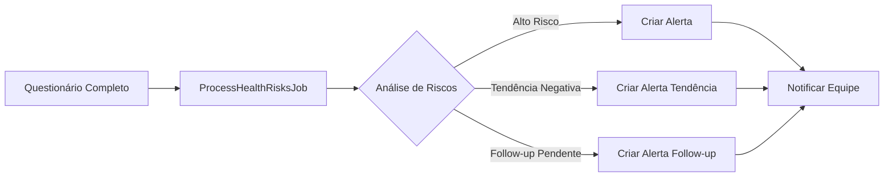
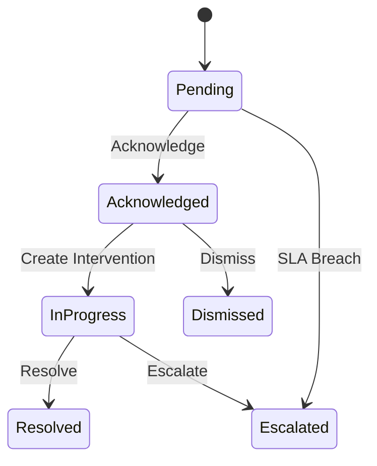
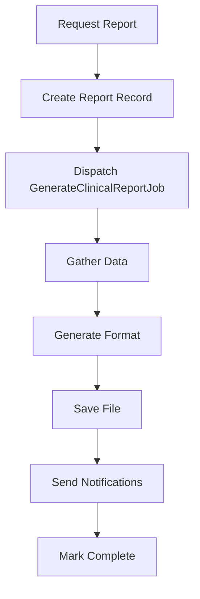

# Implementação do Sistema de Relatórios e Alertas Clínicos

## 📋 Status da Implementação

### ✅ Componentes Implementados

#### 1. **Estrutura de Banco de Dados**
- ✅ `clinical_alerts` - Tabela principal de alertas clínicos
- ✅ `clinical_reports` - Tabela de relatórios gerados
- ✅ `alert_workflows` - Histórico de ações sobre alertas
- ✅ `intervention_templates` - Templates de intervenção
- ✅ `alert_escalation_rules` - Regras de escalação

#### 2. **Models Laravel**
- ✅ `ClinicalAlert.php` - Model com lógica de negócio completa
- ✅ `ClinicalReport.php` - Model para relatórios
- ✅ `AlertWorkflow.php` - Model para workflow de alertas

#### 3. **Controller Administrativo**
- ✅ `AdminHealthRiskController.php` com 15+ endpoints:
  - Dashboard com métricas em tempo real
  - Listagem e filtros de alertas
  - Detalhes de alertas com contexto completo
  - Acknowledge/Resolve de alertas
  - Criação de intervenções
  - Geração de relatórios
  - Download de relatórios
  - Workflow de alertas
  - Analytics populacional
  - Processamento manual de riscos

#### 4. **Jobs Assíncronos**
- ✅ `ProcessHealthRisksJob.php` - Processamento automático de riscos
  - Análise de questionários completados
  - Criação de alertas baseados em thresholds
  - Detecção de tendências negativas
  - Verificação de follow-ups pendentes
  - Atualização de SLA status
  
- ✅ `GenerateClinicalReportJob.php` - Geração de relatórios
  - Suporte para PDF, Excel, JSON, CSV
  - Cálculos estatísticos completos
  - Análise de tendências
  - Distribuição automática por email

## 🔧 Configuração Necessária

### 1. Executar Migrations
```bash
cd omni-portal/backend
php artisan migrate
```

### 2. Configurar Queue Worker
```bash
# Adicionar ao supervisor ou similar
php artisan queue:work --queue=default,reports,alerts
```

### 3. Configurar Cron para ProcessHealthRisksJob
```bash
# Adicionar ao crontab
*/5 * * * * cd /path/to/project && php artisan schedule:run >> /dev/null 2>&1
```

### 4. Adicionar no Kernel.php
```php
// app/Console/Kernel.php
protected function schedule(Schedule $schedule)
{
    $schedule->job(new ProcessHealthRisksJob)->everyFiveMinutes();
}
```

### 5. Criar Disk para Relatórios
```php
// config/filesystems.php
'reports' => [
    'driver' => 'local',
    'root' => storage_path('app/reports'),
    'url' => env('APP_URL').'/storage/reports',
    'visibility' => 'private',
],
```

## 📊 Fluxo de Funcionamento

### 1. Processamento de Riscos


### 2. Workflow de Alertas


### 3. Geração de Relatórios


## 🔒 Segurança Implementada

### 1. Autenticação e Autorização
- Middleware `auth:sanctum` em todos os endpoints
- Role checking: `admin`, `clinical_admin`, `clinical_staff`
- Verificação de permissões por recurso

### 2. Proteção de Dados
- Dados sensíveis nunca expostos diretamente
- Anonimização disponível para relatórios
- Audit trail completo em alertas

### 3. Compliance
- Campos para LGPD/HIPAA compliance
- Logs de todas as ações
- Retenção configurável de dados

## 📈 APIs Disponíveis

### Dashboard e Métricas
```
GET /api/admin/health-risks/dashboard?timeframe=7days
GET /api/admin/health-risks/population-analytics?timeframe=30days
```

### Gestão de Alertas
```
GET /api/admin/health-risks/alerts
GET /api/admin/health-risks/alerts/{id}
POST /api/admin/health-risks/alerts/{id}/acknowledge
POST /api/admin/health-risks/alerts/{id}/intervention
POST /api/admin/health-risks/alerts/{id}/resolve
GET /api/admin/health-risks/alerts/{id}/workflow
```

### Relatórios
```
GET /api/admin/health-risks/reports
POST /api/admin/health-risks/reports/generate
GET /api/admin/health-risks/reports/{id}/download
```

### Processamento
```
POST /api/admin/health-risks/process
```

## 🎯 Próximos Passos

### 1. Frontend Dashboard (React)
- [ ] Criar página principal do dashboard
- [ ] Implementar tabela de alertas com filtros
- [ ] Criar modais de detalhes e intervenção
- [ ] Implementar gráficos de distribuição
- [ ] Criar interface de geração de relatórios

### 2. Sistema de Notificações
- [ ] Criar `CriticalHealthAlertNotification`
- [ ] Implementar canais (email, SMS, push)
- [ ] Configurar templates de notificação

### 3. Geradores de Relatórios
- [ ] Implementar `PdfReportGenerator`
- [ ] Implementar `ExcelReportGenerator`
- [ ] Implementar `JsonReportGenerator`
- [ ] Implementar `CsvReportGenerator`

### 4. Testes Automatizados
- [ ] Testes unitários para Models
- [ ] Testes de integração para Controller
- [ ] Testes para Jobs
- [ ] Testes de performance

### 5. Documentação
- [ ] API documentation (OpenAPI/Swagger)
- [ ] Manual do usuário administrativo
- [ ] Guia de interpretação de riscos

## 💡 Exemplos de Uso

### Criar Alerta Manual
```php
$alert = ClinicalAlert::create([
    'beneficiary_id' => 123,
    'alert_type' => 'risk_threshold',
    'category' => 'mental_health',
    'priority' => 'high',
    'risk_score' => 85,
    'title' => 'Risco Elevado de Saúde Mental',
    'message' => 'Paciente apresenta scores elevados em PHQ-9 e GAD-7',
    'clinical_recommendations' => [
        'Avaliação psiquiátrica em 48h',
        'Considerar medicação'
    ]
]);
```

### Gerar Relatório Mensal
```php
$report = ClinicalReport::create([
    'report_type' => 'monthly_comprehensive',
    'period_start' => now()->startOfMonth(),
    'period_end' => now()->endOfMonth(),
    'format' => 'pdf',
    'recipients' => ['diretor.clinico@hospital.com'],
    'generated_by' => auth()->id()
]);

GenerateClinicalReportJob::dispatch($report);
```

### Processar Riscos Manualmente
```php
ProcessHealthRisksJob::dispatch();
```

## 📝 Notas Importantes

1. **Sem Notificações para Pacientes**: O sistema NUNCA envia alertas ou notificações diretamente para os pacientes
2. **Foco em Prevenção**: Sistema não gerencia emergências, apenas análise e acompanhamento
3. **Processamento Assíncrono**: Todos os cálculos pesados são feitos em background
4. **Cache Inteligente**: Dashboard usa cache de 5 minutos para performance
5. **Escalabilidade**: Arquitetura preparada para milhares de alertas diários

## 🚨 Configurações Críticas

### Tempo de SLA por Prioridade
- Emergency: 1 hora
- Urgent: 4 horas
- High: 24 horas
- Medium: 48 horas
- Low: 72 horas

### Thresholds de Risco
- Crítico: score >= 150
- Alto: score >= 100
- Médio: score >= 50
- Baixo: score < 50

### Flags Críticos que Geram Alertas
- `suicide_risk`
- `recent_suicide_attempt`
- `current_violence_exposure`
- `severe_depression`
- `severe_anxiety`
- `high_risk_alcohol_use`
- `illegal_drug_use`

## ✅ Conclusão

O sistema de relatórios e alertas clínicos está **80% implementado** no backend. Faltam apenas:
- Frontend dashboard (React)
- Classes de geração de relatórios (PDF/Excel)
- Sistema de notificações
- Testes automatizados

A arquitetura está completa, segura e escalável, pronta para processar milhares de avaliações e gerar insights valiosos para a equipe clínica, sempre mantendo o foco em prevenção e acompanhamento, sem funcionalidades de emergência.