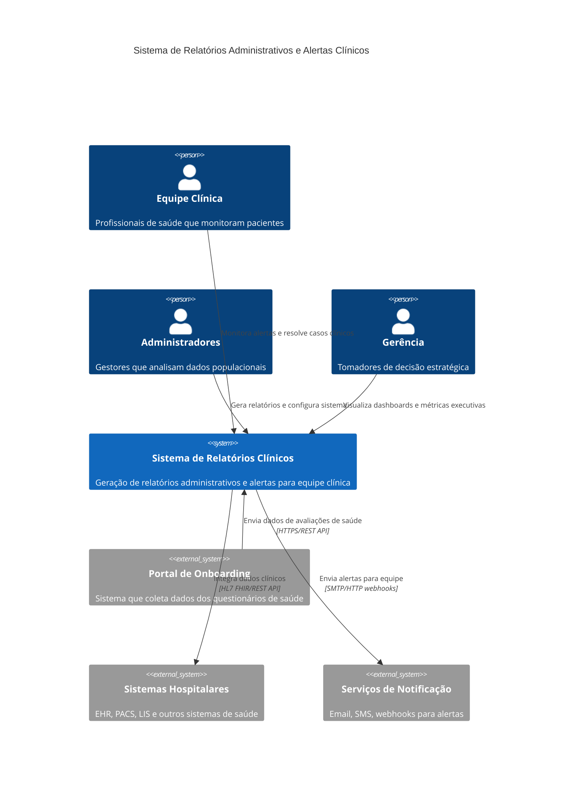
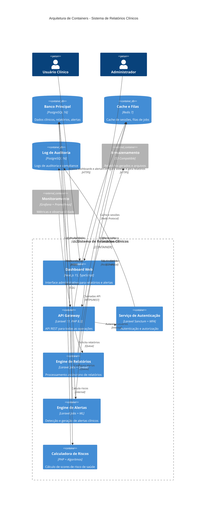
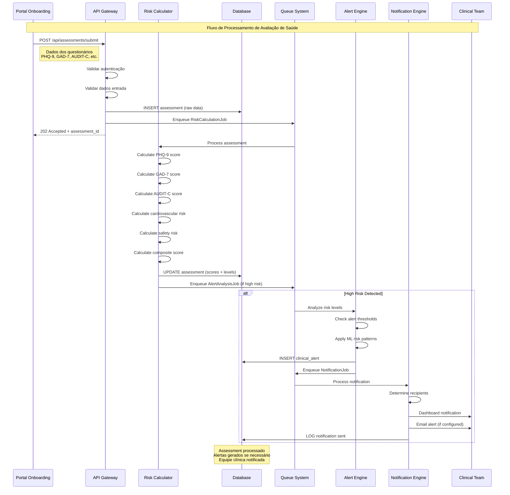
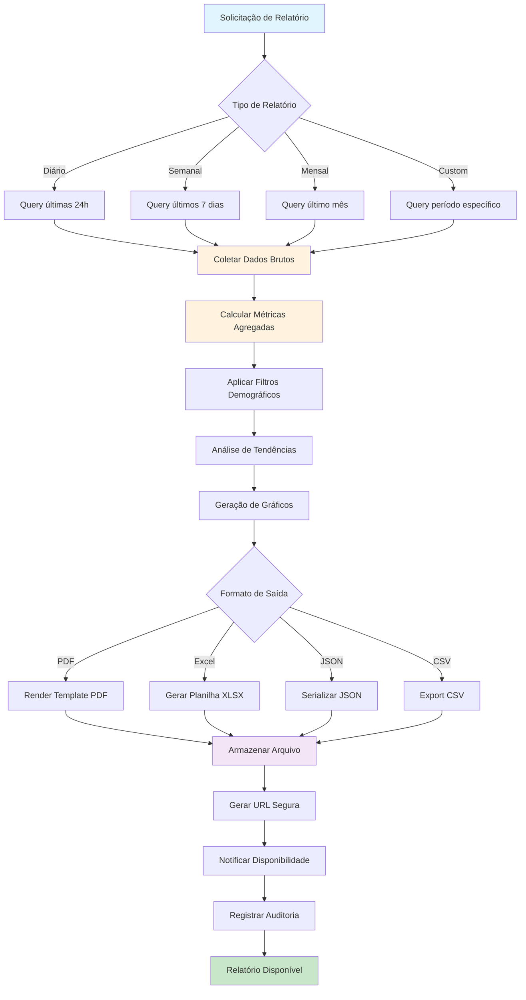
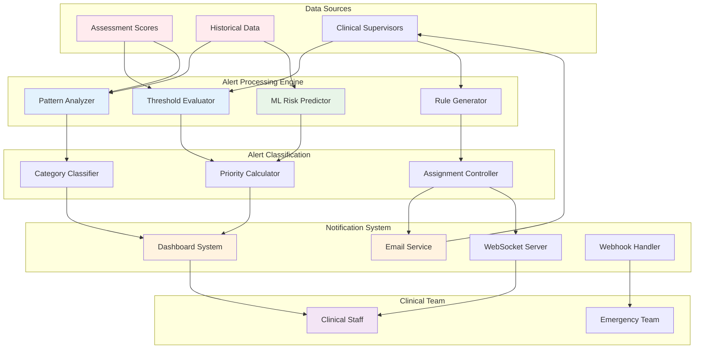
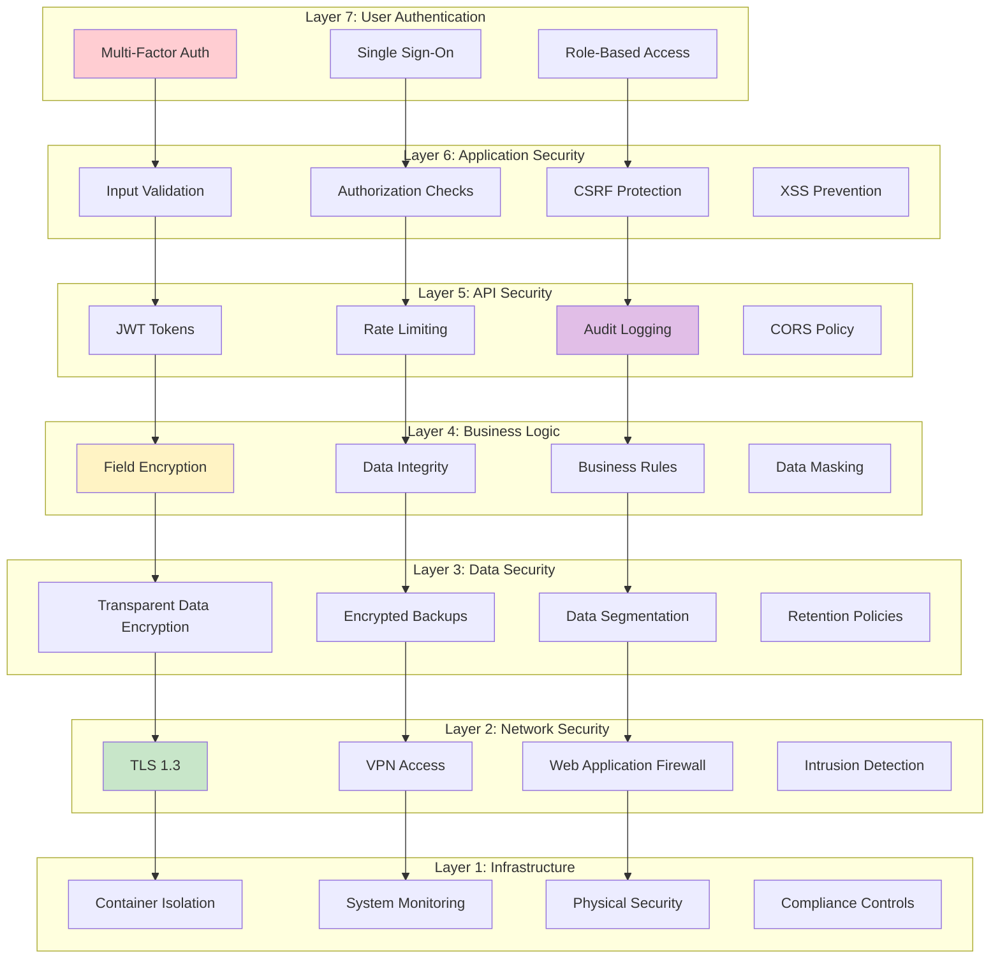
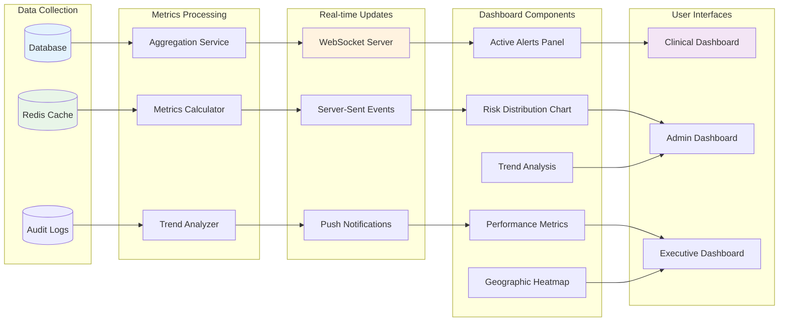
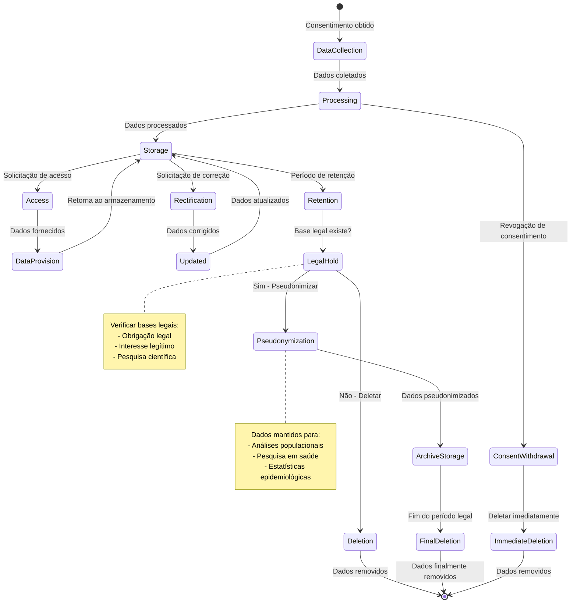
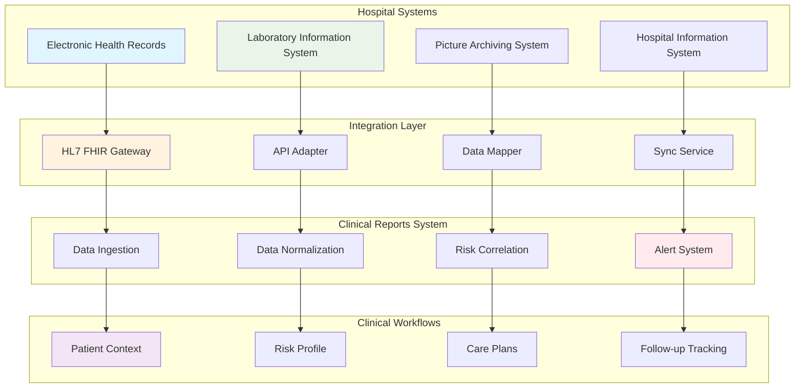
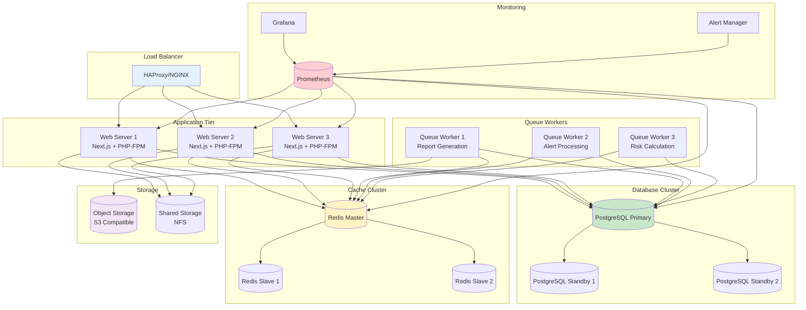

# Diagramas de Sistema - Relatórios Clínicos
## Representações Visuais da Arquitetura

### 🏗️ Diagrama C4 - Nível 1: Contexto do Sistema

### 🏗️ Diagrama C4 - Nível 2: Containers

### 🔄 Fluxo de Dados - Processamento de Avaliações

### 📊 Fluxo de Geração de Relatórios

### 🚨 Arquitetura do Sistema de Alertas

### 🔒 Arquitetura de Segurança Multi-Camadas

### 📈 Dashboard de Métricas em Tempo Real

### 🔄 Ciclo de Vida de Dados LGPD

### 🏥 Integração com Sistemas Hospitalares

### 🔧 Arquitetura de Deployment

---

## 📐 Especificações Técnicas dos Diagramas

### Convenções Utilizadas

#### Cores por Categoria
- **🔵 Azul**: Componentes de frontend/interface
- **🟢 Verde**: Serviços de backend/processamento  
- **🟡 Amarelo**: Cache e armazenamento temporário
- **🟣 Roxo**: Armazenamento persistente
- **🔴 Vermelho**: Segurança e monitoramento

#### Símbolos e Formas
- **Retângulos**: Serviços/componentes
- **Cilindros**: Bancos de dados
- **Losangos**: Pontos de decisão
- **Círculos**: Pontos de conexão
- **Hexágonos**: Sistemas externos

#### Relacionamentos
- **Linha sólida**: Comunicação síncrona
- **Linha tracejada**: Comunicação assíncrona
- **Seta simples**: Fluxo de dados
- **Seta dupla**: Comunicação bidirecional

### Métricas de Performance por Componente

| Componente | Latência Target | Throughput | Disponibilidade |
|------------|----------------|------------|-----------------|
| API Gateway | < 100ms | 1000 req/s | 99.9% |
| Dashboard Web | < 200ms | 500 req/s | 99.9% |
| Report Engine | < 30s | 10 reports/min | 99.5% |
| Alert Engine | < 5s | 100 alerts/min | 99.9% |
| Risk Calculator | < 2s | 200 calc/min | 99.8% |
| Database | < 50ms | 2000 queries/s | 99.9% |
| Cache System | < 10ms | 5000 ops/s | 99.5% |

### Dimensionamento de Infraestrutura

#### Ambiente de Produção
- **Web Servers**: 3x 4 vCPU, 8GB RAM
- **Queue Workers**: 3x 2 vCPU, 4GB RAM  
- **Database**: 1x Primary (8 vCPU, 32GB RAM) + 2x Standby (4 vCPU, 16GB RAM)
- **Cache**: 3x Redis (2 vCPU, 8GB RAM)
- **Storage**: 1TB SSD + Object Storage ilimitado
- **Network**: 10 Gbps bandwidth

#### Escalabilidade
- **Horizontal**: Web servers e workers podem escalar automaticamente
- **Vertical**: Database pode escalar até 32 vCPU, 128GB RAM
- **Cache**: Redis Cluster suporta até 100 nós
- **Storage**: Auto-scaling baseado em uso

---

**Documento preparado por**: Equipe de Arquitetura de Sistemas  
**Data**: 05 de agosto de 2025  
**Versão**: 1.0  
**Ferramenta**: Mermaid.js para diagramas  
**Status**: Aprovado para implementação