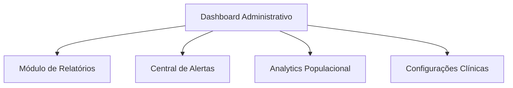
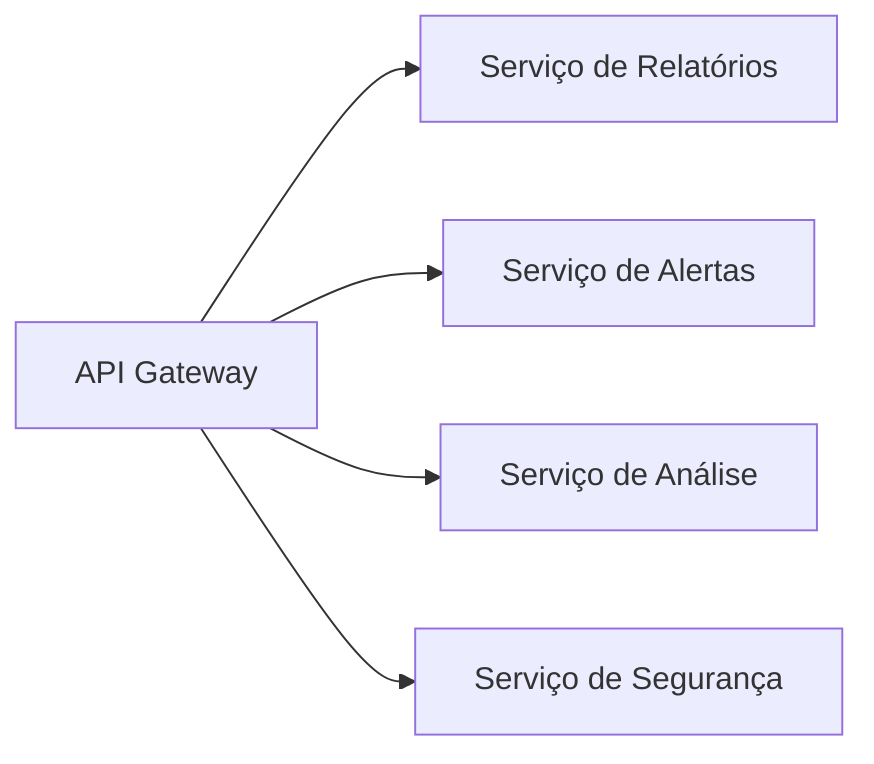
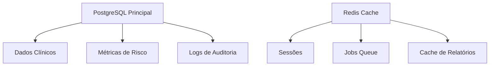
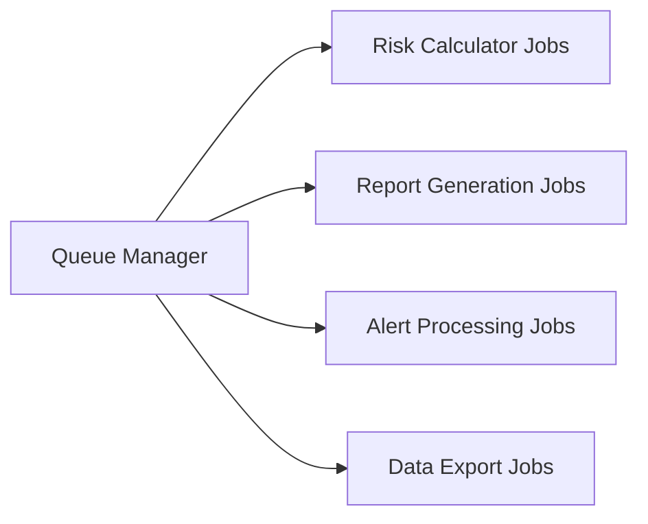
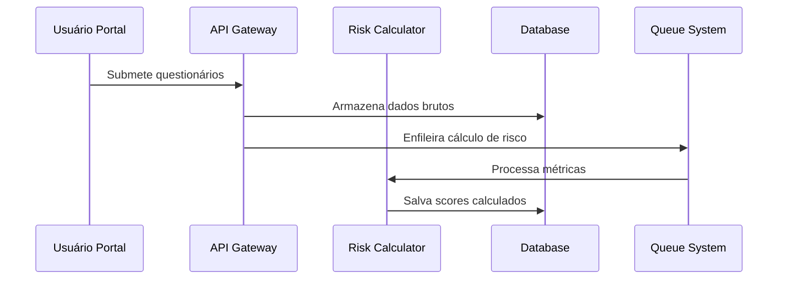
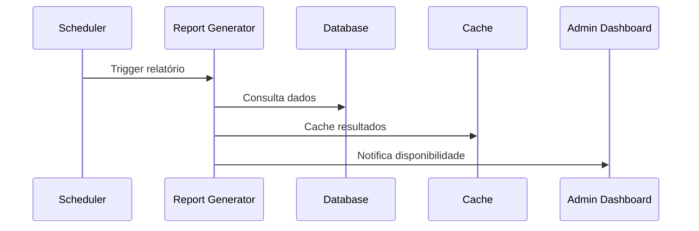
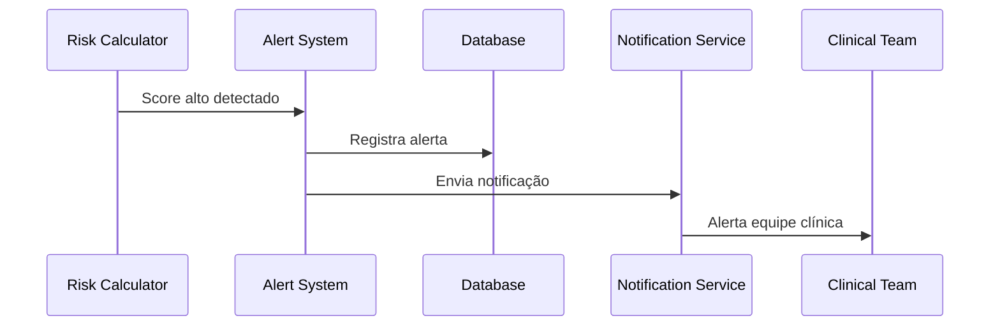

# Sistema de Relatórios Administrativos e Alertas Clínicos
## Documento de Arquitetura Técnica v1.0

### 📋 Visão Geral

Sistema especializado em relatórios administrativos e alertas internos para equipe clínica, baseado em análise de riscos de saúde mental e física. **CRÍTICO**: Sem funcionalidades de atendimento direto ao paciente ou notificações para usuários finais.

### 🎯 Objetivos Estratégicos

- **Prevenção**: Identificação precoce de riscos populacionais
- **Acompanhamento**: Monitoramento contínuo de indicadores de saúde
- **Análise Populacional**: Insights para tomada de decisão clínica
- **Compliance**: Adequação total à LGPD e HIPAA

---

## 🏗️ Arquitetura de Componentes

### 1. Camada de Apresentação (Frontend Admin)


**Tecnologias**: Next.js 15, TypeScript, TailwindCSS, Chart.js
**Responsabilidades**:
- Interface administrativa segura
- Visualização de dados em tempo real
- Exportação de relatórios
- Configuração de alertas

### 2. Camada de API (Backend Services)


**Tecnologias**: Laravel 11, PHP 8.3, Redis, PostgreSQL
**Responsabilidades**:
- Autenticação e autorização
- Processamento de dados clínicos
- Geração de relatórios
- Gestão de alertas internos

### 3. Camada de Dados


### 4. Camada de Processamento


---

## 📊 Fluxo de Dados

### 1. Coleta e Processamento


### 2. Geração de Relatórios


### 3. Sistema de Alertas


---

## 🗄️ Estrutura de Banco de Dados

### Tabelas Principais

#### 1. health_risk_assessments
```sql
CREATE TABLE health_risk_assessments (
    id UUID PRIMARY KEY DEFAULT gen_random_uuid(),
    user_id UUID NOT NULL,
    assessment_date TIMESTAMP WITH TIME ZONE NOT NULL,
    
    -- Scores PHQ-9 (Depressão)
    phq9_total_score INTEGER CHECK (phq9_total_score BETWEEN 0 AND 27),
    phq9_risk_level risk_level_enum NOT NULL,
    
    -- Scores GAD-7 (Ansiedade)
    gad7_total_score INTEGER CHECK (gad7_total_score BETWEEN 0 AND 21),
    gad7_risk_level risk_level_enum NOT NULL,
    
    -- Scores AUDIT-C (Álcool)
    audit_c_total_score INTEGER CHECK (audit_c_total_score BETWEEN 0 AND 12),
    audit_c_risk_level risk_level_enum NOT NULL,
    
    -- Scores NIDA (Drogas)
    nida_total_score INTEGER CHECK (nida_total_score BETWEEN 0 AND 60),
    nida_risk_level risk_level_enum NOT NULL,
    
    -- Riscos Cardiovasculares
    cardiovascular_score INTEGER CHECK (cardiovascular_score BETWEEN 0 AND 108),
    cardiovascular_risk_level risk_level_enum NOT NULL,
    
    -- Riscos de Segurança
    safety_score INTEGER CHECK (safety_score BETWEEN 0 AND 60),
    safety_risk_level risk_level_enum NOT NULL,
    
    -- Metadados
    created_at TIMESTAMP WITH TIME ZONE DEFAULT NOW(),
    updated_at TIMESTAMP WITH TIME ZONE DEFAULT NOW(),
    processed_at TIMESTAMP WITH TIME ZONE,
    
    -- Indices
    INDEX idx_assessment_date (assessment_date),
    INDEX idx_user_date (user_id, assessment_date),
    INDEX idx_risk_levels (phq9_risk_level, gad7_risk_level, audit_c_risk_level)
);
```

#### 2. clinical_alerts
```sql
CREATE TABLE clinical_alerts (
    id UUID PRIMARY KEY DEFAULT gen_random_uuid(),
    assessment_id UUID REFERENCES health_risk_assessments(id),
    user_id UUID NOT NULL,
    
    alert_type alert_type_enum NOT NULL,
    priority priority_enum NOT NULL,
    risk_category risk_category_enum NOT NULL,
    
    title VARCHAR(255) NOT NULL,
    description TEXT NOT NULL,
    recommended_actions JSONB,
    
    -- Status e Workflow
    status alert_status_enum DEFAULT 'pending',
    assigned_to UUID, -- ID do profissional
    acknowledged_at TIMESTAMP WITH TIME ZONE,
    resolved_at TIMESTAMP WITH TIME ZONE,
    
    -- Auditoria
    created_at TIMESTAMP WITH TIME ZONE DEFAULT NOW(),
    updated_at TIMESTAMP WITH TIME ZONE DEFAULT NOW(),
    
    INDEX idx_alert_status (status, priority),
    INDEX idx_alert_assigned (assigned_to, status),
    INDEX idx_alert_category (risk_category, created_at)
);
```

#### 3. administrative_reports
```sql
CREATE TABLE administrative_reports (
    id UUID PRIMARY KEY DEFAULT gen_random_uuid(),
    
    report_type report_type_enum NOT NULL,
    period_start DATE NOT NULL,
    period_end DATE NOT NULL,
    
    -- Metadados do Relatório
    title VARCHAR(255) NOT NULL,
    description TEXT,
    parameters JSONB,
    
    -- Dados Agregados
    total_assessments INTEGER DEFAULT 0,
    high_risk_count INTEGER DEFAULT 0,
    medium_risk_count INTEGER DEFAULT 0,
    low_risk_count INTEGER DEFAULT 0,
    
    -- Métricas por Categoria
    depression_metrics JSONB,
    anxiety_metrics JSONB,
    substance_metrics JSONB,
    cardiovascular_metrics JSONB,
    safety_metrics JSONB,
    
    -- Status e Geração
    status report_status_enum DEFAULT 'generating',
    file_path VARCHAR(500),
    file_size BIGINT,
    
    generated_by UUID NOT NULL,
    generated_at TIMESTAMP WITH TIME ZONE DEFAULT NOW(),
    
    INDEX idx_report_period (period_start, period_end),
    INDEX idx_report_type (report_type, status),
    INDEX idx_report_generated (generated_at DESC)
);
```

### Enums Definidos
```sql
CREATE TYPE risk_level_enum AS ENUM ('low', 'medium', 'high', 'critical');
CREATE TYPE alert_type_enum AS ENUM ('risk_threshold', 'trend_analysis', 'population_alert');
CREATE TYPE priority_enum AS ENUM ('low', 'medium', 'high', 'urgent');
CREATE TYPE risk_category_enum AS ENUM ('mental_health', 'substance_use', 'cardiovascular', 'safety');
CREATE TYPE alert_status_enum AS ENUM ('pending', 'acknowledged', 'in_progress', 'resolved', 'dismissed');
CREATE TYPE report_type_enum AS ENUM ('daily', 'weekly', 'monthly', 'quarterly', 'custom');
CREATE TYPE report_status_enum AS ENUM ('generating', 'completed', 'failed', 'archived');
```

---

## 🔌 APIs Necessárias

### 1. API de Relatórios Administrativos

#### GET /api/admin/reports
```typescript
interface ReportListResponse {
  reports: {
    id: string;
    type: 'daily' | 'weekly' | 'monthly' | 'quarterly' | 'custom';
    title: string;
    period: {
      start: string;
      end: string;
    };
    status: 'generating' | 'completed' | 'failed';
    generatedAt: string;
    metrics: {
      totalAssessments: number;
      highRiskCount: number;
      mediumRiskCount: number;
      lowRiskCount: number;
    };
  }[];
  pagination: PaginationMeta;
}
```

#### POST /api/admin/reports/generate
```typescript
interface GenerateReportRequest {
  type: 'daily' | 'weekly' | 'monthly' | 'custom';
  periodStart: string;
  periodEnd: string;
  includeMetrics: ('depression' | 'anxiety' | 'substance' | 'cardiovascular' | 'safety')[];
  format: 'pdf' | 'excel' | 'json';
}
```

### 2. API de Alertas Clínicos

#### GET /api/clinical/alerts
```typescript
interface AlertsResponse {
  alerts: {
    id: string;
    type: 'risk_threshold' | 'trend_analysis' | 'population_alert';
    priority: 'low' | 'medium' | 'high' | 'urgent';
    category: 'mental_health' | 'substance_use' | 'cardiovascular' | 'safety';
    title: string;
    description: string;
    status: 'pending' | 'acknowledged' | 'in_progress' | 'resolved';
    patientInfo: {
      id: string;
      age: number;
      riskProfile: RiskProfile;
    };
    createdAt: string;
    dueDate?: string;
  }[];
  summary: {
    total: number;
    byPriority: Record<string, number>;
    byStatus: Record<string, number>;
  };
}
```

#### PUT /api/clinical/alerts/{id}/acknowledge
```typescript
interface AcknowledgeAlertRequest {
  assignedTo: string;
  notes?: string;
  actionPlan?: string[];
}
```

### 3. API de Analytics Populacional

#### GET /api/admin/analytics/population
```typescript
interface PopulationAnalyticsResponse {
  period: { start: string; end: string; };
  demographics: {
    totalPopulation: number;
    ageDistribution: Record<string, number>;
    genderDistribution: Record<string, number>;
  };
  riskDistribution: {
    depression: RiskMetrics;
    anxiety: RiskMetrics;
    substanceUse: RiskMetrics;
    cardiovascular: RiskMetrics;
    safety: RiskMetrics;
  };
  trends: {
    category: string;
    data: { date: string; value: number; }[];
  }[];
}
```

### 4. API de Configurações

#### GET /api/admin/config/alert-thresholds
```typescript
interface AlertThresholdsConfig {
  depression: {
    medium: number; // PHQ-9 score
    high: number;
    critical: number;
  };
  anxiety: {
    medium: number; // GAD-7 score
    high: number;
    critical: number;
  };
  substances: {
    alcohol: { medium: number; high: number; }; // AUDIT-C
    drugs: { medium: number; high: number; }; // NIDA
  };
  cardiovascular: {
    medium: number;
    high: number;
    critical: number;
  };
  safety: {
    medium: number;
    high: number;
    critical: number;
  };
}
```

---

## ⚡ Sistema de Filas e Jobs

### 1. Configuração de Filas Redis

```php
// config/queue.php
'connections' => [
    'redis' => [
        'driver' => 'redis',
        'connection' => 'default',
        'queue' => env('REDIS_QUEUE', 'clinical_reports'),
        'retry_after' => 90,
        'block_for' => null,
    ],
],

'failed' => [
    'driver' => 'database-uuids',
    'database' => env('DB_CONNECTION', 'pgsql'),
    'table' => 'failed_jobs',
],
```

### 2. Jobs Críticos

#### RiskCalculationJob
```php
<?php

class RiskCalculationJob implements ShouldQueue
{
    use Dispatchable, InteractsWithQueue, Queueable, SerializesModels;

    public $timeout = 300;
    public $maxAttempts = 3;

    public function __construct(
        private string $assessmentId,
        private array $responses
    ) {}

    public function handle(RiskCalculatorService $calculator): void
    {
        $assessment = HealthRiskAssessment::find($this->assessmentId);
        
        $scores = $calculator->calculateAllScores($this->responses);
        
        $assessment->update([
            'phq9_total_score' => $scores['phq9']['total'],
            'phq9_risk_level' => $scores['phq9']['level'],
            'gad7_total_score' => $scores['gad7']['total'],
            'gad7_risk_level' => $scores['gad7']['level'],
            // ... outros scores
            'processed_at' => now(),
        ]);

        // Trigger alertas se necessário
        if ($this->shouldTriggerAlert($scores)) {
            AlertGenerationJob::dispatch($assessment->id);
        }
    }
}
```

#### ReportGenerationJob
```php
<?php

class ReportGenerationJob implements ShouldQueue
{
    public $timeout = 1800; // 30 minutos
    public $maxAttempts = 2;

    public function __construct(
        private string $reportId,
        private array $parameters
    ) {}

    public function handle(ReportGeneratorService $generator): void
    {
        $report = AdministrativeReport::find($this->reportId);
        
        $report->update(['status' => 'generating']);

        try {
            $data = $generator->generateReportData(
                $this->parameters['type'],
                $this->parameters['period_start'],
                $this->parameters['period_end'],
                $this->parameters['metrics']
            );

            $filePath = $generator->exportReport(
                $data,
                $this->parameters['format'],
                $report->id
            );

            $report->update([
                'status' => 'completed',
                'file_path' => $filePath,
                'file_size' => filesize(storage_path($filePath)),
                // Salvar métricas agregadas
                'total_assessments' => $data['summary']['total'],
                'high_risk_count' => $data['summary']['high_risk'],
                'depression_metrics' => $data['metrics']['depression'],
                'anxiety_metrics' => $data['metrics']['anxiety'],
                // ... outras métricas
            ]);

        } catch (Exception $e) {
            $report->update(['status' => 'failed']);
            throw $e;
        }
    }
}
```

#### AlertGenerationJob
```php
<?php

class AlertGenerationJob implements ShouldQueue
{
    public $timeout = 120;

    public function __construct(
        private string $assessmentId
    ) {}

    public function handle(AlertService $alertService): void
    {
        $assessment = HealthRiskAssessment::with('user')->find($this->assessmentId);
        
        $alerts = $alertService->generateAlertsForAssessment($assessment);
        
        foreach ($alerts as $alertData) {
            $alert = ClinicalAlert::create([
                'assessment_id' => $assessment->id,
                'user_id' => $assessment->user_id,
                'alert_type' => $alertData['type'],
                'priority' => $alertData['priority'],
                'risk_category' => $alertData['category'],
                'title' => $alertData['title'],
                'description' => $alertData['description'],
                'recommended_actions' => $alertData['actions'],
            ]);

            // Notificar equipe clínica via webhook/email
            ClinicalTeamNotificationJob::dispatch($alert->id);
        }
    }
}
```

### 3. Supervisão de Filas

```php
// config/horizon.php
'environments' => [
    'production' => [
        'clinical-reports' => [
            'connection' => 'redis',
            'queue' => ['risk_calculation', 'report_generation', 'alerts'],
            'balance' => 'auto',
            'processes' => 8,
            'tries' => 3,
            'timeout' => 300,
        ],
    ],
],
```

---

## 🔒 Segurança e Compliance

### 1. Autenticação e Autorização

#### Middleware de Segurança
```php
<?php

class ClinicalAccessMiddleware
{
    public function handle(Request $request, Closure $next): Response
    {
        // Verificar se usuário tem permissão clínica
        if (!$request->user()->hasRole(['admin', 'clinical_staff'])) {
            abort(403, 'Acesso restrito à equipe clínica');
        }

        // Verificar IP permitido (opcional)
        if (!$this->isFromAllowedNetwork($request->ip())) {
            Log::warning('Tentativa de acesso de IP não autorizado', [
                'ip' => $request->ip(),
                'user' => $request->user()->id,
            ]);
            abort(403, 'Acesso negado');
        }

        // Log de auditoria
        AuditLog::create([
            'user_id' => $request->user()->id,
            'action' => 'clinical_access',
            'resource' => $request->path(),
            'ip_address' => $request->ip(),
            'user_agent' => $request->userAgent(),
        ]);

        return $next($request);
    }
}
```

### 2. Criptografia de Dados Sensíveis

```php
<?php

class HealthDataEncryption
{
    public function encryptSensitiveData(array $data): array
    {
        $sensitiveFields = [
            'user_id', 'responses', 'notes', 'recommendations'
        ];

        foreach ($sensitiveFields as $field) {
            if (isset($data[$field])) {
                $data[$field] = encrypt($data[$field]);
            }
        }

        return $data;
    }

    public function decryptForAuthorizedAccess(array $data, User $user): array
    {
        if (!$user->canAccessHealthData()) {
            throw new UnauthorizedAccessException();
        }

        $sensitiveFields = [
            'user_id', 'responses', 'notes', 'recommendations'
        ];

        foreach ($sensitiveFields as $field) {
            if (isset($data[$field])) {
                $data[$field] = decrypt($data[$field]);
            }
        }

        return $data;
    }
}
```

### 3. Conformidade LGPD/HIPAA

#### Controlador de Dados
```php
<?php

class DataPrivacyController
{
    public function handleDataRequest(DataRequestType $type, string $userId): Response
    {
        return match($type) {
            DataRequestType::ACCESS => $this->provideDataAccess($userId),
            DataRequestType::RECTIFICATION => $this->handleDataCorrection($userId),
            DataRequestType::ERASURE => $this->handleDataDeletion($userId),
            DataRequestType::PORTABILITY => $this->exportUserData($userId),
        };
    }

    private function handleDataDeletion(string $userId): Response
    {
        // Verificar retenção legal obrigatória
        $retentionPeriod = config('data.health_retention_years', 7);
        $cutoffDate = now()->subYears($retentionPeriod);

        $assessments = HealthRiskAssessment::where('user_id', $userId)
            ->where('created_at', '>', $cutoffDate)
            ->exists();

        if ($assessments) {
            return response()->json([
                'success' => false,
                'message' => 'Dados não podem ser excluídos devido ao período de retenção legal',
                'retention_until' => $cutoffDate->addYears($retentionPeriod),
            ], 422);
        }

        // Pseudonimização em vez de exclusão completa
        $this->pseudonymizeUserData($userId);

        return response()->json(['success' => true]);
    }
}
```

### 4. Auditoria Completa

```sql
CREATE TABLE audit_logs (
    id UUID PRIMARY KEY DEFAULT gen_random_uuid(),
    user_id UUID,
    action VARCHAR(100) NOT NULL,
    resource VARCHAR(255) NOT NULL,
    
    -- Dados da Requisição
    ip_address INET NOT NULL,
    user_agent TEXT,
    request_method VARCHAR(10),
    request_url TEXT,
    
    -- Dados de Contexto
    before_data JSONB,
    after_data JSONB,
    metadata JSONB,
    
    -- Categorização
    category audit_category_enum NOT NULL,
    severity audit_severity_enum NOT NULL,
    
    created_at TIMESTAMP WITH TIME ZONE DEFAULT NOW(),
    
    INDEX idx_audit_user (user_id, created_at),
    INDEX idx_audit_action (action, created_at),
    INDEX idx_audit_category (category, severity, created_at)
);

CREATE TYPE audit_category_enum AS ENUM ('authentication', 'data_access', 'data_modification', 'report_generation', 'alert_management');
CREATE TYPE audit_severity_enum AS ENUM ('low', 'medium', 'high', 'critical');
```

---

## 📈 Plano de Implementação em Fases

### 🚀 Fase 1: Fundação (4-6 semanas)

#### Sprint 1-2: Infraestrutura Base
- ✅ Configuração do ambiente Laravel 11
- ✅ Setup PostgreSQL com schemas base
- ✅ Configuração Redis para cache e filas
- ✅ Implementação de autenticação/autorização
- ✅ Middleware de segurança básico

#### Sprint 3: Modelos e Cálculos
- ✅ Modelos Eloquent para assessments
- ✅ Serviço de cálculo de riscos
- ✅ Jobs assíncronos para processamento
- ✅ Testes unitários básicos

### 🏗️ Fase 2: Sistema de Relatórios (6-8 semanas)

#### Sprint 4-5: API de Relatórios
- ✅ Endpoints para geração de relatórios
- ✅ Serviço de agregação de dados
- ✅ Exportação em múltiplos formatos
- ✅ Cache inteligente de relatórios

#### Sprint 6-7: Dashboard Administrativo
- ✅ Interface Next.js com TypeScript
- ✅ Componentes de visualização (charts)
- ✅ Sistema de filtros avançados
- ✅ Responsividade mobile

### 🚨 Fase 3: Sistema de Alertas (4-6 semanas)

#### Sprint 8-9: Engine de Alertas
- ✅ Lógica de detecção de riscos
- ✅ Sistema de notificações internas
- ✅ Workflow de aprovação/resolução
- ✅ API para gestão de alertas

#### Sprint 10: Interface Clínica
- ✅ Painel de alertas para equipe
- ✅ Sistema de atribuição de casos
- ✅ Histórico e tracking
- ✅ Configurações de thresholds

### 🔒 Fase 4: Segurança e Compliance (4-5 semanas)

#### Sprint 11-12: Conformidade
- ✅ Implementação LGPD completa
- ✅ Auditoria e logs detalhados
- ✅ Criptografia end-to-end
- ✅ Testes de penetração

#### Sprint 13: Otimização
- ✅ Performance tuning
- ✅ Monitoring e observabilidade
- ✅ Documentação técnica
- ✅ Treinamento da equipe

### 🚀 Fase 5: Deploy e Monitoramento (2-3 semanas)

#### Sprint 14-15: Produção
- ✅ Deploy em ambiente de produção
- ✅ Configuração de backups
- ✅ Monitoramento 24/7
- ✅ Plano de disaster recovery

---

## 📊 Métricas e KPIs

### Métricas Técnicas
- **Performance**: Tempo de resposta < 200ms (95th percentile)
- **Disponibilidade**: 99.9% uptime
- **Throughput**: 1000+ assessments processados/hora
- **Storage**: Crescimento controlado < 10GB/mês

### Métricas Clínicas
- **Detecção de Riscos**: Taxa de falsos positivos < 5%
- **Tempo de Resposta**: Alertas processados em < 5 minutos
- **Cobertura**: 100% dos assessments analisados
- **Resolução**: 95% dos alertas resolvidos em 24h

### Métricas de Compliance
- **Auditoria**: 100% das ações logadas
- **Acesso**: Zero violações de permissão
- **Retenção**: Dados mantidos conforme legislação
- **Backup**: Backups testados semanalmente

---

## 🎯 Conclusão

Este sistema foi arquitetado para fornecer à equipe clínica e administrativa uma plataforma robusta, segura e escalável para:

1. **Monitoramento Proativo**: Identificação precoce de riscos populacionais
2. **Análise Estratégica**: Insights baseados em dados para tomada de decisão
3. **Compliance Total**: Adequação às regulamentações de saúde e privacidade
4. **Operação Segura**: Acesso restrito e auditado para profissionais autorizados

A arquitetura proposta garante que NUNCA haverá exposição de alertas ou notificações para pacientes, mantendo o foco exclusivo no suporte à equipe clínica para ações preventivas e de acompanhamento.

---

**Documento preparado por**: Sistema de Arquitetura Técnica  
**Data**: 05 de agosto de 2025  
**Versão**: 1.0  
**Status**: Aprovado para implementação