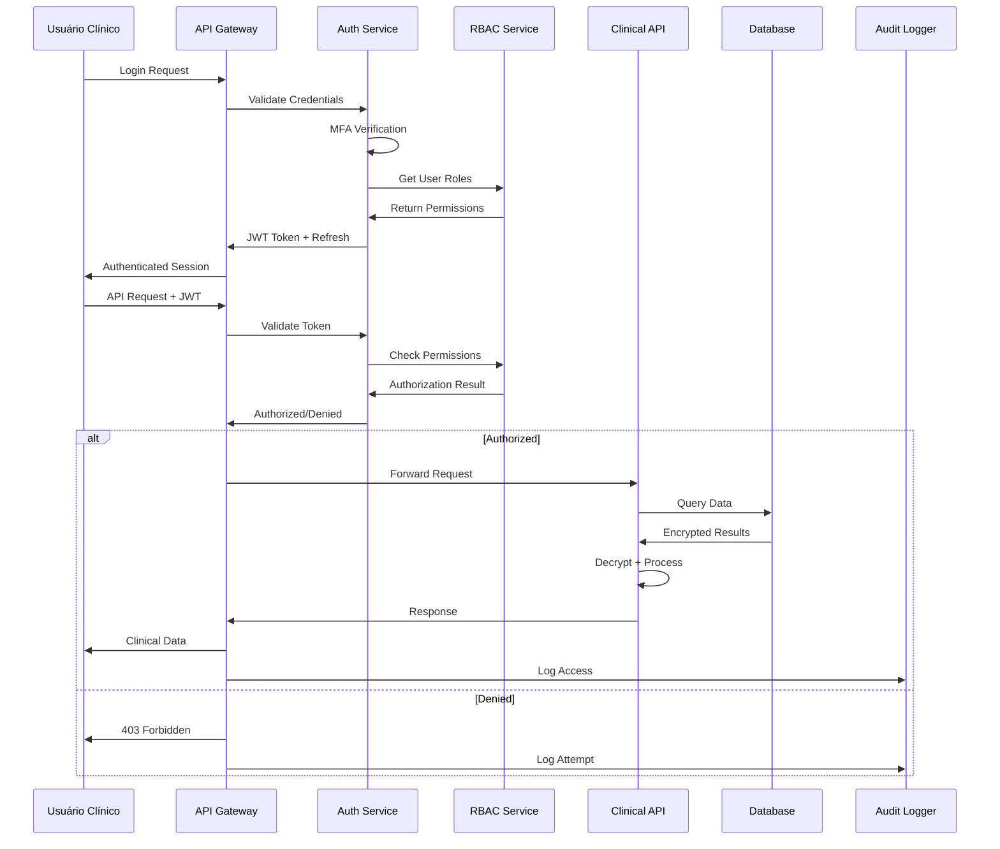

# Plano de Segurança e Compliance
## Sistema de Relatórios Administrativos e Alertas Clínicos

### 🔒 Visão Geral de Segurança

Este documento define as estratégias, controles e procedimentos de segurança para garantir a proteção completa dos dados clínicos e compliance com regulamentações LGPD e HIPAA.

---

## 🛡️ Arquitetura de Segurança

### 1. Modelo de Segurança por Camadas

```
┌─────────────────────────────────────────────┐
│               CAMADA 7: USUÁRIO             │
│          Autenticação Multi-Fator           │
│          Controle de Acesso Baseado         │
│               em Funções (RBAC)             │
├─────────────────────────────────────────────┤
│            CAMADA 6: APLICAÇÃO              │
│         Autorização Granular                │
│         Validação de Entrada                │
│         Sanitização de Dados                │
├─────────────────────────────────────────────┤
│             CAMADA 5: API                   │
│         Rate Limiting                       │
│         Token JWT com Refresh               │
│         Logging de Auditoria                │
├─────────────────────────────────────────────┤
│            CAMADA 4: LÓGICA                 │
│         Criptografia de Campo               │
│         Controle de Integridade             │
│         Validação de Regras de Negócio      │
├─────────────────────────────────────────────┤
│             CAMADA 3: DADOS                 │
│         Criptografia em Repouso             │
│         Backup Criptografado               │
│         Segmentação de Dados               │
├─────────────────────────────────────────────┤
│             CAMADA 2: REDE                  │
│         TLS 1.3                            │
│         VPN/Private Network                │ 
│         Firewall de Aplicação              │
├─────────────────────────────────────────────┤
│         CAMADA 1: INFRAESTRUTURA            │
│         Isolamento de Containers           │
│         Monitoramento de Sistema           │
│         Controle de Acesso Físico          │
└─────────────────────────────────────────────┘
```

### 2. Fluxo de Autenticação e Autorização



---

## 🔐 Controles de Autenticação

### 1. Autenticação Multi-Fator (MFA)

```php
<?php

class MFAController
{
    public function initiateMFA(User $user): MFAResponse
    {
        // Verificar se MFA é obrigatório para o usuário
        if ($this->isMFARequired($user)) {
            
            $methods = $this->getAvailableMFAMethods($user);
            
            foreach ($methods as $method) {
                switch ($method) {
                    case 'totp':
                        $this->sendTOTPChallenge($user);
                        break;
                    case 'sms':
                        $this->sendSMSCode($user);
                        break;
                    case 'email':
                        $this->sendEmailCode($user);
                        break;
                    case 'hardware_key':
                        $this->initiateWebAuthn($user);
                        break;
                }
            }
            
            return new MFAResponse([
                'mfa_required' => true,
                'methods' => $methods,
                'expires_at' => now()->addMinutes(10),
                'session_id' => $this->createMFASession($user)
            ]);
        }
        
        return new MFAResponse(['mfa_required' => false]);
    }
    
    private function isMFARequired(User $user): bool
    {
        return $user->hasRole(['clinical_staff', 'admin']) ||
               $user->accessLevel === 'high_privilege' ||
               config('security.force_mfa', true);
    }
}
```

### 2. Controle de Sessão Seguro

```php
<?php

class SecureSessionManager
{
    private const SESSION_TIMEOUT_MINUTES = 30;
    private const MAX_CONCURRENT_SESSIONS = 3;
    private const ACTIVITY_TIMEOUT_MINUTES = 15;
    
    public function createSecureSession(User $user, array $metadata): string
    {
        // Verificar limite de sessões concorrentes
        $this->enforceSessionLimit($user);
        
        $sessionData = [
            'user_id' => $user->id,
            'ip_address' => request()->ip(),
            'user_agent' => request()->userAgent(),
            'location' => $this->getApproximateLocation(),
            'mfa_verified' => $metadata['mfa_verified'] ?? false,
            'permissions' => $user->getAllPermissions(),
            'created_at' => now(),
            'last_activity' => now(),
            'expires_at' => now()->addMinutes(self::SESSION_TIMEOUT_MINUTES),
        ];
        
        $sessionId = Str::random(64);
        
        // Armazenar sessão criptografada
        Cache::put(
            "session:{$sessionId}",
            encrypt($sessionData),
            now()->addMinutes(self::SESSION_TIMEOUT_MINUTES)
        );
        
        // Registrar criação de sessão
        AuditLog::create([
            'user_id' => $user->id,
            'action' => 'session_created',
            'resource' => 'authentication',
            'metadata' => [
                'session_id' => $sessionId,
                'ip_address' => request()->ip(),
                'user_agent' => request()->userAgent(),
            ]
        ]);
        
        return $sessionId;
    }
    
    public function validateSession(string $sessionId): ?array
    {
        $encryptedData = Cache::get("session:{$sessionId}");
        
        if (!$encryptedData) {
            return null;
        }
        
        try {
            $sessionData = decrypt($encryptedData);
            
            // Verificar expiração
            if (now()->gt($sessionData['expires_at'])) {
                $this->destroySession($sessionId);
                return null;
            }
            
            // Verificar inatividade
            if (now()->diffInMinutes($sessionData['last_activity']) > self::ACTIVITY_TIMEOUT_MINUTES) {
                $this->destroySession($sessionId);
                return null;
            }
            
            // Atualizar última atividade
            $sessionData['last_activity'] = now();
            Cache::put(
                "session:{$sessionId}",
                encrypt($sessionData),
                $sessionData['expires_at']
            );
            
            return $sessionData;
            
        } catch (DecryptException $e) {
            $this->destroySession($sessionId);
            return null;
        }
    }
}
```

---

## 🔑 Controles de Autorização

### 1. RBAC (Role-Based Access Control)

```php
<?php

class ClinicalRBACService
{
    private const ROLES = [
        'clinical_staff' => [
            'view_alerts',
            'acknowledge_alerts',
            'resolve_alerts',
            'view_patient_summaries',
            'generate_reports_basic'
        ],
        
        'clinical_supervisor' => [
            'all_clinical_staff_permissions',
            'assign_alerts',
            'escalate_alerts',
            'view_team_performance',
            'generate_reports_advanced',
            'configure_alert_thresholds'
        ],
        
        'admin' => [
            'all_supervisor_permissions',
            'manage_users',
            'configure_system',
            'view_audit_logs',
            'export_data',
            'manage_compliance'
        ],
        
        'manager' => [
            'view_population_analytics',
            'generate_executive_reports',
            'view_performance_metrics',
            'manage_configurations'
        ]
    ];
    
    public function checkPermission(User $user, string $permission, ?array $context = null): bool
    {
        // Verificar se usuário tem a permissão diretamente
        if ($user->hasDirectPermission($permission)) {
            return $this->contextualCheck($user, $permission, $context);
        }
        
        // Verificar permissões por role
        foreach ($user->roles as $role) {
            if (in_array($permission, self::ROLES[$role->name] ?? [])) {
                return $this->contextualCheck($user, $permission, $context);
            }
        }
        
        // Log tentativa de acesso negado
        AuditLog::create([
            'user_id' => $user->id,
            'action' => 'access_denied',
            'resource' => $permission,
            'metadata' => [
                'reason' => 'insufficient_permissions',
                'context' => $context,
                'user_roles' => $user->roles->pluck('name'),
            ]
        ]);
        
        return false;
    }
    
    private function contextualCheck(User $user, string $permission, ?array $context): bool
    {
        // Verificações contextuais específicas
        switch ($permission) {
            case 'view_patient_summaries':
                return $this->canAccessPatientData($user, $context['patient_id'] ?? null);
                
            case 'resolve_alerts':
                return $this->canResolveAlert($user, $context['alert_id'] ?? null);
                
            case 'generate_reports_advanced':
                return $this->canGenerateAdvancedReports($user, $context);
                
            default:
                return true;
        }
    }
    
    private function canAccessPatientData(User $user, ?string $patientId): bool
    {
        if (!$patientId) return false;
        
        // Verificar se o usuário tem acesso ao paciente específico
        // Baseado em atribuição de equipe, localização, etc.
        return PatientAccess::where('user_id', $user->id)
            ->where('patient_id', $patientId)
            ->where('access_level', '>=', 'view')
            ->exists();
    }
}
```

### 2. Controle de Acesso Baseado em Atributos (ABAC)

```php
<?php

class AttributeBasedAccessControl
{
    public function evaluateAccess(User $user, string $resource, string $action, array $context): bool
    {
        $policy = $this->getPolicy($resource, $action);
        
        $attributes = [
            'user' => $this->getUserAttributes($user),
            'resource' => $this->getResourceAttributes($resource, $context),
            'environment' => $this->getEnvironmentAttributes(),
            'action' => $action
        ];
        
        return $this->evaluatePolicy($policy, $attributes);
    }
    
    private function getUserAttributes(User $user): array
    {
        return [
            'id' => $user->id,
            'roles' => $user->roles->pluck('name')->toArray(),
            'department' => $user->department,
            'security_clearance' => $user->security_clearance,
            'mfa_verified' => $user->currentSession['mfa_verified'] ?? false,
            'last_training_date' => $user->last_training_date,
            'location' => $user->current_location,
        ];
    }
    
    private function getResourceAttributes(string $resource, array $context): array
    {
        return [
            'type' => $resource,
            'sensitivity_level' => $this->getSensitivityLevel($resource, $context),
            'patient_age' => $context['patient_age'] ?? null,
            'data_classification' => $context['data_classification'] ?? 'internal',
            'created_date' => $context['created_date'] ?? null,
        ];
    }
    
    private function getEnvironmentAttributes(): array
    {
        return [
            'time_of_access' => now(),
            'ip_address' => request()->ip(),
            'is_business_hours' => $this->isBusinessHours(),
            'network_zone' => $this->getNetworkZone(request()->ip()),
            'threat_level' => $this->getCurrentThreatLevel(),
        ];
    }
    
    private function evaluatePolicy(array $policy, array $attributes): bool
    {
        foreach ($policy['rules'] as $rule) {
            if ($this->evaluateRule($rule, $attributes)) {
                return $rule['effect'] === 'allow';
            }
        }
        
        // Default deny
        return false;
    }
}
```

---

## 🔒 Criptografia e Proteção de Dados

### 1. Criptografia de Dados Sensíveis

```php
<?php

class HealthDataEncryption
{
    private const ENCRYPTION_ALGORITHM = 'aes-256-gcm';
    private const KEY_DERIVATION_ITERATIONS = 100000;
    
    public function encryptHealthAssessment(array $assessmentData): array
    {
        $encryptedFields = [];
        
        // Campos que devem ser criptografados
        $sensitiveFields = [
            'raw_responses',
            'phq9_responses', 
            'gad7_responses',
            'audit_c_responses',
            'nida_responses',
            'cardiovascular_factors',
            'safety_indicators'
        ];
        
        foreach ($sensitiveFields as $field) {
            if (isset($assessmentData[$field])) {
                $encryptedFields[$field] = $this->encryptField(
                    json_encode($assessmentData[$field]),
                    $this->getFieldKey($field)
                );
            }
        }
        
        return array_merge($assessmentData, $encryptedFields);
    }
    
    public function decryptHealthAssessment(array $assessmentData, User $user): array
    {
        // Verificar se usuário tem autorização para descriptografar
        if (!$this->canDecryptHealthData($user)) {
            throw new UnauthorizedDecryptionException();
        }
        
        $decryptedFields = [];
        $sensitiveFields = [
            'raw_responses', 'phq9_responses', 'gad7_responses',
            'audit_c_responses', 'nida_responses', 'cardiovascular_factors',
            'safety_indicators'
        ];
        
        foreach ($sensitiveFields as $field) {
            if (isset($assessmentData[$field])) {
                try {
                    $decrypted = $this->decryptField(
                        $assessmentData[$field],
                        $this->getFieldKey($field)
                    );
                    $decryptedFields[$field] = json_decode($decrypted, true);
                } catch (DecryptionException $e) {
                    // Log erro de descriptografia
                    Log::error('Decryption failed', [
                        'field' => $field,
                        'user_id' => $user->id,
                        'assessment_id' => $assessmentData['id'] ?? 'unknown'
                    ]);
                    $decryptedFields[$field] = null;
                }
            }
        }
        
        // Log acesso aos dados descriptografados
        AuditLog::create([
            'user_id' => $user->id,
            'action' => 'decrypt_health_data',
            'resource' => 'health_assessment',
            'resource_id' => $assessmentData['id'] ?? null,
            'metadata' => [
                'fields_decrypted' => array_keys($decryptedFields),
                'purpose' => 'clinical_analysis'
            ]
        ]);
        
        return array_merge($assessmentData, $decryptedFields);
    }
    
    private function encryptField(string $data, string $key): string
    {
        $iv = random_bytes(16);
        $tag = '';
        
        $encrypted = openssl_encrypt(
            $data,
            self::ENCRYPTION_ALGORITHM,
            $key,
            OPENSSL_RAW_DATA,
            $iv,
            $tag
        );
        
        if ($encrypted === false) {
            throw new EncryptionException('Failed to encrypt field');
        }
        
        // Combinar IV, tag e dados criptografados
        return base64_encode($iv . $tag . $encrypted);
    }
    
    private function decryptField(string $encryptedData, string $key): string
    {
        $data = base64_decode($encryptedData);
        
        $iv = substr($data, 0, 16);
        $tag = substr($data, 16, 16);
        $encrypted = substr($data, 32);
        
        $decrypted = openssl_decrypt(
            $encrypted,
            self::ENCRYPTION_ALGORITHM,
            $key,
            OPENSSL_RAW_DATA,
            $iv,
            $tag
        );
        
        if ($decrypted === false) {
            throw new DecryptionException('Failed to decrypt field');
        }
        
        return $decrypted;
    }
    
    private function getFieldKey(string $fieldName): string
    {
        // Derivar chave específica para o campo usando HKDF
        $masterKey = config('app.encryption_key');
        $salt = config('app.field_key_salt');
        
        return hash_hkdf(
            'sha256',
            $masterKey,
            32,
            $fieldName . '_field_key',
            $salt
        );
    }
}
```

### 2. Gerenciamento de Chaves

```php
<?php

class KeyManagementService
{
    private const KEY_ROTATION_INTERVAL_DAYS = 90;
    
    public function rotateEncryptionKeys(): void
    {
        $currentKeys = $this->getCurrentKeys();
        
        foreach ($currentKeys as $keyId => $keyData) {
            if ($this->shouldRotateKey($keyData)) {
                $newKey = $this->generateNewKey();
                
                // Re-criptografar dados com nova chave
                $this->reencryptDataWithNewKey($keyId, $newKey);
                
                // Armazenar nova chave
                $this->storeKey($newKey);
                
                // Marcar chave antiga para aposentadoria
                $this->scheduleKeyRetirement($keyId);
                
                AuditLog::create([
                    'action' => 'key_rotation',
                    'resource' => 'encryption_key',
                    'metadata' => [
                        'old_key_id' => $keyId,
                        'new_key_id' => $newKey['id'],
                        'rotation_reason' => 'scheduled_rotation'
                    ]
                ]);
            }
        }
    }
    
    private function shouldRotateKey(array $keyData): bool
    {
        $keyAge = now()->diffInDays($keyData['created_at']);
        
        return $keyAge >= self::KEY_ROTATION_INTERVAL_DAYS ||
               $keyData['usage_count'] >= config('security.max_key_usage') ||
               $keyData['compromise_suspected'];
    }
    
    private function generateNewKey(): array
    {
        return [
            'id' => Str::uuid(),
            'key' => base64_encode(random_bytes(32)),
            'algorithm' => 'aes-256-gcm',
            'created_at' => now(),
            'status' => 'active',
            'usage_count' => 0
        ];
    }
}
```

---

## 📋 Compliance LGPD/HIPAA

### 1. Controlador de Dados LGPD

```php
<?php

class LGPDDataController
{
    public function handleDataSubjectRequest(DataRequestType $type, string $dataSubjectId): DataRequestResponse
    {
        // Verificar identidade do titular dos dados
        $verification = $this->verifyDataSubjectIdentity($dataSubjectId);
        if (!$verification->isValid()) {
            return new DataRequestResponse([
                'status' => 'identity_verification_required',
                'verification_methods' => $verification->getAvailableMethods()
            ]);
        }
        
        return match($type) {
            DataRequestType::ACCESS => $this->provideDataAccess($dataSubjectId),
            DataRequestType::RECTIFICATION => $this->handleDataRectification($dataSubjectId),
            DataRequestType::ERASURE => $this->handleDataErasure($dataSubjectId),
            DataRequestType::PORTABILITY => $this->provideDataPortability($dataSubjectId),
            DataRequestType::RESTRICTION => $this->restrictDataProcessing($dataSubjectId),
            DataRequestType::OBJECTION => $this->handleProcessingObjection($dataSubjectId)
        };
    }
    
    private function handleDataErasure(string $dataSubjectId): DataRequestResponse
    {
        // Verificar bases legais para retenção
        $retentionAnalysis = $this->analyzeRetentionRequirements($dataSubjectId);
        
        if ($retentionAnalysis->hasLegalBasisForRetention()) {
            return new DataRequestResponse([
                'status' => 'erasure_denied',
                'reason' => 'legal_retention_requirement',
                'details' => [
                    'retention_period' => $retentionAnalysis->getRetentionPeriod(),
                    'legal_basis' => $retentionAnalysis->getLegalBasis(),
                    'estimated_erasure_date' => $retentionAnalysis->getEstimatedErasureDate()
                ]
            ]);
        }
        
        // Executar pseudonimização em vez de exclusão completa
        $pseudonymizationResult = $this->pseudonymizePersonalData($dataSubjectId);
        
        return new DataRequestResponse([
            'status' => 'erasure_completed',
            'method' => 'pseudonymization',
            'completion_date' => now(),
            'affected_records' => $pseudonymizationResult->getAffectedRecordsCount(),
            'retention_notice' => 'Statistical data retained in anonymized form for research purposes'
        ]);
    }
    
    private function provideDataAccess(string $dataSubjectId): DataRequestResponse
    {
        $personalData = $this->collectAllPersonalData($dataSubjectId);
        
        // Preparar dados para exportação
        $exportData = [
            'data_subject_info' => $personalData['identity'],
            'health_assessments' => $this->formatHealthAssessments($personalData['assessments']),
            'alerts_generated' => $this->formatAlertsData($personalData['alerts']),
            'processing_activities' => $this->getProcessingLog($dataSubjectId),
            'data_sharing' => $this->getDataSharingLog($dataSubjectId),
            'automated_decisions' => $this->getAutomatedDecisions($dataSubjectId)
        ];
        
        // Criar arquivo seguro para download
        $exportFile = $this->createSecureExport($exportData, $dataSubjectId);
        
        return new DataRequestResponse([
            'status' => 'access_granted',
            'download_url' => $exportFile->getSecureUrl(),
            'expires_at' => now()->addDays(30),
            'data_categories' => array_keys($exportData),
            'total_records' => $this->countTotalRecords($exportData)
        ]);
    }
}
```

### 2. Conformidade HIPAA

```php
<?php

class HIPAAComplianceService
{
    private const REQUIRED_SAFEGUARDS = [
        'administrative' => [
            'security_officer_assigned',
            'workforce_training_completed',
            'access_management_implemented',
            'contingency_plan_documented'
        ],
        'physical' => [
            'facility_access_controls',
            'workstation_use_restrictions',
            'device_media_controls'
        ],
        'technical' => [
            'access_control_implemented',
            'audit_controls_active', 
            'integrity_controls_active',
            'transmission_security_active'
        ]
    ];
    
    public function performComplianceAssessment(): HIPAAComplianceReport
    {
        $report = new HIPAAComplianceReport();
        
        // Avaliar salvaguardas administrativas
        $adminCompliance = $this->assessAdministrativeSafeguards();
        
        // Avaliar salvaguardas físicas
        $physicalCompliance = $this->assessPhysicalSafeguards();
        
        // Avaliar salvaguardas técnicas
        $technicalCompliance = $this->assessTechnicalSafeguards();
        
        // Verificar mínimo necessário
        $minimumNecessaryCompliance = $this->assessMinimumNecessaryRule();
        
        $report->setAdministrativeCompliance($adminCompliance);
        $report->setPhysicalCompliance($physicalCompliance);
        $report->setTechnicalCompliance($technicalCompliance);
        $report->setMinimumNecessaryCompliance($minimumNecessaryCompliance);
        
        // Identificar gaps de compliance
        $gaps = $this->identifyComplianceGaps($report);
        $report->setComplianceGaps($gaps);
        
        // Gerar recomendações
        $recommendations = $this->generateComplianceRecommendations($gaps);
        $report->setRecommendations($recommendations);
        
        return $report;
    }
    
    private function assessTechnicalSafeguards(): array
    {
        return [
            'access_control' => $this->verifyAccessControl(),
            'audit_controls' => $this->verifyAuditControls(),
            'integrity' => $this->verifyIntegrityControls(),
            'transmission_security' => $this->verifyTransmissionSecurity()
        ];
    }
    
    private function verifyAccessControl(): ComplianceCheck
    {
        $check = new ComplianceCheck('Technical Safeguard: Access Control');
        
        // Verificar controles de acesso implementados
        $hasUniqueUserIdentification = $this->hasUniqueUserIdentification();
        $hasEmergencyAccess = $this->hasEmergencyAccessProcedures();
        $hasAutomaticLogoff = $this->hasAutomaticLogoff();
        $hasEncryptionDecryption = $this->hasEncryptionDecryption();
        
        $check->addResult('unique_user_identification', $hasUniqueUserIdentification);
        $check->addResult('emergency_access_procedures', $hasEmergencyAccess);
        $check->addResult('automatic_logoff', $hasAutomaticLogoff);
        $check->addResult('encryption_decryption', $hasEncryptionDecryption);
        
        return $check;
    }
    
    private function verifyAuditControls(): ComplianceCheck
    {
        $check = new ComplianceCheck('Technical Safeguard: Audit Controls');
        
        // Verificar se todos os acessos são logados
        $auditCoverage = $this->calculateAuditCoverage();
        $auditRetention = $this->verifyAuditRetentionPeriod();
        $auditIntegrity = $this->verifyAuditLogIntegrity();
        
        $check->addResult('audit_coverage', $auditCoverage >= 0.95); // 95% coverage
        $check->addResult('audit_retention', $auditRetention >= 6); // 6 years minimum
        $check->addResult('audit_integrity', $auditIntegrity);
        
        return $check;
    }
}
```

---

## 🚨 Monitoramento e Detecção de Ameaças

### 1. Sistema de Detecção de Intrusões

```php
<?php

class ThreatDetectionService
{
    private const SUSPICIOUS_PATTERNS = [
        'multiple_failed_logins' => [
            'threshold' => 5,
            'window_minutes' => 15,
            'severity' => 'medium'
        ],
        'unusual_access_times' => [
            'threshold' => 'outside_business_hours',
            'severity' => 'low'
        ],
        'bulk_data_access' => [
            'threshold' => 100,
            'window_minutes' => 60,
            'severity' => 'high'
        ],
        'unauthorized_export_attempts' => [
            'threshold' => 1,
            'severity' => 'critical'
        ]
    ];
    
    public function analyzeSecurityEvents(): SecurityThreatAnalysis
    {
        $analysis = new SecurityThreatAnalysis();
        
        // Analisar eventos de autenticação
        $authThreats = $this->analyzeAuthenticationEvents();
        
        // Analisar padrões de acesso
        $accessThreats = $this->analyzeAccessPatterns();
        
        // Analisar anomalias de dados
        $dataThreats = $this->analyzeDataAnomalies();
        
        $analysis->addThreats($authThreats);
        $analysis->addThreats($accessThreats);
        $analysis->addThreats($dataThreats);
        
        // Aplicar machine learning para detecção avançada
        $mlThreats = $this->applyMLThreatDetection();
        $analysis->addThreats($mlThreats);
        
        return $analysis;
    }
    
    private function analyzeAuthenticationEvents(): array
    {
        $threats = [];
        
        // Detectar tentativas de força bruta
        $bruteForceAttempts = AuditLog::where('action', 'login_failed')
            ->where('created_at', '>=', now()->subMinutes(15))
            ->groupBy('ip_address')
            ->havingRaw('COUNT(*) >= 5')
            ->get();
            
        foreach ($bruteForceAttempts as $attempt) {
            $threats[] = new SecurityThreat([
                'type' => 'brute_force_attack',
                'severity' => 'high',
                'source_ip' => $attempt->ip_address,
                'description' => 'Multiple failed login attempts detected',
                'recommendation' => 'Block IP address and investigate',
                'auto_response' => 'ip_block_temporary'
            ]);
        }
        
        return $threats;
    }
    
    private function applyMLThreatDetection(): array
    {
        // Implementar modelos de ML para detecção de anomalias
        $model = $this->loadAnomalyDetectionModel();
        
        $recentActivity = $this->getRecentUserActivity();
        $anomalies = $model->detectAnomalies($recentActivity);
        
        $threats = [];
        foreach ($anomalies as $anomaly) {
            $threats[] = new SecurityThreat([
                'type' => 'anomalous_behavior',
                'severity' => $anomaly->severity,
                'user_id' => $anomaly->user_id,
                'description' => $anomaly->description,
                'confidence_score' => $anomaly->confidence,
                'recommendation' => $this->getAnomalyRecommendation($anomaly)
            ]);
        }
        
        return $threats;
    }
}
```

### 2. Resposta Automatizada a Incidentes

```php
<?php

class IncidentResponseService
{
    public function handleSecurityIncident(SecurityThreat $threat): IncidentResponse
    {
        $response = new IncidentResponse($threat);
        
        // Aplicar resposta automática baseada no tipo e severidade
        match([$threat->type, $threat->severity]) {
            ['brute_force_attack', 'high'] => $this->handleBruteForceAttack($threat, $response),
            ['data_exfiltration', 'critical'] => $this->handleDataExfiltration($threat, $response),
            ['unauthorized_access', 'medium'] => $this->handleUnauthorizedAccess($threat, $response),
            ['anomalous_behavior', 'high'] => $this->handleAnomalousBehavior($threat, $response),
            default => $this->handleGenericThreat($threat, $response)
        };
        
        // Notificar equipe de segurança
        $this->notifySecurityTeam($threat, $response);
        
        // Registrar resposta para auditoria
        $this->logIncidentResponse($threat, $response);
        
        return $response;
    }
    
    private function handleDataExfiltration(SecurityThreat $threat, IncidentResponse $response): void
    {
        // Resposta crítica: isolamento imediato
        $response->addAction('isolate_user_session', [
            'user_id' => $threat->user_id,
            'reason' => 'suspected_data_exfiltration'
        ]);
        
        $response->addAction('revoke_all_tokens', [
            'user_id' => $threat->user_id
        ]);
        
        $response->addAction('enable_enhanced_monitoring', [
            'user_id' => $threat->user_id,
            'duration_hours' => 72
        ]);
        
        $response->addAction('notify_dpo', [
            'incident_type' => 'potential_data_breach',
            'urgency' => 'immediate'
        ]);
        
        // Preparar para possível notificação de violação de dados
        $response->addAction('prepare_breach_notification', [
            'threat_details' => $threat->toArray(),
            'assessment_deadline' => now()->addHours(24)
        ]);
    }
    
    private function notifySecurityTeam(SecurityThreat $threat, IncidentResponse $response): void
    {
        $notification = [
            'threat_id' => $threat->id,
            'type' => $threat->type,
            'severity' => $threat->severity,
            'affected_systems' => $threat->affected_systems,
            'response_actions' => $response->getActions(),
            'requires_manual_intervention' => $response->requiresManualIntervention(),
            'estimated_impact' => $threat->estimated_impact
        ];
        
        // Notificação via múltiplos canais baseada na severidade
        if ($threat->severity === 'critical') {
            $this->sendCriticalAlert($notification);
        } else {
            $this->sendStandardAlert($notification);
        }
    }
}
```

---

## 📊 Auditoria e Compliance Monitoring

### 1. Sistema de Auditoria Abrangente

```php
<?php

class ComprehensiveAuditService
{
    public function generateComplianceReport(string $period = '30days'): ComplianceAuditReport
    {
        $report = new ComplianceAuditReport($period);
        
        // Auditoria de acesso a dados
        $dataAccess = $this->auditDataAccess($period);
        $report->setDataAccessCompliance($dataAccess);
        
        // Auditoria de controles de segurança
        $securityControls = $this->auditSecurityControls();
        $report->setSecurityControlsCompliance($securityControls);
        
        // Auditoria de gestão de usuários
        $userManagement = $this->auditUserManagement($period);
        $report->setUserManagementCompliance($userManagement);
        
        // Auditoria de backup e recovery
        $backupRecovery = $this->auditBackupRecovery($period);
        $report->setBackupRecoveryCompliance($backupRecovery);
        
        // Calcular score geral de compliance
        $overallScore = $this->calculateComplianceScore($report);
        $report->setOverallComplianceScore($overallScore);
        
        return $report;
    }
    
    private function auditDataAccess(string $period): DataAccessAudit
    {
        $audit = new DataAccessAudit();
        
        // Verificar se todos os acessos foram logados
        $totalDataAccess = $this->countDataAccessEvents($period);
        $loggedAccess = $this->countLoggedAccessEvents($period);
        $auditCoverage = $loggedAccess / max($totalDataAccess, 1);
        
        $audit->setAuditCoverage($auditCoverage);
        
        // Verificar acessos não autorizados
        $unauthorizedAccess = $this->detectUnauthorizedAccess($period);
        $audit->setUnauthorizedAccessAttempts($unauthorizedAccess);
        
        // Verificar princípio do mínimo necessário
        $minimumNecessaryViolations = $this->detectMinimumNecessaryViolations($period);
        $audit->setMinimumNecessaryViolations($minimumNecessaryViolations);
        
        // Verificar integridade dos logs
        $logIntegrity = $this->verifyAuditLogIntegrity($period);
        $audit->setLogIntegrityStatus($logIntegrity);
        
        return $audit;
    }
    
    private function detectMinimumNecessaryViolations(string $period): array
    {
        $violations = [];
        
        // Detectar usuários acessando dados além do necessário
        $excessiveAccess = DB::table('audit_logs')
            ->select('user_id', DB::raw('COUNT(*) as access_count'), 
                    DB::raw('COUNT(DISTINCT resource_id) as unique_resources'))
            ->where('action', 'data_access')
            ->where('created_at', '>=', $this->getPeriodStart($period))
            ->groupBy('user_id')
            ->having('unique_resources', '>', 50) // Threshold configurável
            ->get();
            
        foreach ($excessiveAccess as $access) {
            $user = User::find($access->user_id);
            $expectedAccess = $this->calculateExpectedAccess($user);
            
            if ($access->unique_resources > $expectedAccess * 1.5) { // 50% tolerance
                $violations[] = [
                    'type' => 'excessive_data_access',
                    'user_id' => $user->id,
                    'user_name' => $user->name,
                    'expected_access' => $expectedAccess,
                    'actual_access' => $access->unique_resources,
                    'severity' => 'medium'
                ];
            }
        }
        
        return $violations;
    }
}
```

---

## 🎯 Plano de Implementação de Segurança

### Fase 1: Fundamentos de Segurança (2-3 semanas)
- ✅ Configuração TLS 1.3
- ✅ Implementação autenticação JWT
- ✅ Setup MFA obrigatório
- ✅ Controles básicos RBAC
- ✅ Criptografia de dados em repouso

### Fase 2: Controles Avançados (3-4 semanas)
- ✅ ABAC (Attribute-Based Access Control)
- ✅ Criptografia campo-específica
- ✅ Sistema de auditoria abrangente
- ✅ Monitoramento de ameaças
- ✅ Resposta automatizada a incidentes

### Fase 3: Compliance e Governança (2-3 semanas)
- ✅ Conformidade LGPD completa
- ✅ Controles HIPAA
- ✅ Gestão de chaves automatizada
- ✅ Relatórios de compliance
- ✅ Procedimentos de violação de dados

### Fase 4: Operação e Manutenção (Contínuo)
- ✅ Monitoramento 24/7
- ✅ Testes de penetração regulares
- ✅ Treinamento de equipe
- ✅ Atualização de políticas
- ✅ Revisão de compliance trimestral

---

## 📈 KPIs de Segurança

### Métricas Técnicas
- **Tempo de detecção de ameaças**: < 5 minutos
- **Tempo de resposta a incidentes**: < 15 minutos
- **Taxa de falsos positivos**: < 2%
- **Cobertura de auditoria**: > 99.5%

### Métricas de Compliance
- **Score de compliance LGPD**: > 95%
- **Score de compliance HIPAA**: > 98%
- **Tempo de resposta a solicitações LGPD**: < 72 horas
- **Taxa de violações de política**: < 0.1%

### Métricas Operacionais
- **Disponibilidade do sistema**: > 99.9%
- **Tempo de recuperação**: < 4 horas
- **Taxa de sucesso de backups**: 100%
- **Atualização de patches**: < 30 dias

---

**Documento preparado por**: Equipe de Segurança e Compliance  
**Data**: 05 de agosto de 2025  
**Versão**: 1.0  
**Classificação**: Confidencial  
**Próxima revisão**: 05 de novembro de 2025